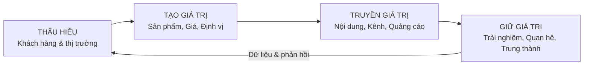

# Tập 1 · Chương 1 — Tư duy Marketing 2026–2035: từ "bán hàng" đến "tạo & truyền tải giá trị"

> **Đối tượng:** CEO, chủ doanh nghiệp, startup, nhà sản xuất/OEM, marketer, sinh viên · **Thời lượng đọc:** ~22 phút · **Phiên bản:** v1.0 (2026)
> **Tóm tắt 1 câu:** Chương này thay đổi *cách bạn nghĩ* về marketing — từ "làm sao bán được hàng" sang "làm sao tạo ra và truyền tải giá trị mà khách hàng sẵn lòng trả tiền" — nền tảng cho mọi chương sau.

---

## 1. Giới thiệu

Hãy tưởng tượng hai chủ tiệm bánh cạnh nhau trên cùng một con phố.

Người thứ nhất mở cửa mỗi sáng và tự hỏi: *"Hôm nay mình bán được bao nhiêu ổ bánh?"*. Người thứ hai mở cửa và tự hỏi: *"Hôm nay khách của mình đang cố giải quyết điều gì — một bữa sáng vội, một món quà xin lỗi vợ, hay một buổi sinh nhật đáng nhớ cho con?"*.

Sau một năm, tiệm thứ nhất vẫn đang "đẩy hàng" và lo lắng mỗi khi trời mưa. Tiệm thứ hai đã có khách quen gọi đặt trước, có bánh sinh nhật đặt riêng, có người giới thiệu bạn bè. Cả hai bán bánh. Nhưng chỉ một người **làm marketing đúng nghĩa**.

Sự khác biệt không nằm ở kỹ thuật chạy quảng cáo, ở màu logo hay ở số lượng bài đăng Facebook. Nó nằm ở **tư duy** — ở câu hỏi mà bạn đặt ra mỗi sáng. Đây là chương quan trọng nhất của cả bộ sách, vì mọi công cụ, framework, prompt AI trong 9 tập còn lại đều vô dụng nếu đặt trên một nền tư duy sai.

## 2. Khái niệm

**Marketing** không phải là quảng cáo. Không phải là bán hàng. Không phải là mạng xã hội.

Định nghĩa dùng trong bộ sách này, tổng hợp từ nhiều trường phái:

> **Marketing là toàn bộ quá trình một tổ chức thấu hiểu một nhóm khách hàng, tạo ra giá trị mà nhóm đó thật sự cần, truyền tải giá trị ấy một cách thuyết phục, và giữ mối quan hệ để giá trị được trao đổi nhiều lần — có lợi cho cả hai bên.**

Ba động từ cốt lõi: **thấu hiểu → tạo giá trị → truyền tải giá trị** (và lặp lại qua *quan hệ*).

Cần phân biệt rõ ba khái niệm hay bị nhầm:

| Khái niệm | Câu hỏi trung tâm | Tầm nhìn |
|---|---|---|
| **Bán hàng (Sales)** | "Làm sao đẩy sản phẩm này ra?" | Ngắn hạn, xoay quanh sản phẩm |
| **Marketing** | "Khách hàng cần giá trị gì, và ta tạo & truyền tải nó ra sao?" | Dài hạn, xoay quanh khách hàng |
| **Branding (Thương hiệu)** | "Ta muốn tồn tại thế nào trong tâm trí khách hàng?" | Dài hạn nhất, xoay quanh nhận thức |

Bán hàng là *một phần* của marketing, không phải toàn bộ. Peter Drucker nói một câu kinh điển: *"Mục tiêu của marketing là làm cho việc bán hàng trở nên thừa"* — khi bạn hiểu khách hàng đủ sâu và tạo đúng sản phẩm, nó gần như tự bán được. *(Ý kiến diễn giải từ Drucker, "Management", 1973.)*

## 3. Lịch sử hình thành

Tư duy marketing đã tiến hóa qua nhiều thời kỳ. Hiểu dòng lịch sử này giúp bạn biết mình đang đứng ở đâu — và tránh mang tư duy của thế kỷ trước vào năm 2026.

```
1900s ── Thời kỳ SẢN XUẤT      → "Sản xuất được là bán được" (cầu > cung)
1930s ── Thời kỳ SẢN PHẨM      → "Sản phẩm tốt hơn sẽ tự thắng"
1950s ── Thời kỳ BÁN HÀNG      → "Cung > cầu, phải đẩy mạnh bán & quảng cáo"
1970s ── Thời kỳ MARKETING     → "Bắt đầu từ nhu cầu khách hàng" (Kotler, Levitt)
1990s ── Thời kỳ QUAN HỆ (CRM) → "Giữ khách còn quan trọng hơn kiếm khách"
2010s ── Thời kỳ SỐ & DỮ LIỆU  → "Cá nhân hóa, đo lường, real-time"
2020s ── Thời kỳ GIÁ TRỊ & AI  → "Ý nghĩa, cộng đồng, AI làm đòn bẩy"
```

Một cột mốc tư tưởng đáng nhớ: năm 1960, Theodore Levitt (Harvard) viết bài *"Marketing Myopia"* — cảnh báo các công ty đường sắt Mỹ suy tàn vì họ nghĩ mình "kinh doanh đường sắt" thay vì "kinh doanh vận tải". Họ định nghĩa mình theo *sản phẩm*, không theo *nhu cầu khách hàng*, nên bỏ lỡ ô tô và máy bay. *(Dữ kiện: Levitt, "Marketing Myopia", Harvard Business Review, 1960.)*

Bài học đó vẫn đúng nguyên vào 2026: Kodak "kinh doanh phim" thay vì "kinh doanh lưu giữ kỷ niệm", Nokia "kinh doanh điện thoại bền" thay vì "kinh doanh kết nối & phần mềm".

## 4. Tại sao quan trọng

Với một CEO hay chủ doanh nghiệp, tư duy marketing đúng quyết định ba thứ sống còn:

1. **Quyết định bạn xây gì.** Tư duy "lấy khách hàng làm gốc" khiến bạn xây sản phẩm người ta cần, thay vì sản phẩm bạn thích. Đây là lý do lớn nhất khiến startup chết: xây thứ không ai cần.
2. **Quyết định biên lợi nhuận.** Doanh nghiệp bán *giá trị* có quyền định giá cao; doanh nghiệp bán *sản phẩm* buộc phải cạnh tranh bằng giá — cuộc đua xuống đáy.
3. **Quyết định độ bền.** Giá trị và quan hệ tạo khách hàng trung thành; chiêu trò bán hàng chỉ tạo giao dịch một lần.

Hệ quả nếu tư duy sai: bạn sẽ đổ tiền vào quảng cáo để bù cho một sản phẩm không ai thực sự cần — như đổ nước vào một cái xô thủng. Không ngân sách quảng cáo nào cứu nổi một offer yếu.

## 5. Nguyên lý hoạt động

Vì sao marketing "lấy giá trị làm gốc" lại hiệu quả hơn "lấy bán hàng làm gốc"? Ba nguyên lý nền:

**Nguyên lý 1 — Trao đổi giá trị (Value Exchange).** Mọi giao dịch là một cuộc trao đổi: khách đưa tiền + thời gian + niềm tin, bạn đưa lại giải pháp cho một vấn đề. Giao dịch chỉ bền khi *cả hai bên cùng thắng*. Marketing là nghệ thuật làm cho cán cân giá trị nghiêng có lợi rõ ràng về phía khách — đến mức không mua mới là thiệt.

**Nguyên lý 2 — Nhận thức quan trọng hơn thực tế (Perception).** Khách không mua sản phẩm tốt nhất; họ mua sản phẩm mà họ *tin* là tốt nhất cho họ. Định vị, thương hiệu, câu chuyện tồn tại để định hình nhận thức đó. (Đây là cầu nối sang Tập 3 — Thương hiệu.)

**Nguyên lý 3 — Con người ra quyết định bằng cảm xúc, biện minh bằng lý trí.** Kahneman gọi đó là Hệ thống 1 (nhanh, cảm xúc) dẫn đường, Hệ thống 2 (chậm, lý trí) đi sau hợp thức hóa. Marketing giỏi chạm cảm xúc trước, cung cấp lý do sau. *(Diễn giải từ Kahneman, "Thinking, Fast and Slow", 2011 — đào sâu ở Tập 2.)*

## 6. Mô hình

**Mô hình Golden Circle của Simon Sinek** là công cụ tư duy mạnh nhất để chuyển từ "bán sản phẩm" sang "truyền giá trị". *(Nguồn: Sinek, "Start With Why", 2009.)*

```
        ┌──────────────┐
        │     WHY      │   ← Vì sao bạn tồn tại? (niềm tin, mục đích)
        │  ┌────────┐  │
        │  │  HOW   │  │   ← Bạn làm điều đó khác biệt thế nào?
        │  │ ┌────┐ │  │
        │  │ │WHAT│ │  │   ← Bạn bán cái gì? (sản phẩm cụ thể)
        │  │ └────┘ │  │
        │  └────────┘  │
        └──────────────┘
```

Phần lớn doanh nghiệp truyền thông từ ngoài vào trong: "Chúng tôi bán X (WHAT), chất lượng cao (HOW), mua đi (!)". Doanh nghiệp xuất sắc làm ngược lại — từ trong ra ngoài: bắt đầu bằng WHY.

Apple không nói "Chúng tôi làm máy tính tốt". Apple nói (diễn giải): *"Chúng tôi tin vào việc thách thức hiện trạng và tư duy khác biệt (WHY). Cách chúng tôi làm điều đó là tạo ra sản phẩm đẹp, dễ dùng (HOW). Tình cờ, chúng tôi làm ra máy tính (WHAT). Bạn muốn mua chứ?"*. Cùng một sản phẩm, nhưng WHY biến khách hàng thành tín đồ.

## 7. Framework

**Framework "TẠO – TRUYỀN – GIỮ" (Create – Communicate – Keep)** — bản đồ tư duy marketing tổng thể dùng xuyên suốt bộ sách:



| Giai đoạn | Câu hỏi cốt lõi | Tập liên quan |
|---|---|---|
| **Thấu hiểu** | Khách là ai, họ cần gì, đối thủ làm gì? | Tập 1, 2 |
| **Tạo giá trị** | Sản phẩm gì, giá bao nhiêu, định vị ra sao? | Tập 3, 4 |
| **Truyền giá trị** | Nói gì, ở đâu, cách nào để họ tin? | Tập 5, 7 |
| **Giữ giá trị** | Làm sao để họ quay lại và giới thiệu? | Tập 6 |
| **Đòn bẩy xuyên suốt** | AI & dữ liệu tăng tốc mọi giai đoạn thế nào? | Tập 8, 9 |

Đây chính là logic sắp xếp của toàn bộ 10 tập. Nhớ vòng lặp này, bạn sẽ luôn biết mình đang thiếu mảnh nào.

## 8. Công thức

Marketing có nền tảng tư duy, nhưng vẫn cần vài công thức để "neo" quyết định vào con số.

**Công thức Giá trị cảm nhận (của khách hàng):**
```
Giá trị cảm nhận  =  (Lợi ích chức năng + Lợi ích cảm xúc + Lợi ích xã hội)
                     ─────────────────────────────────────────────────────
                     (Giá tiền + Công sức + Rủi ro + Chi phí thời gian)
```
Nhiệm vụ của marketing: **tăng tử số** (thêm lợi ích, kể câu chuyện) hoặc **giảm mẫu số** (giảm rủi ro cảm nhận bằng bảo hành, review, dùng thử) — chứ không chỉ giảm giá.

**Công thức "sức khỏe" tăng trưởng — quan hệ CLV : CAC:**
```
CLV : CAC ≥ 3 : 1   → mô hình lành mạnh
```
Nghĩa là: mỗi khách hàng nên mang lại giá trị vòng đời (CLV) gấp ít nhất ~3 lần chi phí thu hút họ (CAC). *(Đây là quy tắc kinh nghiệm phổ biến trong giới SaaS/startup — cần kiểm chứng theo từng ngành; đào sâu ở Tập 7.)*

*Ví dụ (số minh họa):* nếu thu hút 1 khách tốn 300.000đ (CAC) và trung bình mỗi khách mua tổng cộng 1.200.000đ lợi nhuận gộp trong đời (CLV) → tỷ lệ 4:1, khỏe mạnh.

## 9. Quy trình

Quy trình 6 bước để áp dụng tư duy marketing đúng vào một doanh nghiệp/sản phẩm cụ thể:

1. **Xác định WHY & khách hàng cốt lõi.** Bạn tồn tại để giải quyết vấn đề gì, cho ai?
2. **Tìm insight & "job to be done".** Khách thật sự "thuê" sản phẩm để hoàn thành việc gì?
3. **Thiết kế giá trị.** Sản phẩm/dịch vụ/trải nghiệm nào đáp ứng job đó tốt hơn đối thủ?
4. **Định vị & thông điệp.** Bạn muốn chiếm vị trí nào trong tâm trí khách? Nói bằng một câu.
5. **Chọn kênh & truyền tải.** Khách ở đâu, tin ai, tiêu thụ nội dung kiểu gì?
6. **Đo – học – lặp lại.** Đo phản hồi, học, quay lại bước 2 để tinh chỉnh.

Lưu ý: đây là vòng lặp, không phải đường thẳng. Marketing giỏi là *học liên tục*, không phải "làm một lần cho xong".

## 10. Ví dụ đơn giản

**Một người bán nước mía ở vỉa hè.**

- *Tư duy bán hàng:* "Bán được càng nhiều ly càng tốt, ai đi qua thì mời."
- *Tư duy marketing:* "Khách của mình là dân văn phòng đi làm buổi trưa nắng. Họ cần *giải khát nhanh + sạch sẽ + đáng tin*." → Anh ta đặt xe ở gần tòa nhà văn phòng (kênh), dùng ly có nắp và ống hút giấy, để bảng "mía sạch, ép tại chỗ, không đá bẩn" (giảm rủi ro cảm nhận), nhớ mặt khách quen và bớt 2.000đ (quan hệ).

Cùng bán nước mía. Nhưng người thứ hai bán *sự an tâm và tiện lợi* — và bán được giá cao hơn, có khách quay lại.

## 11. Ví dụ doanh nghiệp

**Một xưởng may gia công (OEM) muốn thoát cảnh làm thuê giá rẻ.**

Tư duy cũ: "Nhận đơn, may theo mẫu, cạnh tranh bằng giá nhân công." → biên lợi nhuận mỏng, phụ thuộc vài khách lớn, dễ bị ép giá.

Tư duy marketing: xưởng nhận ra *job* thật của khách hàng (các thương hiệu thời trang nhỏ) không chỉ là "may rẻ" mà là "*may đúng, giao đúng hẹn, đặt số lượng nhỏ được, có tư vấn chất liệu*". Xưởng bèn đóng gói giá trị mới: nhận đơn nhỏ (MOQ thấp), có mẫu nhanh, tư vấn vải theo mùa. Kết quả: từ "xưởng gia công" trở thành "đối tác sản xuất cho thương hiệu mới nổi" — bán giá trị dịch vụ, không chỉ bán công may. Đây chính là bài toán của rất nhiều nhà máy OEM Việt Nam (bao gồm ngành mỹ phẩm, thực phẩm chức năng) muốn nâng cấp chuỗi giá trị.

## 12. Ví dụ Việt Nam

**Biti's Hunter — tái định vị bằng tư duy giá trị & câu chuyện.**

Biti's là thương hiệu giày Việt "quốc dân" nhưng từng bị giới trẻ xem là "giày của bố mẹ". Thay vì chỉ giảm giá để bán hàng tồn, Biti's chọn tư duy marketing: hiểu rằng người trẻ mua giày không chỉ để đi, mà để *thể hiện bản sắc và niềm tự hào*. Chiến dịch "Đi để trở về" (kết hợp âm nhạc, cảm xúc Tết, tinh thần trở về nhà) đã kết nối sản phẩm với một *giá trị cảm xúc* lớn hơn đôi giày. Dòng Biti's Hunter hồi sinh mạnh mẽ trong giới trẻ. *(Dữ kiện marketing được truyền thông rộng rãi khoảng 2016–2017; con số doanh thu cụ thể: cần kiểm chứng.)*

Bài học: cùng một đôi giày, khi được gắn vào một *câu chuyện giá trị*, nó ngừng cạnh tranh bằng giá.

## 13. Ví dụ quốc tế

**Nike — bán khát vọng, không bán giày.**

Nike gần như không bao giờ quảng cáo về đế giày hay công nghệ đệm trong các chiến dịch lớn nhất của mình. Thông điệp "Just Do It" bán một *niềm tin*: rằng bất kỳ ai cũng có thể vượt qua giới hạn bản thân. Sản phẩm (WHAT) chỉ là phương tiện; giá trị cảm xúc và bản sắc (WHY) mới là thứ khách hàng trung thành. *(Dữ kiện: "Just Do It" ra mắt 1988. Phân tích: chính chiến lược "bán khát vọng" cho phép Nike giữ vị thế cao cấp và biên lợi nhuận tốt trong hàng thập kỷ.)*

Đối chiếu quan trọng: trường phái Byron Sharp ("How Brands Grow", 2010) sẽ nhắc chúng ta rằng Nike lớn được **cũng** nhờ *độ phủ vật lý* khổng lồ và *sự dễ nhận diện* (logo swoosh, màu sắc), không chỉ nhờ "ý nghĩa". Tư duy marketing trưởng thành biết kết hợp cả hai: **ý nghĩa** *và* **độ hiện diện**. (Xem Tập 3.)

## 14. Sai lầm thường gặp

| Sai lầm | Vì sao nguy hiểm | Cách sửa |
|---|---|---|
| **Đồng nhất marketing với quảng cáo/chạy ads** | Đổ tiền vào truyền tải khi giá trị (sản phẩm/offer) còn yếu | Sửa offer trước, khuếch đại sau |
| **Lấy sản phẩm làm trung tâm ("sản phẩm tôi hay lắm")** | Yêu sản phẩm hơn yêu khách hàng → xây thứ ít người cần | Bắt đầu từ vấn đề của khách, không từ tính năng |
| **Cạnh tranh bằng giá theo phản xạ** | Cuộc đua xuống đáy, giết biên lợi nhuận | Tăng giá trị cảm nhận thay vì hạ giá |
| **Nhắm "tất cả mọi người"** | Thông điệp loãng, không chạm ai | Chọn phân khúc rõ (xem Chương 1.2 – STP) |
| **Chạy theo chiến thuật, bỏ chiến lược** | Bận rộn làm content/ads mà không có định hướng | Xác định WHY & định vị trước |
| **Đo lường sai (đo like thay vì đo doanh thu/giá trị)** | Tối ưu nhầm mục tiêu | Gắn chỉ số với kết quả kinh doanh (Tập 7) |

## 15. Checklist

Kiểm tra "sức khỏe tư duy marketing" của doanh nghiệp bạn:

- [ ] Tôi diễn đạt được **WHY** của mình trong 1 câu.
- [ ] Tôi biết rõ **khách hàng cốt lõi** là ai (không phải "tất cả mọi người").
- [ ] Tôi biết **"job to be done"** — vấn đề thật khách thuê sản phẩm để giải quyết.
- [ ] Tôi mô tả được **giá trị khác biệt** so với đối thủ trong 1 câu.
- [ ] Tôi biết mình muốn chiếm **vị trí nào trong tâm trí khách**.
- [ ] Tôi đang cạnh tranh bằng **giá trị**, không (chỉ) bằng giá.
- [ ] Tôi có cách **đo lường** gắn với doanh thu/giá trị, không chỉ like/view.
- [ ] Tôi có cơ chế **lắng nghe phản hồi** và cải tiến định kỳ.

Dưới 5 ô tick: hãy dừng việc chạy quảng cáo và quay lại củng cố nền tảng.

## 16. SOP

**SOP: Buổi làm rõ tư duy marketing cho một sản phẩm/dịch vụ (nửa ngày, cho đội ngũ).**

1. **(30') Định nghĩa WHY.** Cả nhóm viết 1 câu "Chúng tôi tồn tại để…". Chốt 1 phiên bản.
2. **(45') Vẽ chân dung khách hàng cốt lõi.** Ai? Ở đâu? Nỗi đau gì? (dùng biểu mẫu mục 18).
3. **(45') Tìm "Job To Be Done".** Hoàn thành câu: "Khách thuê sản phẩm của tôi để ___".
4. **(30') Viết tuyên bố giá trị.** "Với [khách], sản phẩm của tôi giúp [job] tốt hơn nhờ [khác biệt]."
5. **(30') Định vị 1 câu.** "Chúng tôi là [danh mục] dành cho [ai] muốn [giá trị]."
6. **(30') Rà 3 kênh** khách hàng tin tưởng nhất → ưu tiên nguồn lực.
7. **(20') Chốt 3 chỉ số** sẽ theo dõi (gắn doanh thu/giá trị, không phải like).
8. **Đầu ra:** 1 trang "Marketing One-Pager" dán ở nơi cả đội thấy.

Lặp lại SOP này mỗi khi ra sản phẩm mới hoặc mỗi 6 tháng.

## 17. KPI

Tư duy đúng phải đo được. Các KPI nền tảng (chi tiết ở Tập 7):

| KPI | Ý nghĩa | Cách tính | Ngưỡng định tính |
|---|---|---|---|
| **CAC** | Chi phí thu hút 1 khách | Tổng chi marketing ÷ số khách mới | Càng thấp càng tốt, so với CLV |
| **CLV** | Giá trị vòng đời 1 khách | Lợi nhuận gộp TB/khách × số lần mua × tuổi thọ | Càng cao càng tốt |
| **CLV : CAC** | Sức khỏe mô hình | CLV ÷ CAC | ≥ 3:1 (kinh nghiệm; cần kiểm chứng theo ngành) |
| **Tỷ lệ khách quay lại** | Sức mạnh "giữ giá trị" | Khách mua lại ÷ tổng khách | Càng cao càng bền |
| **NPS** | Thiện cảm & giới thiệu | % ủng hộ − % chê | Dương và tăng dần |
| **Tỷ lệ giới thiệu (referral)** | Giá trị lan truyền | Khách đến từ giới thiệu ÷ tổng khách | Càng cao càng rẻ |

Nguyên tắc vàng: **đừng đo thứ dễ đo (like, view) nếu nó không dẫn tới thứ đáng đo (giá trị, doanh thu).**

## 18. Biểu mẫu

**Biểu mẫu "Marketing One-Pager"** — điền để chốt tư duy cho một sản phẩm:

| Mục | Nội dung (điền) |
|---|---|
| **WHY (vì sao tồn tại)** | |
| **Khách hàng cốt lõi** | |
| **Nỗi đau / Job To Be Done** | |
| **Giá trị khác biệt** | |
| **Câu định vị (1 câu)** | |
| **3 lợi ích chính** | 1. … 2. … 3. … |
| **Bằng chứng tin cậy** (giảm rủi ro) | |
| **3 kênh ưu tiên** | 1. … 2. … 3. … |
| **3 chỉ số theo dõi** | 1. … 2. … 3. … |
| **1 câu kêu gọi hành động** | |

> Mẹo: nếu không điền nổi một ô, đó chính là lỗ hổng chiến lược cần xử lý trước khi tiêu tiền quảng cáo.

## 19. Prompt AI

Dùng ngay để áp dụng chương này vào doanh nghiệp của bạn. Thay `[...]` bằng thông tin thật.

**ChatGPT (định vị & WHY):**
```
Bạn là chiến lược gia marketing dày dạn. Doanh nghiệp của tôi: [mô tả sản phẩm/dịch vụ, khách hàng, thị trường].
Hãy: (1) đề xuất 3 phiên bản tuyên bố WHY theo Golden Circle của Sinek; (2) chỉ ra "Job To Be Done" thật sự của khách; (3) viết 1 câu định vị. Đặt câu hỏi làm rõ nếu thiếu thông tin trước khi trả lời.
```

**Claude (phản biện tư duy):**
```
Đây là tư duy marketing hiện tại của tôi cho [sản phẩm]: [dán mô tả].
Hãy đóng vai một hội đồng phản biện (Kotler, Byron Sharp, Rory Sutherland). Chỉ ra: tôi đang mắc "marketing myopia" ở đâu? Tôi đang lấy sản phẩm hay khách hàng làm trung tâm? 3 điểm mù lớn nhất và cách sửa.
```

**Gemini (nghiên cứu thị trường nhanh):**
```
Tổng hợp bối cảnh thị trường [ngành] tại Việt Nam năm 2026: xu hướng chính, hành vi khách hàng, 3 nhóm đối thủ. Ghi rõ điều nào là dữ kiện có nguồn, điều nào là suy đoán. Cảnh báo phần cần kiểm chứng.
```

**Perplexity (tìm dẫn chứng có nguồn):**
```
Tìm dữ liệu và nguồn đáng tin (kèm năm công bố) về [nhu cầu/hành vi khách hàng của ngành X tại Việt Nam]. Trích dẫn nguồn cụ thể. Nếu dữ liệu không chắc chắn, nói rõ.
```

**NotebookLM (biến chương này thành khóa học):**
```
Từ tài liệu chương "Tư duy Marketing" đã tải lên, hãy tạo: (1) bản tóm tắt 10 ý cốt lõi; (2) 8 câu hỏi thảo luận cho buổi đào tạo nội bộ; (3) một dàn ý bài giảng 60 phút.
```

**AI Agent (tự động hóa):**
```
Mục tiêu: xây "Marketing One-Pager" cho sản phẩm [X]. Hãy: bước 1 phỏng vấn tôi 6 câu để thu thập thông tin; bước 2 điền biểu mẫu One-Pager; bước 3 đề xuất 3 chỉ số theo dõi; bước 4 xuất ra file markdown. Dừng ở mỗi bước chờ tôi xác nhận trước khi đi tiếp.
```

## 20. Bài tập

1. **Marketing Myopia của chính bạn.** Viết 1 câu bạn *đang* định nghĩa doanh nghiệp mình ("Tôi kinh doanh ___"). Giờ viết lại theo *nhu cầu khách hàng*, không theo sản phẩm. So sánh hai câu.
2. **Golden Circle.** Điền WHY – HOW – WHAT cho sản phẩm của bạn. Thử viết một thông điệp bắt đầu bằng WHY.
3. **Công thức giá trị cảm nhận.** Liệt kê mọi thứ làm *tăng tử số* và *giảm mẫu số* trong công thức giá trị cho khách của bạn. Chọn 2 việc làm ngay tuần này.
4. **One-Pager.** Điền đầy đủ biểu mẫu mục 18 cho một sản phẩm thật. Ô nào bỏ trống = việc cần làm.

## 21. Câu hỏi ôn tập

1. Ba động từ cốt lõi trong định nghĩa marketing của bộ sách này là gì?
2. Phân biệt Sales, Marketing và Branding qua "câu hỏi trung tâm" của mỗi cái.
3. "Marketing Myopia" nghĩa là gì? Cho một ví dụ hiện đại.
4. Giải thích mô hình Golden Circle và vì sao nên truyền thông "từ trong ra ngoài".
5. Vì sao cạnh tranh bằng giá thường là "cuộc đua xuống đáy"? Có cách nào khác?
6. Framework "Tạo – Truyền – Giữ" gồm những giai đoạn nào?
7. Tỷ lệ CLV:CAC lành mạnh (theo kinh nghiệm) là bao nhiêu và nó nói lên điều gì?
8. Nêu 3 sai lầm tư duy marketing phổ biến và cách sửa.

## 22. Case Study

**Thành công — Apple (tư duy giá trị & định vị).**
- *Bối cảnh:* thị trường máy tính/điện thoại cạnh tranh khốc liệt về cấu hình và giá.
- *Chiến lược:* Apple từ chối cuộc đua thông số. Họ bán *trải nghiệm, thiết kế, bản sắc và hệ sinh thái* — bắt đầu từ WHY ("think different").
- *Thực thi:* sản phẩm tối giản, quảng cáo tập trung cảm xúc/con người thay vì thông số, hệ sinh thái khóa chặt (iPhone–Mac–AirPods), trải nghiệm cửa hàng cao cấp.
- *Kết quả:* Apple duy trì vị thế cao cấp và lòng trung thành khách hàng bậc nhất, cho phép định giá và biên lợi nhuận cao. *(Phân tích; các con số tài chính cụ thể: cần kiểm chứng theo báo cáo từng năm.)*
- *Bài học:* khi bạn bán giá trị và ý nghĩa, bạn thoát khỏi cuộc chiến giá.

**Thất bại — bài học "Marketing Myopia" của Kodak.**
- *Bối cảnh:* Kodak từng thống trị ngành phim ảnh; thậm chí *chính Kodak* phát minh máy ảnh số đầu tiên (1975).
- *Sai lầm tư duy:* Kodak định nghĩa mình là "công ty kinh doanh phim" (WHAT) thay vì "công ty giúp con người lưu giữ & chia sẻ kỷ niệm" (WHY). Họ ngần ngại đẩy máy ảnh số vì sợ giết mảng phim đang hái ra tiền.
- *Kết quả:* thế giới chuyển sang số, Kodak nộp đơn phá sản năm 2012. *(Dữ kiện lịch sử được ghi nhận rộng rãi.)*
- *Bài học:* định nghĩa mình theo *nhu cầu khách hàng*, không theo *sản phẩm hiện tại* — nếu không, chính thành công hôm nay sẽ trói bạn.

## 23. Tổng kết

Năm điểm cốt lõi cần khắc ghi:

1. **Marketing không phải bán hàng hay quảng cáo** — nó là *thấu hiểu → tạo giá trị → truyền tải → giữ quan hệ*.
2. **Lấy khách hàng làm gốc, không lấy sản phẩm** — tránh "Marketing Myopia".
3. **Bán giá trị, không bán giá** — đó là con đường thoát khỏi cuộc đua xuống đáy.
4. **Bắt đầu từ WHY** — ý nghĩa tạo ra khách hàng trung thành, không chỉ giao dịch.
5. **Tư duy trước, công cụ sau** — mọi framework và AI ở các tập sau chỉ mạnh khi đặt trên nền tư duy này.

Chương tiếp theo (1.2 — STP) sẽ biến tư duy "lấy khách hàng làm gốc" thành một quy trình cụ thể: chọn *đúng* nhóm khách hàng và chiếm *đúng* vị trí trong tâm trí họ.

## 24. Nguồn tham khảo

- Kotler, P. & Keller, K. — *Marketing Management* (nhiều lần tái bản).
- Drucker, P. — *Management: Tasks, Responsibilities, Practices* (1973).
- Levitt, T. — *"Marketing Myopia"*, Harvard Business Review (1960).
- Sinek, S. — *Start With Why* (2009).
- Kahneman, D. — *Thinking, Fast and Slow* (2011).
- Sharp, B. — *How Brands Grow* (2010).
- Christensen, C. — lý thuyết *Jobs To Be Done* (nhiều bài viết & sách).
- Godin, S. — *This Is Marketing* (2018).

> *Lưu ý trích dẫn:* các mốc thời gian là dữ kiện lịch sử phổ biến; các phân tích chiến lược là diễn giải của Hội đồng biên soạn; số liệu tài chính doanh nghiệp cụ thể cần tra cứu báo cáo chính thức từng năm trước khi sử dụng.

## Cần cập nhật trong tương lai

- **Vai trò của AI trong "tạo giá trị":** khi AI hạ chi phí sản xuất nội dung/sản phẩm về gần 0, lợi thế cạnh tranh dịch chuyển sang đâu (thương hiệu, cộng đồng, dữ liệu độc quyền)? Cần bổ sung khi bức tranh rõ hơn.
- **Định nghĩa marketing thời AI Agent:** khi khách hàng dùng AI Agent để mua thay họ, "truyền tải giá trị" cho *máy* khác với cho *người* thế nào? (liên kết Tập 8).
- **Số liệu ngưỡng CLV:CAC** theo từng ngành tại Việt Nam — hiện để định tính, cần dữ liệu kiểm chứng.
- **Case study bổ sung** doanh nghiệp Việt Nam chuyển đổi tư duy thành công/thất bại giai đoạn 2024–2030.

---

*Chương 1.1 · Tập 1 · MARKETING THỰC CHIẾN 2026–2035 · v1.0 (2026)*
