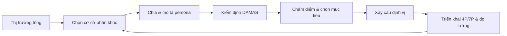

# Tập 1 · Chương 2 — STP: Phân khúc, Chọn thị trường mục tiêu & Định vị

> **Đối tượng:** Nhà sáng lập, CMO, marketer, sinh viên Marketing · **Thời lượng đọc ước tính:** 35–45 phút · **Phiên bản:** v1.0 (2026)

---

## Giới thiệu

Không một thương hiệu nào đủ nguồn lực để phục vụ tất cả mọi người theo cách tốt nhất. Đây là chân lý nền tảng của Marketing hiện đại: khi bạn cố gắng làm hài lòng tất cả, bạn thường chẳng làm hài lòng ai một cách trọn vẹn. STP — **Segmentation (Phân khúc) – Targeting (Chọn thị trường mục tiêu) – Positioning (Định vị)** — chính là bộ ba tư duy giúp doanh nghiệp trả lời ba câu hỏi sống còn: *Thị trường có những nhóm khách hàng nào? Ta nên tập trung vào nhóm nào? Và trong tâm trí nhóm đó, ta muốn được ghi nhớ là gì?*

Chương này sẽ dẫn bạn đi từ khái niệm gốc rễ đến quy trình triển khai thực chiến. Bạn sẽ gặp cả tư duy kinh điển của Al Ries, Jack Trout, Philip Kotler lẫn góc phản biện sắc bén của Byron Sharp — để không rơi vào cái bẫy "học thuộc lý thuyết" mà mất khả năng nghi ngờ. Mục tiêu cuối cùng: bạn có thể mở một file trắng và tự xây một chiến lược STP hoàn chỉnh cho sản phẩm của mình ngay sau khi đọc xong.

## Khái niệm

**STP** là một quy trình chiến lược gồm ba bước liên tiếp:

- **Segmentation (Phân khúc thị trường):** Chia một thị trường lớn, không đồng nhất thành các nhóm nhỏ (phân khúc) có đặc điểm, nhu cầu hoặc hành vi tương đồng.
- **Targeting (Chọn thị trường mục tiêu):** Đánh giá độ hấp dẫn của từng phân khúc và quyết định tập trung nguồn lực vào một hoặc một số phân khúc.
- **Positioning (Định vị):** Thiết kế hình ảnh và giá trị của thương hiệu sao cho chiếm được một vị trí khác biệt, đáng giá trong tâm trí khách hàng mục tiêu.

Ba khái niệm này gắn chặt với nhau như một chuỗi nhân quả: *phân khúc sai → chọn nhầm mục tiêu → định vị lệch*. Ngược lại, một phân khúc sắc bén tạo tiền đề cho việc chọn mục tiêu đúng và định vị mạnh.

Cần phân biệt: **phân khúc** là hoạt động phân tích thị trường (khách quan, dựa trên dữ liệu); **định vị** là hoạt động chiến lược truyền thông và thiết kế giá trị (chủ quan, mang tính sáng tạo và cạnh tranh).

## Lịch sử hình thành

- **1956:** Wendell R. Smith công bố bài báo *"Product Differentiation and Market Segmentation as Alternative Marketing Strategies"* trên *Journal of Marketing*, thường được xem là điểm khởi đầu học thuật của khái niệm phân khúc.
- **Thập niên 1960–1970:** Philip Kotler hệ thống hóa STP trong bộ giáo trình *Marketing Management*, biến nó thành khung chuẩn giảng dạy toàn cầu.
- **1969–1972:** Al Ries và Jack Trout giới thiệu khái niệm *"Positioning"* qua loạt bài trên tạp chí *Advertising Age*, sau đó tập hợp thành cuốn *Positioning: The Battle for Your Mind* (1981). Luận điểm cốt lõi: định vị không phải là điều bạn làm với sản phẩm, mà là điều bạn làm với *tâm trí khách hàng tiềm năng*.
- **2010:** Byron Sharp xuất bản *How Brands Grow* (Ehrenberg-Bass Institute), đưa ra góc nhìn thực nghiệm phản biện một phần lý thuyết định vị và phân khúc truyền thống (trình bày chi tiết ở mục "Sai lầm thường gặp" và "Mô hình").

*(Các mốc trên là dữ kiện lịch sử về tác giả và ấn phẩm; xem mục Nguồn tham khảo.)*

## Tại sao quan trọng

STP quan trọng vì nó là *cầu nối giữa nghiên cứu thị trường và marketing hỗn hợp (4P/7P)*. Không có STP, mọi quyết định về sản phẩm, giá, kênh phân phối và truyền thông đều thiếu điểm neo.

| Nếu KHÔNG làm STP | Nếu làm STP tốt |
|---|---|
| Thông điệp chung chung, "nói với tất cả" | Thông điệp sắc, chạm đúng nhóm |
| Ngân sách phân tán, ROI thấp | Nguồn lực tập trung, hiệu suất cao |
| Cạnh tranh bằng giá | Cạnh tranh bằng giá trị & sự khác biệt |
| Dễ bị "vô hình" trên thị trường | Có chỗ đứng rõ trong tâm trí |

**Phân tích:** Với doanh nghiệp nhỏ và startup, STP còn quan trọng hơn với tập đoàn — vì nguồn lực hạn chế buộc bạn phải chọn một trận địa để thắng, thay vì dàn quân trên toàn mặt trận và thua ở mọi nơi.

## Nguyên lý hoạt động

STP vận hành theo nguyên lý **"tập trung để khác biệt"**. Sơ đồ luồng:

```
THỊ TRƯỜNG TỔNG      →   PHÂN KHÚC        →   CHỌN MỤC TIÊU     →   ĐỊNH VỊ
(không đồng nhất)        (nhóm tương đồng)     (nhóm hấp dẫn)        (vị trí trong tâm trí)

   ▢▢▢▢▢▢▢▢▢▢          ▢▢▢ | ▣▣▣ | ▢▢▢       →  [ ▣▣▣ ]          "Thương hiệu X = ______"
   trộn lẫn              chia thành nhóm       chọn nhóm thắng      1 ý niệm sở hữu được
```

Ba nguyên lý con:

1. **Nguyên lý đồng nhất bên trong – khác biệt bên ngoài:** Người trong cùng một phân khúc phải giống nhau về nhu cầu; các phân khúc phải khác nhau đủ để đối xử khác nhau.
2. **Nguyên lý đánh đổi:** Chọn mục tiêu này nghĩa là chấp nhận buông mục tiêu kia. Không có đánh đổi thì không có chiến lược.
3. **Nguyên lý sở hữu tâm trí:** Theo Ries & Trout, tâm trí con người có hạn; thương hiệu thắng là thương hiệu chiếm được *một từ khóa* trước đối thủ (ví dụ Volvo = "an toàn").

## Mô hình

**Mô hình 1 — Tháp STP cổ điển (Kotler):** ba tầng Segmentation → Targeting → Positioning như đã mô tả.

**Mô hình 2 — Ba chiến lược chọn mục tiêu:**

```
[ Undifferentiated ]  → 1 thông điệp cho toàn thị trường (marketing đại chúng)
[ Differentiated ]    → nhiều thông điệp cho nhiều phân khúc (đa phân khúc)
[ Concentrated/Niche ]→ dồn toàn lực vào 1 phân khúc ngách
```

**Mô hình 3 — Góc phản biện của Byron Sharp (đối chiếu):** Dựa trên dữ liệu thực nghiệm của Ehrenberg-Bass Institute, Sharp lập luận rằng:
- Các thương hiệu cạnh tranh thường có tập khách hàng *chồng lấn* nhiều hơn ta tưởng; phân khúc "sạch, tách biệt" phần lớn là ảo tưởng.
- Tăng trưởng đến chủ yếu từ *mở rộng độ phủ (penetration)* — thu hút nhiều người mua nhẹ (light buyers) — hơn là từ việc "khóa chặt" một phân khúc trung thành.
- Ông đề cao **mental availability** (dễ được nhớ đến) và **physical availability** (dễ mua được) hơn là định vị khác biệt tinh vi.

**Cách dung hòa (phân tích của Hội đồng biên soạn):** STP không sai, nhưng đừng tuyệt đối hóa "sự khác biệt". Một chiến lược khỏe cần *vừa* có định vị rõ ràng (để dễ nhớ) *vừa* theo đuổi độ phủ rộng và độ sẵn có (để dễ mua). Hai trường phái bổ sung nhau nhiều hơn là loại trừ.

## Framework

Ba framework thực chiến nên nắm:

**A. Cơ sở phân khúc (4 nhóm biến số):**

| Nhóm biến | Ví dụ tiêu chí |
|---|---|
| Địa lý (Geographic) | Vùng miền, thành thị/nông thôn, khí hậu |
| Nhân khẩu (Demographic) | Tuổi, giới, thu nhập, nghề, học vấn |
| Tâm lý (Psychographic) | Lối sống, giá trị, tính cách |
| Hành vi (Behavioral) | Dịp mua, lợi ích tìm kiếm, mức độ trung thành, tần suất |

**B. Kiểm định phân khúc — tiêu chí DAMAS (mở rộng từ Kotler):** một phân khúc tốt phải:
- **D**istinguishable — phân biệt được với nhóm khác
- **A**ccessible — tiếp cận được qua kênh truyền thông/phân phối
- **M**easurable — đo lường được quy mô và sức mua
- **A**ctionable — đủ khả năng để doanh nghiệp phục vụ
- **S**ubstantial — đủ lớn để sinh lời

**C. Positioning Statement (Kotler) — khung câu định vị:**
> *"Đối với [khách hàng mục tiêu], thương hiệu [X] là [khung tham chiếu/ngành hàng] mang lại [lợi ích khác biệt] bởi vì [lý do tin tưởng]."*

## Công thức

**Công thức câu định vị (điền vào chỗ trống):**

```
Với ______________ (đối tượng mục tiêu)
đang cần _________ (nhu cầu/pain point)
[Thương hiệu] là __ (khung tham chiếu)
mang lại _________ (điểm khác biệt / lợi ích cốt lõi)
khác với _________ (đối thủ chính)
nhờ ______________ (Reason To Believe – lý do tin tưởng).
```

**Công thức đánh giá độ hấp dẫn phân khúc (định tính, dùng để chấm điểm nội bộ):**

```
Điểm hấp dẫn = f(Quy mô × Tốc độ tăng trưởng × Biên lợi nhuận)
                ────────────────────────────────────────────────
                (Cường độ cạnh tranh × Rào cản gia nhập của ta)
```

> Lưu ý: đây là công thức *khái niệm* để tư duy có hệ thống, không phải công thức toán học có hằng số cố định. Hãy tự gán trọng số theo ngành của bạn.

## Quy trình

Quy trình 7 bước triển khai STP:

1. **Xác định thị trường tổng** cần phân tích (định nghĩa ngành hàng và ranh giới).
2. **Chọn cơ sở phân khúc** phù hợp (địa lý/nhân khẩu/tâm lý/hành vi hoặc kết hợp).
3. **Chia phân khúc và mô tả chân dung** từng nhóm (persona).
4. **Kiểm định phân khúc** bằng tiêu chí DAMAS, loại bỏ nhóm không đạt.
5. **Chấm điểm & chọn mục tiêu** theo độ hấp dẫn và độ phù hợp với năng lực.
6. **Xây câu định vị** cho phân khúc mục tiêu (Positioning Statement).
7. **Triển khai xuống 4P/7P** và bản đồ định vị, rồi đo lường – điều chỉnh.



## Ví dụ đơn giản

**Một quán cà phê mới mở ở khu văn phòng.**

- **Phân khúc:** thị trường "người uống cà phê" chia thành: (1) dân văn phòng cần mua nhanh buổi sáng, (2) freelancer cần chỗ ngồi làm việc lâu, (3) nhóm bạn tụ tập cuối tuần.
- **Chọn mục tiêu:** với quán nhỏ 20 chỗ gần tòa nhà văn phòng, chọn nhóm (1) — dân văn phòng mua mang đi buổi sáng.
- **Định vị:** *"Ly cà phê ngon, lấy nhanh dưới 3 phút cho buổi sáng bận rộn."* Từ đó suy ra 4P: menu gọn, quầy pickup riêng, app đặt trước, khuyến mãi khung 7–9h.

Bài học: cùng một cái quán, ba lựa chọn phân khúc dẫn tới ba mô hình vận hành hoàn toàn khác nhau.

## Ví dụ doanh nghiệp

**Marriott International** vận hành đa thương hiệu theo chiến lược *differentiated targeting*: mỗi thương hiệu con phục vụ một phân khúc khác nhau — Ritz-Carlton (siêu cao cấp), Marriott (cao cấp công tác), Courtyard (khách công tác tầm trung), Fairfield (tiết kiệm). Cùng một tập đoàn nhưng mỗi nhãn có định vị, mức giá và trải nghiệm riêng, tránh việc một thương hiệu phải "gánh" mọi phân khúc. *(Dữ kiện về danh mục thương hiệu; chi tiết cơ cấu có thể thay đổi theo thời gian — cần kiểm chứng khi trích số liệu.)*

**Phân tích:** đây là minh họa kinh điển cho việc dùng *kiến trúc thương hiệu* (house of brands) để phủ nhiều phân khúc mà không làm loãng định vị của từng nhãn.

## Ví dụ Việt Nam

**Vinamilk** áp dụng *differentiated targeting* trong danh mục sữa: dòng cho trẻ em, dòng Organic cho nhóm quan tâm sức khỏe/thu nhập cao, dòng sữa cho người lớn tuổi (canxi/ít đường), sữa hạt cho nhóm ăn thực vật. Mỗi dòng có bao bì, thông điệp và điểm giá riêng.

**Biti's Hunter (chiến dịch "Đi để trở về", ~2016–2017):** tái định vị Biti's từ hình ảnh "bền, cho người lớn tuổi" sang thương hiệu sneaker cho giới trẻ Việt yêu xê dịch. Đây là ví dụ *repositioning* thành công nhờ chọn đúng phân khúc (Gen Z, người trẻ) và gắn thương hiệu với một cảm xúc (hành trình – trở về). *(Diễn giải định tính; con số doanh thu cụ thể cần kiểm chứng.)*

**Thế Giới Di Động → Điện Máy Xanh → Bách Hóa Xanh:** một tập đoàn tách thành ba chuỗi, mỗi chuỗi nhắm một nhu cầu và tần suất mua khác nhau (điện thoại – điện máy – thực phẩm tươi hằng ngày), thay vì nhồi mọi thứ vào một cửa hàng.

## Ví dụ quốc tế

**Volvo = "An toàn":** ví dụ định vị được Ries & Trout dẫn nhiều lần. Trong nhiều thập niên, Volvo sở hữu từ khóa "safety" trong tâm trí người mua xe — minh chứng cho nguyên lý "chiếm một từ".

**Tesla:** định vị ban đầu không phải "xe điện giá rẻ cho tất cả" mà là *xe thể thao điện cao cấp, hiệu năng cao* nhắm nhóm khách công nghệ – thu nhập cao (Roadster, Model S), rồi mới mở rộng xuống phân khúc phổ thông hơn (Model 3). Đây là chiến lược *concentrated → mở rộng* điển hình.

**Dove — "Real Beauty":** định vị dựa trên *tâm lý và giá trị* (vẻ đẹp thật, tự tin) thay vì thuộc tính sản phẩm thuần túy, nhắm nhóm phụ nữ mệt mỏi với chuẩn đẹp phi thực tế.

## Sai lầm thường gặp

| # | Sai lầm | Hệ quả |
|---|---|---|
| 1 | Phân khúc quá nhỏ, không đủ lớn để sinh lời | "Ngách chết", không đủ doanh thu |
| 2 | Phân khúc chỉ dựa trên nhân khẩu, bỏ qua hành vi & nhu cầu | Nhóm không đồng nhất về nhu cầu thật |
| 3 | Chọn mục tiêu nhưng không dám buông nhóm khác | Định vị nhòe, thông điệp chung chung |
| 4 | Định vị dựa trên điều *ta thích*, không phải điều khách hàng *quan tâm* | Không ai nhớ, không tạo khác biệt |
| 5 | Định vị "khác biệt" nhưng không có Reason To Believe | Bị xem là nói suông |
| 6 | Đổi định vị liên tục theo mốt | Xóa sạch trí nhớ thương hiệu đã tích lũy |
| 7 | Tuyệt đối hóa định vị mà quên độ phủ & độ sẵn có (bẫy mà Byron Sharp cảnh báo) | Thương hiệu "khác biệt" nhưng khó nhớ, khó mua → không tăng trưởng |

**Ghi chú đối chiếu:** Sai lầm #7 chính là điểm mấu chốt trong tranh luận Ries/Trout vs. Sharp. Bài học thực chiến: hãy định vị rõ *và* đầu tư cho việc dễ nhớ – dễ mua.

## Checklist

- [ ] Đã định nghĩa rõ ranh giới thị trường/ngành hàng?
- [ ] Đã chọn cơ sở phân khúc phù hợp (không chỉ nhân khẩu)?
- [ ] Mỗi phân khúc có persona rõ ràng và tên gọi dễ nhớ?
- [ ] Từng phân khúc đạt đủ tiêu chí DAMAS?
- [ ] Đã chấm điểm độ hấp dẫn và chọn mục tiêu có căn cứ?
- [ ] Đã dám *buông* các nhóm ngoài mục tiêu?
- [ ] Câu định vị có đủ: đối tượng – khung tham chiếu – khác biệt – RTB?
- [ ] Điểm khác biệt có *quan trọng với khách hàng* và *ta làm tốt hơn đối thủ*?
- [ ] Có bản đồ định vị so với đối thủ chính?
- [ ] Định vị đã được triển khai nhất quán xuống 4P/7P?
- [ ] Đã cân nhắc cả độ phủ và độ sẵn có (không chỉ khác biệt)?

## SOP

**SOP — Xây dựng chiến lược STP (chu kỳ rà soát: 6–12 tháng/lần)**

1. **Chuẩn bị dữ liệu** (Tuần 1): thu thập dữ liệu bán hàng, khảo sát khách hàng, social listening, phỏng vấn định tính 8–12 khách.
2. **Workshop phân khúc** (Tuần 2): dùng framework 4 nhóm biến số, chia phân khúc, dựng persona.
3. **Kiểm định DAMAS** (Tuần 2): loại phân khúc không đạt, giữ 3–5 nhóm khả thi.
4. **Chấm điểm & chọn mục tiêu** (Tuần 3): dùng công thức độ hấp dẫn, ban lãnh đạo quyết định.
5. **Xây định vị** (Tuần 3): viết Positioning Statement, vẽ bản đồ định vị.
6. **Chuyển giao 4P/7P** (Tuần 4): brief cho các phòng sản phẩm, giá, kênh, truyền thông.
7. **Đo lường** (liên tục): theo dõi KPI ở mục dưới; rà soát định kỳ.

*Người chịu trách nhiệm:* CMO/Head of Marketing chủ trì; có sự tham gia của Sales, R&D, Tài chính.

## KPI

| Bước STP | KPI gợi ý |
|---|---|
| Phân khúc | Số phân khúc đạt DAMAS; độ rõ của persona |
| Targeting | Quy mô phân khúc mục tiêu; tốc độ tăng trưởng; biên lợi nhuận dự phóng |
| Định vị – nhận biết | Brand awareness (aided/unaided); mental availability |
| Định vị – liên tưởng | Tỷ lệ khách gắn thương hiệu với từ khóa mục tiêu; NPS |
| Hiệu quả kinh doanh | Thị phần trong phân khúc; market penetration; CAC; CLV; tỷ lệ chuyển đổi |

> Nguyên tắc: mỗi KPI phải gắn với *một* mục tiêu của STP, tránh đo dàn trải. Nên đo cả chỉ số *nhận thức* (awareness, liên tưởng) lẫn *kết quả* (thị phần, doanh thu).

## Biểu mẫu

**Biểu mẫu 1 — Bảng mô tả phân khúc**

| Tiêu chí | Phân khúc A | Phân khúc B | Phân khúc C |
|---|---|---|---|
| Tên gọi / persona | | | |
| Cơ sở phân khúc chính | | | |
| Nhu cầu / pain point | | | |
| Quy mô ước tính | | | |
| Sức mua | | | |
| Kênh tiếp cận | | | |
| Đạt DAMAS? (Đ/K) | | | |
| Điểm hấp dẫn (1–10) | | | |

**Biểu mẫu 2 — Câu định vị (Positioning Statement)**

| Thành phần | Nội dung điền |
|---|---|
| Đối tượng mục tiêu | |
| Nhu cầu / bối cảnh | |
| Khung tham chiếu (ngành hàng) | |
| Điểm khác biệt cốt lõi | |
| Đối thủ chính | |
| Reason To Believe (RTB) | |
| **Câu định vị hoàn chỉnh** | |

## Prompt AI

> Thay các phần trong [ ] bằng thông tin thật của bạn trước khi chạy.

**ChatGPT (GPT-4/5 – brainstorm & cấu trúc):**
> "Bạn là chuyên gia chiến lược Marketing. Sản phẩm của tôi là [mô tả]. Thị trường: [mô tả]. Hãy đề xuất 4–5 cách phân khúc theo địa lý, nhân khẩu, tâm lý, hành vi; với mỗi phân khúc, mô tả persona và pain point; rồi chấm điểm độ hấp dẫn theo quy mô–tăng trưởng–cạnh tranh và đề xuất phân khúc nên chọn, giải thích lý do."

**Claude (lập luận sâu & phản biện):**
> "Đóng vai Hội đồng phản biện chiến lược. Đây là chiến lược STP hiện tại của tôi: [dán]. Hãy: (1) chỉ ra các giả định ngầm chưa được kiểm chứng; (2) đối chiếu với góc nhìn Byron Sharp về penetration và mental/physical availability; (3) nêu 3 rủi ro lớn nhất và cách kiểm chứng bằng dữ liệu."

**Gemini (tổng hợp thị trường & đa nguồn):**
> "Tổng hợp thông tin công khai về hành vi tiêu dùng của [nhóm khách hàng] tại [thị trường/Việt Nam]. Phân nhóm theo nhu cầu và trích dẫn nguồn cho từng nhận định. Nếu không chắc chắn, hãy ghi rõ mức độ tin cậy."

**Perplexity (tra cứu có nguồn):**
> "Tìm các báo cáo, khảo sát và số liệu về quy mô và xu hướng của [ngành hàng] tại [thị trường], kèm nguồn và năm xuất bản. Chỉ trả về thông tin có nguồn kiểm chứng được, ghi rõ năm."

**NotebookLM (phân tích tài liệu nội bộ):**
> "Dựa trên các tài liệu tôi tải lên (khảo sát khách hàng, báo cáo bán hàng), hãy trích xuất các phân khúc khách hàng nổi bật, dẫn chứng bằng trích đoạn từ tài liệu gốc, và tổng hợp thành bảng persona."

**AI Agent (tự động hóa quy trình):**
> "Mục tiêu: xây dựng draft chiến lược STP cho [sản phẩm]. Bước 1: thu thập dữ liệu thị trường từ nguồn công khai (ghi nguồn). Bước 2: đề xuất phân khúc và kiểm định DAMAS. Bước 3: chấm điểm và chọn mục tiêu. Bước 4: viết Positioning Statement. Bước 5: xuất bảng biểu mẫu đã điền. Dừng lại xin xác nhận của tôi sau mỗi bước quan trọng."

## Bài tập

1. **Cơ bản:** Chọn một sản phẩm bạn đang dùng hằng ngày. Viết 3 phân khúc thị trường của nó và mô tả persona cho từng nhóm.
2. **Trung cấp:** Với một quán ăn/thương hiệu địa phương bạn biết, hãy dựng bảng Biểu mẫu 1 (mô tả phân khúc) đầy đủ và chấm điểm DAMAS.
3. **Nâng cao:** Viết câu định vị hoàn chỉnh cho startup giả định của bạn theo Biểu mẫu 2, rồi tự phản biện: điểm khác biệt này có *quan trọng với khách* và *bền vững trước đối thủ* không?
4. **Phản biện:** Đọc lập luận của Byron Sharp ở mục "Mô hình". Viết một đoạn 200 từ tranh luận: với sản phẩm của bạn, nên nghiêng về "định vị khác biệt" hay "độ phủ rộng"? Vì sao?

## Câu hỏi ôn tập

1. STP là viết tắt của những từ nào và mối quan hệ nhân quả giữa chúng ra sao?
2. Nêu 4 nhóm cơ sở phân khúc và cho một ví dụ mỗi nhóm.
3. Tiêu chí DAMAS gồm những gì? Vì sao "Substantial" quan trọng với startup?
4. Phân biệt ba chiến lược targeting: undifferentiated, differentiated, concentrated.
5. Theo Ries & Trout, "định vị" thực chất diễn ra ở đâu và tại sao "chiếm một từ" lại quan trọng?
6. Byron Sharp phản biện lý thuyết định vị ở những điểm nào? Ta nên dung hòa ra sao?
7. Một câu định vị (Positioning Statement) đầy đủ gồm những thành phần nào?

## Case Study

**Thành công — Biti's Hunter (Việt Nam):** Trước 2016, Biti's bị nhận diện là thương hiệu giày "bền, cho thế hệ trước". Bằng việc *chọn lại phân khúc* (giới trẻ, Gen Z yêu du lịch) và *định vị lại* quanh cảm xúc "Đi để trở về" (hợp tác cùng MV nhạc trẻ đang viral), Biti's Hunter tạo được liên tưởng mới, tươi trẻ. **Vì sao thành công:** phân khúc rõ, định vị gắn với cảm xúc mạnh và đúng nền tảng (mạng xã hội, âm nhạc), lại đúng thời điểm văn hóa. *(Phân tích định tính; số liệu doanh thu cụ thể cần kiểm chứng.)*

**Thất bại — bài học từ New Coke (Coca-Cola, 1985):** Coca-Cola thay đổi công thức và định vị sản phẩm cốt lõi để "hợp khẩu vị" theo kết quả thử mù, nhưng bỏ qua *mối liên hệ cảm xúc và bản sắc* mà khách hàng đã gắn với thương hiệu gốc. Phản ứng dữ dội buộc hãng khôi phục "Coca-Cola Classic" chỉ sau khoảng ba tháng. **Vì sao thất bại:** đọc sai nhu cầu thật của phân khúc trung thành (họ mua *bản sắc*, không chỉ *vị*), và thay đổi định vị đã ăn sâu trong tâm trí — đúng cảnh báo của Ries & Trout về việc đừng phá vỡ vị trí đã sở hữu. *(Đây là sự kiện lịch sử được ghi chép rộng rãi.)*

## Tổng kết

- STP là quy trình *phân khúc → chọn mục tiêu → định vị*, cầu nối giữa nghiên cứu thị trường và 4P/7P.
- Phân khúc tốt phải đồng nhất bên trong, khác biệt bên ngoài, và đạt tiêu chí DAMAS.
- Chọn mục tiêu là một *quyết định đánh đổi*: dám buông để tập trung.
- Định vị là cuộc chiến trong *tâm trí khách hàng* (Ries & Trout): hãy sở hữu một ý niệm rõ ràng, đúng điều khách hàng quan tâm, có Reason To Believe.
- **Đừng tuyệt đối hóa "khác biệt":** góc nhìn Byron Sharp nhắc ta rằng độ phủ (penetration), mental availability và physical availability cũng quyết định tăng trưởng. Chiến lược khỏe là *vừa dễ nhớ, vừa dễ mua*.
- Công cụ mang về nhà: quy trình 7 bước, biểu mẫu điền được, câu định vị theo công thức, và bộ KPI đo cả nhận thức lẫn kết quả.

## Nguồn tham khảo

- Ries, A. & Trout, J. *Positioning: The Battle for Your Mind*. McGraw-Hill, 1981.
- Kotler, P. & Keller, K. L. *Marketing Management* (các phiên bản). Pearson.
- Kotler, P. & Armstrong, G. *Principles of Marketing*. Pearson.
- Sharp, B. *How Brands Grow: What Marketers Don't Know*. Oxford University Press (Ehrenberg-Bass Institute), 2010.
- Smith, W. R. "Product Differentiation and Market Segmentation as Alternative Marketing Strategies". *Journal of Marketing*, 1956.
- Trout, J. & Rivkin, S. *Differentiate or Die*. Wiley.

> Ghi chú trích dẫn: Các mốc lịch sử và khung lý thuyết ở trên dựa trên các ấn phẩm có thật liệt kê trong mục này. Các ví dụ doanh nghiệp mang tính minh họa; mọi số liệu định lượng cụ thể cần được kiểm chứng từ báo cáo chính thức trước khi sử dụng trong tài liệu học thuật hay thương mại.

## Cần cập nhật trong tương lai

- **Phân khúc bằng AI & dữ liệu lớn:** cập nhật kỹ thuật clustering, phân khúc theo hành vi thời gian thực, và "segment of one" (cá nhân hóa đến từng người) khi công nghệ dữ liệu tiến hóa.
- **Hậu-cookie & quyền riêng tư:** khi định danh người dùng bị siết (privacy-first), cập nhật cách phân khúc dựa trên dữ liệu first-party và contextual targeting.
- **Định vị trong kỷ nguyên AI search & trợ lý ảo:** khi khách hàng hỏi AI thay vì tự tìm, "mental availability" có thể chuyển thành "AI availability" — thương hiệu được AI gợi ý. Cần bổ sung khung định vị cho ngữ cảnh này.
- **Cập nhật tranh luận học thuật:** theo dõi các nghiên cứu mới của Ehrenberg-Bass và trường phái định vị để cập nhật sự dung hòa hai góc nhìn.
- **Ví dụ Việt Nam mới:** bổ sung case gần thời điểm cập nhật (VinFast tại thị trường quốc tế, các thương hiệu D2C nội địa) kèm số liệu đã kiểm chứng.
