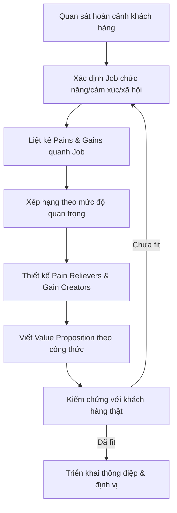

# Tập 1 · Chương 5 — Tuyên bố Giá trị & Jobs To Be Done

*Metadata: Bộ giáo trình "Marketing Thực Chiến 2026–2035" · Tập 1 — Nền tảng & Tư duy · Chương 5 · Cập nhật: 2026-07-25 · Độ dài: ~3.500 từ · Cấp độ: Nền tảng → Vận dụng*

> **Tóm tắt 1 câu:** Chương này dạy bạn cách xác định đúng "công việc" khách hàng cần hoàn thành (Jobs To Be Done) và đóng gói lời hứa giá trị của doanh nghiệp thành một Tuyên bố Giá trị sắc bén bằng Value Proposition Canvas cùng công thức viết chuẩn.

---

## 1. Giới thiệu

Phần lớn sản phẩm thất bại không phải vì kém chất lượng, mà vì chúng giải quyết một vấn đề **không ai thực sự quan tâm**, hoặc mô tả giá trị theo ngôn ngữ mà khách hàng không hiểu. Doanh nghiệp thường say mê tính năng (feature) của chính mình mà quên hỏi câu hỏi cốt lõi: *"Khách hàng đang cố hoàn thành công việc gì trong cuộc sống của họ, và họ 'thuê' sản phẩm của tôi để làm gì?"*

Chương 5 kết nối hai khung tư duy bổ trợ nhau chặt chẽ. **Jobs To Be Done (JTBD)** — do Clayton Christensen phổ biến — giúp ta *nhìn thấy nhu cầu ẩn* đằng sau hành vi mua. **Value Proposition Canvas (VPC)** — của Alexander Osterwalder — giúp ta *chuyển nhu cầu đó thành lời chào giá trị* có thể kiểm chứng. Đây là bản lề nối liền tư duy khách hàng (Chương 3–4) với chiến lược định vị và thông điệp mà các tập sau sẽ khai thác.

*(Phân tích của nhóm biên soạn)* Nắm vững chương này, bạn sẽ ngừng bán "cái khoan" và bắt đầu bán "cái lỗ trên tường" — thậm chí bán "bức tranh treo lên bức tường đó".

## 2. Khái niệm

**Tuyên bố Giá trị (Value Proposition):** lời khẳng định ngắn gọn, rõ ràng về lợi ích mà khách hàng nhận được từ sản phẩm/dịch vụ, lý do sản phẩm đáng mua, và điều khiến nó khác biệt so với lựa chọn thay thế. Đây *không phải* slogan quảng cáo; nó là nền tảng chiến lược mà mọi thông điệp bắt nguồn từ đó.

**Jobs To Be Done (Công việc cần hoàn thành):** khung lý thuyết cho rằng khách hàng không "mua sản phẩm" — họ "thuê" sản phẩm để hoàn thành một công việc (job) phát sinh trong một hoàn cảnh cụ thể. Công việc có ba lớp:

| Lớp job | Ý nghĩa | Ví dụ (mua cà phê sáng) |
|---|---|---|
| Chức năng (functional) | Nhiệm vụ thực dụng cần làm | Tỉnh táo, chống buồn ngủ |
| Cảm xúc (emotional) | Cảm giác muốn có/tránh | Cảm thấy được nuông chiều, giảm căng thẳng |
| Xã hội (social) | Cách muốn được người khác nhìn nhận | Trông sành điệu, thuộc "dân văn phòng thành đạt" |

**Phân biệt Feature – Benefit – Value** *(nền tảng cốt lõi của chương)*:

| Cấp độ | Định nghĩa | Ví dụ (kem chống nắng SPF50+) |
|---|---|---|
| Feature (tính năng) | Sản phẩm *có gì* | Chỉ số SPF50+, PA++++, kết cấu không nhờn |
| Benefit (lợi ích) | Tính năng *làm được gì* | Bảo vệ da khỏi tia UVA/UVB, không bít lỗ chân lông |
| Value (giá trị) | Điều đó *có ý nghĩa gì* với đời sống khách hàng | Tự tin ra nắng cả ngày mà không lo lão hóa/nám |

Khách hàng trả tiền cho **value**, không phải feature.

## 3. Lịch sử hình thành

*(Dữ kiện, có nguồn)*

- **Thập niên 1960:** Theodore Levitt (Harvard) nêu câu nói kinh điển: *"Người ta không muốn mua cái khoan 6mm; họ muốn cái lỗ 6mm."* — hạt giống đầu tiên của tư duy JTBD (Levitt, *Marketing Myopia*, HBR 1960).
- **1990s–2000s:** Clayton Christensen và cộng sự phát triển lý thuyết "Jobs To Be Done" qua nghiên cứu về đổi mới đột phá; câu chuyện "milkshake" nổi tiếng được kể trong nhiều bài giảng và bài viết (Christensen et al., HBS).
- **2005:** Christensen, Anthony, Roth trình bày khung "purpose brand"/jobs trong *Seeing What's Next*.
- **2014:** Alexander Osterwalder, Yves Pigneur và cộng sự xuất bản *Value Proposition Design*, giới thiệu **Value Proposition Canvas** như phần mở rộng của Business Model Canvas (2010).
- **2016:** Christensen, Hall, Dillon, Duncan xuất bản *Competing Against Luck: The Story of Innovation and Customer Choice* — tài liệu JTBD hệ thống nhất, chính thức hóa câu chuyện milkshake.

Hai dòng lý thuyết — JTBD (vì sao khách mua) và VPC (đóng gói giá trị) — hội tụ thành bộ công cụ chuẩn mực của marketing và thiết kế sản phẩm hiện đại.

## 4. Tại sao quan trọng

1. **Tránh "cận thị marketing":** Tập trung vào job giúp bạn nhìn đúng đối thủ cạnh tranh. *(Ví dụ phân tích)* Một quán cà phê không chỉ cạnh tranh với quán khác mà với trà sữa, nước tăng lực, thậm chí một giấc ngủ trưa — nếu job là "tỉnh táo".
2. **Định hướng phát triển sản phẩm:** Biết job giúp ưu tiên tính năng nào thật sự tạo giá trị, tránh lãng phí nguồn lực.
3. **Sắc bén thông điệp & định vị:** Value proposition rõ ràng là "hạt nhân" để viết quảng cáo, landing page, kịch bản bán hàng.
4. **Tăng tỷ lệ chuyển đổi:** Thông điệp nói trúng job và nỗi đau khách hàng dễ cộng hưởng hơn thông điệp liệt kê tính năng.
5. **Cơ sở cho fit sản phẩm – thị trường (product–market fit):** VPC là công cụ trực quan để kiểm tra sản phẩm có "khớp" nhu cầu thật hay không.

## 5. Nguyên lý hoạt động

Cơ chế cốt lõi gồm ba bước liên hoàn:

1. **Quan sát hoàn cảnh (context):** Job luôn xuất hiện trong một tình huống cụ thể ("Tôi đang lái xe 20 phút, đói nhẹ, buồn chán, một tay rảnh"). Hoàn cảnh quyết định job, không phải đặc điểm nhân khẩu học.
2. **Xác định job đa lớp:** Bóc tách job chức năng, cảm xúc, xã hội. Đây là "công việc" khách hàng muốn tiến bộ (make progress) trong đời họ.
3. **Ghép giá trị:** Thiết kế sản phẩm sao cho **pain relievers** (thứ giảm nỗi đau) và **gain creators** (thứ tạo lợi ích mong muốn) khớp chính xác với **pains** và **gains** của khách quanh job đó. Khi hai bên khớp → đạt **fit**.

> Nguyên lý vàng: *Sản phẩm không tự có giá trị. Giá trị chỉ sinh ra khi nó giúp khách hàng hoàn thành một job quan trọng, tốt hơn/rẻ hơn/dễ hơn lựa chọn hiện tại.*

## 6. Mô hình — Value Proposition Canvas

VPC gồm hai nửa: **Hồ sơ khách hàng** (hình tròn) và **Bản đồ giá trị** (hình vuông). Đạt "fit" khi hai nửa khớp nhau.

```
        HỒ SƠ KHÁCH HÀNG (Customer Profile)          BẢN ĐỒ GIÁ TRỊ (Value Map)
        ┌───────────────────────────┐                ┌───────────────────────────┐
        │        GAINS (Lợi ích      │  ◄── khớp ──►  │  GAIN CREATORS            │
        │        mong muốn)          │                │  (Thứ tạo lợi ích)        │
        │                            │                │                           │
        │   ┌──────────────────┐     │                │   ┌───────────────────┐   │
        │   │  CUSTOMER JOBS   │     │  ◄── khớp ──►  │   │  PRODUCTS &       │   │
        │   │ (Công việc cần    │     │                │   │  SERVICES         │   │
        │   │  hoàn thành)     │     │                │   │  (Sản phẩm/DV)    │   │
        │   └──────────────────┘     │                │   └───────────────────┘   │
        │                            │                │                           │
        │        PAINS (Nỗi đau,     │  ◄── khớp ──►  │  PAIN RELIEVERS           │
        │        trở ngại, rủi ro)   │                │  (Thứ giảm nỗi đau)       │
        └───────────────────────────┘                └───────────────────────────┘
                  Ai họ là                                   Ta đề xuất gì
```

**Hồ sơ khách hàng:**
- *Customer Jobs:* việc chức năng/cảm xúc/xã hội cần làm.
- *Pains:* kết quả xấu, rủi ro, trở ngại khi làm job (tốn tiền, mất thời gian, sợ sai...).
- *Gains:* lợi ích mong muốn, kỳ vọng, điều làm khách vui.

**Bản đồ giá trị:**
- *Products & Services:* danh mục sản phẩm/dịch vụ ta cung cấp.
- *Pain Relievers:* cách sản phẩm xóa/giảm nỗi đau.
- *Gain Creators:* cách sản phẩm tạo ra lợi ích khách mong.

## 7. Framework — Tích hợp JTBD vào VPC

Sơ đồ quy trình tư duy tổng thể (mermaid):



**Nguyên tắc ưu tiên:** không cần giải quyết *mọi* pain/gain. Hãy tập trung vào các job **quan trọng, chưa được đáp ứng tốt, và khách sẵn sàng trả tiền** — đây là "điểm ngọt" cho fit.

## 8. Công thức

**Công thức viết Value Proposition kinh điển (Geoffrey Moore, *Crossing the Chasm*):**

```
For [khách hàng mục tiêu]
who [nhu cầu / vấn đề cần giải quyết],
our [tên sản phẩm]
is [danh mục sản phẩm]
that [lợi ích cốt lõi / lý do mua].
Unlike [đối thủ / lựa chọn thay thế],
our product [điểm khác biệt chính].
```

Bản tiếng Việt:

```
Dành cho [khách hàng] đang [nhu cầu/vấn đề],
[sản phẩm] của chúng tôi là [danh mục]
giúp [lợi ích cốt lõi].
Khác với [đối thủ], chúng tôi [điểm khác biệt].
```

**Công thức JTBD job statement (Tony Ulwick / dạng phổ biến):**

```
Khi [hoàn cảnh], tôi muốn [động từ + đối tượng của job],
để tôi có thể [kết quả/tiến bộ mong muốn].
```

Ví dụ: *"Khi lái xe đi làm buổi sáng một mình, tôi muốn một thứ giúp bận rộn cái miệng và no lâu, để tôi không thấy chán và không đói tới trưa."*

**Công thức chuyển Feature → Value:** `Tính năng + "điều đó có nghĩa là bạn..." → Lợi ích + "để bạn cuối cùng..." → Giá trị`.

## 9. Quy trình 7 bước

1. **Chọn phân khúc & hoàn cảnh:** xác định nhóm khách và tình huống job phát sinh.
2. **Phỏng vấn JTBD:** hỏi về lần mua gần nhất, điều gì thúc đẩy ("push"), điều gì hấp dẫn ("pull"), điều gì cản trở.
3. **Lập Customer Profile:** điền jobs, pains, gains; xếp hạng ưu tiên.
4. **Lập Value Map:** liệt kê sản phẩm/dịch vụ, pain relievers, gain creators.
5. **Kiểm tra fit:** nối từng gain creator/pain reliever với gain/pain tương ứng; loại thứ không khớp.
6. **Viết Value Proposition:** áp dụng công thức, tạo 2–3 biến thể.
7. **Kiểm chứng thực địa:** A/B test thông điệp, phỏng vấn, đo phản hồi; lặp lại.

## 10. Ví dụ đơn giản

**Sản phẩm:** bình giữ nhiệt cho dân văn phòng.

- *Job chức năng:* giữ nước nóng/lạnh suốt buổi làm việc.
- *Job cảm xúc:* an tâm, không phải rời bàn nhiều lần.
- *Job xã hội:* trông gọn gàng, "sống xanh", không dùng ly nhựa dùng một lần.
- *Pain:* nước nguội nhanh, đổ tràn trong túi, cồng kềnh.
- *Gain:* giữ nhiệt 12 giờ, nắp chống rò, vừa giá đỡ ly ô tô.

**Value Proposition:** *"Dành cho dân văn phòng bận rộn muốn uống đủ nước nóng/lạnh cả ngày mà không rời bàn, bình giữ nhiệt X giữ nhiệt tới 12 giờ và chống rò tuyệt đối — khác với bình thường mau nguội và dễ tràn."*

Chú ý: thông điệp bán **value** ("uống đủ nước cả ngày, không rời bàn"), không chỉ **feature** ("inox 304, hai lớp chân không").

## 11. Ví dụ doanh nghiệp

**Slack (nền tảng giao tiếp nội bộ)** *(dữ kiện định vị, quan sát công khai)*:

- *Job chức năng:* trao đổi công việc nhóm nhanh, tìm lại thông tin dễ.
- *Pain:* email chậm, hộp thư quá tải, thông tin phân tán.
- *Gain:* giao tiếp tức thời, tích hợp công cụ, giảm số cuộc họp.
- *Định vị nổi tiếng:* Slack từng truyền thông thông điệp gắn với ý tưởng *"be less busy"* / thay thế email nội bộ. *(cần kiểm chứng câu chữ chính xác theo từng giai đoạn)*

**VP tái dựng:** *"Dành cho các đội nhóm ngập trong email và họp hành, Slack là không gian làm việc chung giúp trao đổi tức thời và tìm lại mọi thông tin — khác với email, mọi thứ ở đúng một nơi, theo ngữ cảnh."*

Bài học doanh nghiệp: Slack không bán "phần mềm chat"; nó bán **job "giảm hỗn loạn giao tiếp, làm việc bớt bận rộn"**.

## 12. Ví dụ Việt Nam

**Trường hợp A — Kem chống nắng nội địa (ngành mỹ phẩm, bối cảnh sát với dự án):**

- *Hoàn cảnh:* phụ nữ Việt 25–35, đi làm bằng xe máy dưới nắng gắt, sợ nám/sạm.
- *Job chức năng:* bảo vệ da khỏi tia UV suốt hành trình ngoài trời.
- *Job cảm xúc:* an tâm không lo lão hóa; tự tin về làn da.
- *Job xã hội:* làn da sáng khỏe được đồng nghiệp/khách hàng đánh giá tích cực.
- *Pain:* kem nhờn rít gây bí da, đổ mồ hôi trôi kem, sợ bít mụn.
- *Gain:* thấm nhanh, kiềm dầu, nâng tông nhẹ, an toàn cho da nhạy cảm.

**Value Proposition:** *"Dành cho phụ nữ Việt di chuyển ngoài trời hằng ngày và sợ nám sạm, kem chống nắng [thương hiệu] cho khả năng bảo vệ SPF50+ thấm nhanh, không nhờn rít và kiềm dầu — khác với kem chống nắng thông thường gây bí và trôi khi ra mồ hôi."*

**Trường hợp B — Grab / gọi xe & giao đồ (thị trường Việt Nam):** *(dữ kiện thị trường ai cũng quan sát được)*

- *Job:* di chuyển nhanh/an toàn khi không có phương tiện; hoặc "được ăn món yêu thích mà không phải ra khỏi nhà".
- *Pain (trước đây):* khó bắt taxi, lo bị "chặt chém" giá, chờ lâu.
- *Gain:* biết giá trước, theo dõi tài xế, thanh toán không tiền mặt.
- *Value:* "chủ động, minh bạch, tiện lợi" — chính là điều thay đổi hành vi thị trường, chứ không chỉ "ứng dụng đặt xe".

## 13. Ví dụ quốc tế

**Câu chuyện Milkshake (Christensen, *Competing Against Luck*, 2016)** — ví dụ JTBD kinh điển *(dữ kiện, có nguồn)*:

Một chuỗi đồ ăn nhanh muốn tăng doanh số milkshake. Khảo sát cải tiến sản phẩm theo nhân khẩu học không hiệu quả. Nhóm nghiên cứu quan sát và phát hiện: gần một nửa milkshake được bán **vào buổi sáng sớm**, mua bởi người đi làm **mua mang đi, uống một mình trên xe**. Job họ "thuê" milkshake để làm: **giết thời gian trên quãng đường lái xe dài & buồn chán, giữ no tới trưa, làm bằng một tay**.

Đối thủ thật sự của milkshake buổi sáng không phải milkshake hãng khác — mà là **chuối, bánh donut, thanh bagel**. Milkshake thắng vì đặc, uống lâu hết (giữ bận rộn), không rơi vụn, không làm bẩn tay. Bài học: cùng một sản phẩm có thể được "thuê" cho các job khác nhau ở hoàn cảnh khác nhau (milkshake buổi chiều lại là job "làm bố chiều con") — và cách cải tiến phải theo job, không theo nhân khẩu học.

## 14. Sai lầm thường gặp

| # | Sai lầm | Hệ quả | Cách sửa |
|---|---|---|---|
| 1 | Bán feature thay vì value | Khách không thấy liên quan | Dịch mọi feature sang "điều đó có nghĩa gì với khách" |
| 2 | Nhồi nhét quá nhiều lợi ích | Loãng, không nhớ được | Chọn 1 giá trị cốt lõi nổi bật |
| 3 | Định nghĩa job theo sản phẩm | Bỏ lỡ đối thủ thật sự | Định nghĩa job theo tiến bộ khách muốn đạt |
| 4 | Tự nghĩ pains/gains, không hỏi khách | Canvas "tưởng tượng" | Phỏng vấn JTBD với khách thật |
| 5 | Lẫn nhân khẩu học với hoàn cảnh | Nhắm sai thông điệp | Bắt đầu từ "khi nào/ở đâu", không phải "ai" |
| 6 | Value Proposition = slogan kêu | Thiếu chiều sâu chiến lược | Xây từ canvas trước, câu chữ sau |
| 7 | Bỏ qua job cảm xúc & xã hội | Mất đòn bẩy cảm xúc | Bóc tách đủ 3 lớp job |
| 8 | Không kiểm chứng, không lặp | Fit giả định | A/B test và phỏng vấn liên tục |

## 15. Checklist

- [ ] Đã xác định hoàn cảnh (context) khách hàng cụ thể?
- [ ] Đã bóc tách job chức năng / cảm xúc / xã hội?
- [ ] Đã liệt kê và xếp hạng pains theo mức độ nghiêm trọng?
- [ ] Đã liệt kê và xếp hạng gains theo mức độ mong muốn?
- [ ] Mỗi pain reliever có nối được với một pain thật?
- [ ] Mỗi gain creator có nối được với một gain thật?
- [ ] Value Proposition có nêu rõ khách – nhu cầu – lợi ích – khác biệt?
- [ ] Đã dịch mọi feature quan trọng thành value?
- [ ] Đã kiểm chứng với ít nhất 5 khách hàng thật?
- [ ] Thông điệp đủ ngắn để nhớ trong 10 giây?

## 16. SOP — Quy trình chuẩn xây dựng Value Proposition

1. **Đầu vào:** chọn phân khúc + hoàn cảnh mục tiêu. *(Phụ trách: Marketing lead)*
2. **Nghiên cứu:** thực hiện 5–10 phỏng vấn JTBD; ghi âm, gỡ băng, trích "push/pull/anxiety/habit".
3. **Tổng hợp Customer Profile:** workshop 90 phút, dùng sticky note; xếp hạng jobs/pains/gains.
4. **Dựng Value Map:** đối chiếu danh mục sản phẩm; xác định pain relievers & gain creators.
5. **Đánh giá fit:** đánh dấu mục khớp/không khớp; ghi nhận khoảng trống sản phẩm.
6. **Soạn thảo:** viết 3 biến thể Value Proposition theo công thức Moore.
7. **Kiểm chứng:** landing page A/B test hoặc phỏng vấn 5 khách; đo tỷ lệ hiểu & quan tâm.
8. **Chốt & phổ biến:** đưa VP vào brand book; đồng bộ mọi kênh.
9. **Rà soát định kỳ:** 6 tháng/lần hoặc khi thị trường đổi.

## 17. KPI

*(Các con số dưới đây là "số minh họa" để làm ví dụ ngưỡng, không phải benchmark ngành.)*

| KPI | Ý nghĩa | Ngưỡng tham chiếu (số minh họa) |
|---|---|---|
| Message clarity score | % người test hiểu đúng giá trị sau 10 giây | ≥ 80% |
| Landing page conversion | Tỷ lệ chuyển đổi trang đích | Cải thiện ≥ 20% sau tối ưu VP |
| Problem–resonance rate | % khách xác nhận "đúng vấn đề của tôi" | ≥ 70% |
| Willingness to pay | % khách sẵn sàng trả giá đề xuất | Theo mục tiêu định giá |
| CAC/LTV | Hiệu quả thu hút vs. giá trị vòng đời | LTV/CAC ≥ 3 (tham chiếu phổ biến, cần kiểm chứng theo ngành) |
| Feature adoption của gain creator chính | Khách có thật sự dùng lợi ích cốt lõi? | Theo dõi theo thời gian |

## 18. Biểu mẫu

**Biểu mẫu Customer Profile & Value Map (điền tay):**

```
[PHÂN KHÚC / HOÀN CẢNH]: ______________________________________

CUSTOMER JOBS (xếp hạng 1-5 theo tầm quan trọng)
  Chức năng: ____________________________  [ ][ ][ ][ ][ ]
  Cảm xúc:   ____________________________  [ ][ ][ ][ ][ ]
  Xã hội:    ____________________________  [ ][ ][ ][ ][ ]

PAINS (xếp hạng theo mức nghiêm trọng)          GAINS (theo mức mong muốn)
  1. _______________________                      1. _______________________
  2. _______________________                      2. _______________________
  3. _______________________                      3. _______________________

PRODUCTS & SERVICES: ___________________________________________

PAIN RELIEVERS (nối tới pain #)                 GAIN CREATORS (nối tới gain #)
  1. ______________ → pain __                     1. ______________ → gain __
  2. ______________ → pain __                     2. ______________ → gain __

VALUE PROPOSITION:
  Dành cho ____________ đang ____________,
  [sản phẩm] là ____________ giúp ____________.
  Khác với ____________, chúng tôi ____________.
```

## 19. Prompt AI

Dùng các prompt sau, thay `[...]` bằng thông tin thật.

**ChatGPT (brainstorm JTBD):**
> "Đóng vai chuyên gia Jobs To Be Done. Sản phẩm: [mô tả]. Khách hàng & hoàn cảnh: [context]. Hãy liệt kê job chức năng, cảm xúc, xã hội; kèm 5 pains và 5 gains, xếp hạng ưu tiên và giải thích lý do."

**Claude (dựng Value Proposition Canvas + kiểm chứng logic):**
> "Dựa trên dữ liệu phỏng vấn khách hàng tôi dán dưới đây, hãy điền Value Proposition Canvas (jobs/pains/gains ↔ products/pain relievers/gain creators). Chỉ dùng thông tin có trong dữ liệu, đánh dấu chỗ nào là suy luận. Sau đó viết 3 biến thể Value Proposition theo công thức 'For...who...our...is...that...unlike...'."

**Gemini (nghiên cứu bối cảnh & đối thủ thay thế):**
> "Với job '[phát biểu job]' của khách hàng tại thị trường Việt Nam, hãy liệt kê tất cả 'lựa chọn thay thế' mà khách có thể 'thuê' để hoàn thành job này (kể cả giải pháp phi-sản-phẩm), và phân tích điểm mạnh/yếu từng lựa chọn."

**Perplexity (tìm dữ kiện có nguồn):**
> "Tìm các số liệu và nghiên cứu có trích dẫn về hành vi mua [ngành/sản phẩm] tại Việt Nam giai đoạn gần đây. Nêu rõ nguồn và năm. Đánh dấu thông tin nào chưa được kiểm chứng."

**NotebookLM (tổng hợp từ tài liệu nội bộ):**
> "Từ các bản ghi phỏng vấn khách hàng đã tải lên, hãy trích các câu trực tiếp thể hiện job, pain, gain. Nhóm theo chủ đề và trích dẫn nguyên văn kèm nguồn tài liệu."

**AI Agent (tự động hóa vòng lặp kiểm chứng):**
> "Mục tiêu: tối ưu Value Proposition cho [sản phẩm]. Quy trình: (1) sinh 3 biến thể VP; (2) tạo bản mô tả test cho từng biến thể; (3) đề xuất phương án A/B test trên landing page; (4) tổng hợp giả thuyết cần kiểm chứng và tiêu chí thành công. Xuất ra bảng kế hoạch."

## 20. Bài tập

1. Chọn một sản phẩm bạn dùng hằng ngày. Viết job statement theo mẫu "Khi... tôi muốn... để...".
2. Lấy 3 tính năng bất kỳ của sản phẩm đó và dịch từng cái thành benefit rồi thành value.
3. Điền đầy đủ một Value Proposition Canvas cho sản phẩm/dự án của bạn (dùng biểu mẫu Mục 18).
4. Viết 2 biến thể Value Proposition theo công thức Moore, rồi rút gọn mỗi cái xuống ≤ 20 từ.
5. Liệt kê 5 "lựa chọn thay thế" ngoài ngành mà khách có thể dùng để hoàn thành job của bạn.

## 21. Câu hỏi ôn tập

1. Phân biệt feature, benefit và value bằng ví dụ của riêng bạn.
2. Ba lớp job là gì? Vì sao bỏ qua job cảm xúc/xã hội là sai lầm?
3. Value Proposition Canvas gồm những thành phần nào? "Fit" nghĩa là gì?
4. Câu chuyện milkshake dạy điều gì về việc xác định đối thủ cạnh tranh?
5. Viết lại công thức Value Proposition của Moore bằng trí nhớ.
6. Vì sao nên bắt đầu từ "hoàn cảnh" thay vì "nhân khẩu học"?

## 22. Case Study

**Thành công — Grab tại Đông Nam Á / Việt Nam** *(dữ kiện thị trường công khai; phân tích của nhóm biên soạn)*:
Grab thắng không phải vì "app đẹp hơn" mà vì nắm đúng job "di chuyển chủ động, minh bạch giá, an toàn" trong bối cảnh taxi truyền thống gây lo ngại về giá và độ tin cậy. Pain relievers (báo giá trước, định vị tài xế, đánh giá hai chiều) khớp trực tiếp pains của thị trường. Sau đó Grab mở rộng sang các job kề cận (giao đồ ăn, giao hàng, thanh toán) dựa trên cùng khung "tiện lợi – minh bạch". Bài học: fit job → mở rộng theo job kề cận.

**Thất bại — Google Glass (2013–2015)** *(dữ kiện công khai; phân tích)*:
Google Glass là kỳ tích công nghệ nhưng thất bại thương mại ở thị trường tiêu dùng vì **không gắn với một job đủ quan trọng** mà khách sẵn sàng "thuê" nó, đồng thời tạo **pain xã hội lớn** (bị xem là kỳ quặc, lo ngại quyền riêng tư — biệt danh "Glasshole"). Feature ấn tượng nhưng value mơ hồ và job xã hội bị âm. Bài học: công nghệ mạnh không cứu được value proposition thiếu job rõ ràng; job xã hội có thể là "sát thủ" thầm lặng.

## 23. Tổng kết

- Khách hàng "thuê" sản phẩm để hoàn thành một **job** trong một **hoàn cảnh** cụ thể; job có ba lớp: chức năng, cảm xúc, xã hội.
- **Value Proposition Canvas** khớp jobs/pains/gains (phía khách) với products/pain relievers/gain creators (phía ta); đạt **fit** là mục tiêu.
- Khách trả tiền cho **value**, không phải feature — luôn dịch feature → benefit → value.
- Dùng **công thức Moore** (For...who...our...is...that...unlike...) để đóng gói giá trị thành câu sắc bén.
- Xác định đối thủ theo **job**, không theo danh mục sản phẩm (bài học milkshake).
- Không bao giờ chốt value proposition mà chưa **kiểm chứng với khách hàng thật**; đây là vòng lặp, không phải việc một lần.

## 24. Nguồn tham khảo

*(Không kèm link để tránh dẫn nguồn sai; vui lòng tra cứu theo tên tác giả/tựa/năm.)*

1. Osterwalder, A., Pigneur, Y., Bernarda, G., Smith, A. (2014). *Value Proposition Design*. Wiley.
2. Osterwalder, A., Pigneur, Y. (2010). *Business Model Generation*. Wiley.
3. Christensen, C. M., Hall, T., Dillon, K., Duncan, D. S. (2016). *Competing Against Luck: The Story of Innovation and Customer Choice*. HarperBusiness.
4. Christensen, C. M. et al. "Know Your Customers' Jobs to Be Done." *Harvard Business Review* (2016).
5. Levitt, T. (1960). "Marketing Myopia." *Harvard Business Review*.
6. Moore, G. A. (1991/2014). *Crossing the Chasm*. HarperBusiness — nguồn công thức value positioning statement.
7. Ulwick, A. (2016). *Jobs to Be Done: Theory to Practice*. Idea Bite Press — khung "outcome-driven innovation".
8. Strategyzer — tài liệu và mẫu Value Proposition Canvas *(cần kiểm chứng phiên bản cập nhật)*.

## Cần cập nhật trong tương lai

- Cập nhật số liệu benchmark chuyển đổi và LTV/CAC theo ngành mỹ phẩm/tiêu dùng Việt Nam khi có dữ liệu kiểm chứng.
- Bổ sung tác động của AI cá nhân hóa tới việc phát hiện job "ẩn" theo thời gian thực (2026–2035).
- Cập nhật case study Việt Nam mới (thương hiệu nội địa vừa đạt product–market fit).
- Đối chiếu câu chữ định vị chính xác của Slack/các thương hiệu theo từng giai đoạn (mục cần kiểm chứng).
- Theo dõi biến thể mới của JTBD (Jobs-as-Progress, switch interviews) và công cụ canvas số hóa.
