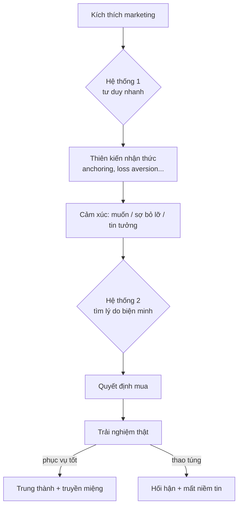

# Tập 2 · Chương 1 — Tâm lý học hành vi & Kinh tế học hành vi trong Marketing

> Đối tượng: Marketer, founder, chủ shop, người mới lẫn CEO · Thời lượng đọc: ~35–45 phút · Phiên bản v1.0 (2026)

---

## 1. Giới thiệu

Mọi quyết định mua hàng đều bắt đầu trong đầu khách hàng — không phải trong bảng tính của bạn. Một người phụ nữ đứng trước quầy mỹ phẩm, cầm hai hộp kem gần như giống hệt nhau về thành phần, nhưng chọn hộp đắt hơn 30%. Một khách hàng thêm sản phẩm vào giỏ chỉ vì thấy dòng chữ "Chỉ còn 2 sản phẩm". Một người từ chối giảm giá 10.000đ nhưng lại vui vẻ khi được tặng "quà trị giá 10.000đ". Nếu con người hoàn toàn lý trí, những điều này không thể xảy ra.

Chương này nói về lý do thật sự khiến người ta mua — không phải lý do họ *nói* ra, mà cơ chế tâm lý vận hành bên dưới. Chúng ta sẽ đi qua hai trụ cột: **Tâm lý học người tiêu dùng (Consumer Psychology)** và **Kinh tế học hành vi (Behavioral Economics)**. Bốn người thầy dẫn đường: Daniel Kahneman (tư duy nhanh/chậm), Richard Thaler (nudge, mental accounting), Robert Cialdini (thuyết phục), và Rory Sutherland (giá trị cảm nhận, "alchemy").

Một lời hứa và một lời cảnh báo ngay từ đầu: những kiến thức này mạnh đến mức có thể dùng để **phục vụ** khách hàng tốt hơn — hoặc **thao túng** họ. Ranh giới đó là chủ đề xuyên suốt chương. Marketing thực chiến 2026–2035 không phải cuộc đua ai lừa giỏi hơn, mà ai hiểu con người sâu hơn để tạo ra lựa chọn mà khách hàng thật sự biết ơn.

---

## 2. Khái niệm

**Tâm lý học người tiêu dùng** là ngành nghiên cứu cách con người suy nghĩ, cảm nhận, ghi nhớ và ra quyết định khi mua sắm và tiêu dùng.

**Kinh tế học hành vi** là nhánh kinh tế học kết hợp tâm lý học, chỉ ra rằng con người *không* ra quyết định thuần lý trí như mô hình "homo economicus" của kinh tế học cổ điển giả định. Thay vào đó, con người bị chi phối bởi các **thiên kiến nhận thức (cognitive biases)** và **lối tắt tư duy (heuristics)** có hệ thống, có thể dự đoán được.

Vài thuật ngữ nền tảng:

| Thuật ngữ | Nghĩa ngắn gọn |
|---|---|
| Heuristic | Lối tắt tư duy, "quy tắc ngón tay cái" giúp ra quyết định nhanh |
| Cognitive bias | Thiên kiến — sai lệch có hệ thống so với logic thuần túy |
| Hệ thống 1 / Hệ thống 2 | Tư duy nhanh (tự động, cảm xúc) / tư duy chậm (nỗ lực, logic) |
| Nudge | "Cú huých" — thay đổi cách trình bày lựa chọn để định hướng hành vi mà không cấm đoán |
| Framing | Đóng khung — cùng một thông tin, cách trình bày khác nhau cho kết quả khác nhau |

Điểm mấu chốt: các sai lệch này **không ngẫu nhiên**. Chúng lặp lại, đo được, và vì thế marketer có thể thiết kế trải nghiệm phù hợp với cách não người thật sự vận hành.

---

## 3. Lịch sử hình thành

Dòng thời gian rút gọn (dữ kiện lịch sử):

- **Thập niên 1950–1970**: Kinh tế học cổ điển thống trị với giả định con người lý trí tối đa hóa lợi ích.
- **1979**: Daniel Kahneman và Amos Tversky công bố *Prospect Theory* — nền móng cho khái niệm **loss aversion** (né tránh mất mát). Đây là bước ngoặt học thuật.
- **1984**: Robert Cialdini xuất bản *Influence: The Psychology of Persuasion*, hệ thống hóa các nguyên tắc thuyết phục từ nghiên cứu thực địa.
- **2002**: Kahneman nhận giải Nobel Kinh tế (dù ông là nhà tâm lý học) — dấu mốc thừa nhận kinh tế học hành vi.
- **2008**: Richard Thaler và Cass Sunstein xuất bản *Nudge*, phổ biến khái niệm "kiến trúc lựa chọn" (choice architecture).
- **2011**: Kahneman xuất bản *Thinking, Fast and Slow*, đưa Hệ thống 1 & 2 ra công chúng đại chúng.
- **2017**: Richard Thaler nhận giải Nobel Kinh tế.
- **2019**: Rory Sutherland xuất bản *Alchemy*, mang tư duy hành vi vào thực chiến quảng cáo.

Xu hướng 2020–2035 (phân tích): kinh tế học hành vi chuyển từ "phòng thí nghiệm" sang "mặc định" trong thiết kế sản phẩm số, personalization bằng AI, và ngày càng bị soi dưới lăng kính đạo đức (chống "dark patterns").

---

## 4. Tại sao quan trọng

Với marketer, đây không phải kiến thức trang trí. Ba lý do thực chiến:

1. **Khách hàng không mua theo bảng thông số** — họ mua theo cảm nhận. Rory Sutherland nói (diễn giải): giá trị nằm trong tâm trí, không nằm trong sản phẩm. Hiểu tâm lý = tăng được giá trị cảm nhận mà không tốn thêm chi phí sản xuất.
2. **Cùng ngân sách, hiệu quả khác nhau** — hai landing page cùng sản phẩm, cùng traffic, nhưng cách đóng khung khác nhau có thể chênh lệch tỷ lệ chuyển đổi đáng kể (mức chênh cụ thể *cần kiểm chứng* theo ngành và test thực tế).
3. **Đây là lợi thế bền vững** — thuật toán quảng cáo ai cũng chạy được, nhưng hiểu sâu con người thì khó sao chép.

Sơ đồ định vị chương này trong hành trình khách hàng:

```
Nhận biết → Cân nhắc → Quyết định → Mua → Trung thành
   ▲            ▲           ▲          ▲        ▲
   └── Tâm lý học hành vi tác động ở MỌI điểm chạm ──┘
```

---

## 5. Nguyên lý hoạt động

Trái tim của toàn bộ chương là mô hình **hai hệ thống tư duy** của Kahneman:

| | Hệ thống 1 (Nhanh) | Hệ thống 2 (Chậm) |
|---|---|---|
| Đặc điểm | Tự động, vô thức, tức thì | Có chủ ý, tốn sức, logic |
| Ví dụ | Thấy ảnh đẹp → thích ngay; đọc chữ mẹ đẻ | Tính 17 × 24; so sánh 3 gói bảo hiểm |
| Vai trò mua hàng | Quyết định phần lớn cảm xúc, ấn tượng đầu | Biện minh, kiểm tra lại sau khi đã "muốn" |
| Điểm yếu | Dễ bị thiên kiến chi phối | Lười biếng, mệt là "nhường" cho Hệ thống 1 |

Insight cốt lõi (phân tích): **Hầu hết quyết định mua được Hệ thống 1 khởi phát, rồi Hệ thống 2 tìm lý do biện minh.** Người ta "quyết định bằng cảm xúc, biện minh bằng lý trí". Vì vậy marketing giỏi phải chạm Hệ thống 1 trước (hình ảnh, cảm giác, câu chuyện, niềm tin xã hội), rồi *cung cấp đạn* cho Hệ thống 2 (thông số, đánh giá, bảo hành) để khách tự thuyết phục mình.

Cơ chế của thiên kiến: khi Hệ thống 1 dùng lối tắt, nó tạo ra sai lệch có thể đoán trước. Marketer không "tạo" ra thiên kiến — chúng có sẵn trong não — mà chỉ *thiết kế bối cảnh* để lựa chọn tốt trở nên dễ dàng, tự nhiên.

---

## 6. Mô hình

Dưới đây là bản đồ các thiên kiến quan trọng nhất trong marketing. Đây là "hộp đồ nghề" bạn sẽ dùng suốt sự nghiệp.

| Thiên kiến | Cơ chế | Ứng dụng marketing |
|---|---|---|
| **Anchoring (Neo)** | Số đầu tiên thấy trở thành mốc so sánh | Hiện giá gốc gạch ngang cạnh giá bán |
| **Loss Aversion (Né mất mát)** | Mất 1 đau gấp ~2 lần niềm vui được 1 | "Đừng bỏ lỡ", dùng thử miễn phí rồi sợ mất |
| **Framing (Đóng khung)** | Cách diễn đạt đổi cảm nhận | "95% không tác dụng phụ" thay vì "5% có" |
| **Social Proof (Bằng chứng xã hội)** | Ta làm theo số đông | "10.000 khách đã mua", review, sao đánh giá |
| **Scarcity (Khan hiếm)** | Hiếm = giá trị cao, sợ mất cơ hội | "Còn 3 sản phẩm", "Kết thúc sau 2 giờ" |
| **Endowment (Sở hữu)** | Cái gì đã "của mình" thì định giá cao hơn | Dùng thử, cá nhân hóa, "giỏ hàng của bạn" |
| **Decoy (Mồi nhử)** | Thêm lựa chọn kém để làm nổi lựa chọn đích | Gói 3 giá, gói giữa được thiết kế để "thắng" |
| **Default (Mặc định)** | Người ta ngại đổi lựa chọn có sẵn | Ô đăng ký nhận tin đã tick sẵn (cẩn trọng đạo đức) |

Sơ đồ tư duy tổng:



---

## 7. Framework

### 7.1. Bảy nguyên tắc thuyết phục của Cialdini

Từ *Influence* (Cialdini). Đây là framework thuyết phục được trích dẫn nhiều nhất thế giới:

1. **Reciprocity (Có qua có lại)** — Cho trước, nhận sau. Tặng giá trị (ebook, sample) → khách thấy "nợ".
2. **Commitment & Consistency (Cam kết & nhất quán)** — Ai đã nói "có" bước nhỏ, dễ nói "có" bước lớn.
3. **Social Proof (Bằng chứng xã hội)** — Người khác làm, ta yên tâm làm theo.
4. **Authority (Uy quyền)** — Tin chuyên gia, bằng cấp, chứng nhận.
5. **Liking (Thiện cảm)** — Mua từ người/thương hiệu mình thích, thấy giống mình.
6. **Scarcity (Khan hiếm)** — Sắp hết, giới hạn → hành động ngay.
7. **Unity (Đồng nhất bản sắc)** — Nguyên tắc thứ 7 Cialdini bổ sung năm 2016: "chúng ta là một phe" (cùng quê, cùng cộng đồng, cùng giá trị).

### 7.2. Framework EAST (nudge thực dụng)

Do Behavioural Insights Team (UK) đề xuất — muốn nudge hiệu quả, hãy làm cho hành vi mong muốn:

- **E**asy — Dễ (giảm ma sát, đặt mặc định tốt)
- **A**ttractive — Hấp dẫn (thu hút chú ý, thưởng)
- **S**ocial — Có tính xã hội (cho thấy người khác đã làm)
- **T**imely — Đúng lúc (nhắc đúng thời điểm ra quyết định)

---

## 8. Công thức

Kinh tế học hành vi có vài "công thức" định tính đáng nhớ (lưu ý: đây là mô hình khái niệm, không phải hằng số vật lý):

**Công thức 1 — Prospect Theory (Kahneman & Tversky, 1979):**
```
Nỗi đau mất mát ≈ 2 × Niềm vui được lợi (cùng độ lớn)
```
Hệ số né mất mát thường được nêu quanh mức ~2 (dữ kiện học thuật, con số chính xác thay đổi theo nghiên cứu — *cần kiểm chứng* theo bối cảnh). Hàm ý: đóng khung theo "mất" mạnh hơn "được".

**Công thức 2 — Giá trị cảm nhận (diễn giải Sutherland):**
```
Giá trị cảm nhận = Chất lượng thật + Kỳ vọng + Bối cảnh + Ý nghĩa
```
Bạn có thể tăng vế phải mà không đụng đến chi phí sản xuất — đó là "alchemy".

**Công thức 3 — Xác suất hành động (nudge):**
```
Hành động ↑ khi:  Động lực ↑  ×  (Ma sát ↓)  ×  Đúng thời điểm
```
Muốn tăng chuyển đổi, đừng chỉ tăng động lực — hãy *giảm ma sát*, thường rẻ và hiệu quả hơn.

**Công thức 4 — Neo giá:**
```
Cảm nhận "đắt/rẻ" = Giá thực tế ÷ Giá neo tham chiếu
```

---

## 9. Quy trình

Quy trình 7 bước áp dụng tâm lý hành vi vào một chiến dịch/trang bán:

```
B1. Xác định HÀNH VI mục tiêu (mua? đăng ký? thêm giỏ?)
      ↓
B2. Vẽ hành trình & tìm điểm MA SÁT / DO DỰ của khách
      ↓
B3. Chẩn đoán: điểm đó Hệ thống 1 hay 2 đang cản?
      ↓
B4. Chọn 1–3 nguyên tắc phù hợp (đừng nhồi hết)
      ↓
B5. Thiết kế can thiệp (copy, layout, giá, bằng chứng)
      ↓
B6. A/B TEST — đo thật, không tin cảm tính
      ↓
B7. Kiểm tra ĐẠO ĐỨC: có phục vụ khách không? → nhân rộng
```

Nguyên tắc vàng: **mỗi trang chỉ tối ưu cho một hành vi**, và luôn kết thúc bằng bước kiểm tra đạo đức trước khi scale.

---

## 10. Ví dụ đơn giản

**Anchoring ở quán cà phê.** Menu để size L giá 55.000đ ở trên cùng, size M 45.000đ ở dưới. Con số 55.000đ "neo" khiến 45.000đ thấy hợp lý. Nếu menu chỉ có mỗi size M 45.000đ, khách lại thấy hơi đắt.

**Framing khi bán kem chống nắng.** So sánh:
- Cách A: "Chứa 5% thành phần có thể gây kích ứng nhẹ."
- Cách B: "95% thành phần dịu lành cho da nhạy cảm."

Cùng một sự thật, cách B khiến Hệ thống 1 thấy an tâm hơn ngay lập tức.

**Social proof ở tiệm phở.** Quán đông người xếp hàng → người đi đường nghĩ "chắc ngon" và vào. Quán vắng tanh → dù ngon cũng bị nghi ngờ. Đây là lý do nhiều quán "giữ" khách ngồi khu vực nhìn ra đường.

---

## 11. Ví dụ doanh nghiệp

**Định giá theo mồi nhử (decoy) — kiểu The Economist.** Trong *Predictably Irrational*, Dan Ariely mô tả bảng giá gói đăng ký của The Economist (dữ kiện được ông trích dẫn): (1) chỉ web 59$, (2) chỉ báo giấy 125$, (3) báo giấy + web cũng 125$. Gói (2) là "mồi nhử" — không ai chọn, nhưng nó khiến gói (3) trông như món hời (được thêm web miễn phí). Kết quả trong thử nghiệm của Ariely: đa số chọn gói 125$ đắt nhất. Bỏ mồi nhử đi, lựa chọn dịch chuyển sang gói rẻ. (Đây là ví dụ kinh điển, dùng để minh họa nguyên lý decoy.)

**Amazon & loss aversion + default.** Amazon Prime dùng bản dùng thử miễn phí (endowment: khách "đã có" giao hàng nhanh), phí duy trì tự động (default), và khung "bạn sẽ mất quyền lợi" khi định hủy (loss aversion). Đây là cỗ máy giữ chân dựa trên tâm lý (phân tích).

---

## 12. Ví dụ Việt Nam

**Sàn TMĐT (Shopee, Lazada, TikTok Shop).** Các cơ chế tâm lý hiển hiện: giá gốc gạch ngang (anchoring), đồng hồ đếm ngược flash sale (scarcity + timely), "đã bán 12.000" và đánh giá 5 sao (social proof), voucher "sắp hết lượt" (scarcity). Ngày sale 9.9, 11.11, 12.12 là sự kết hợp khan hiếm + đúng thời điểm ở quy mô quốc gia (dữ kiện quan sát được; hiệu quả doanh số cụ thể *cần kiểm chứng* theo báo cáo từng sàn).

**Livestream bán hàng.** Câu "chốt đơn nhanh tay còn 5 suất giá sốc" là scarcity + social proof (thấy người khác chốt) + timely, kích Hệ thống 1 mua ngay trước khi Hệ thống 2 kịp cân nhắc.

**Highlands, The Coffee House — thẻ tích điểm.** Cơ chế "cam kết & nhất quán" + endowment: khi đã tích được điểm/ly, khách có xu hướng quay lại để "không lãng phí" tiến trình đã có.

**Mỹ phẩm nội địa & sample.** Nhiều thương hiệu mỹ phẩm Việt tặng mẫu thử (reciprocity) và "mini size" — khách đã dùng thấy hợp da (endowment) thì dễ mua full size.

---

## 13. Ví dụ quốc tế

**Google (Nudge Unit & màu nút).** Google từng nổi tiếng với thử nghiệm 41 sắc xanh cho nút để tối ưu click (dữ kiện được báo chí công nghệ đưa tin rộng rãi; chi tiết con số *cần kiểm chứng*). Minh họa việc thiết kế tác động tới Hệ thống 1.

**IKEA effect (endowment biến thể).** Khách tự lắp ráp đồ IKEA → thấy nó "của mình" và định giá cao hơn. Nghiên cứu của Norton, Mochon & Ariely (2011) đặt tên "IKEA effect" (dữ kiện học thuật).

**Nudge tiết kiệm hưu trí (Thaler).** Chương trình "Save More Tomorrow" của Thaler dùng default + tránh mất mát: nhân viên đồng ý *tăng dần* tỷ lệ tiết kiệm theo mỗi lần tăng lương. Vì trích từ khoản lương tăng thêm, họ không "cảm thấy mất". Đây là ví dụ nudge phục vụ lợi ích người dùng (dữ kiện trong *Nudge*).

---

## 14. Sai lầm thường gặp

| # | Sai lầm | Vì sao hại | Cách đúng |
|---|---|---|---|
| 1 | Nhồi hết mọi thiên kiến vào một trang | Gây nhiễu, mất niềm tin, "cảm giác bị lừa" | Chọn 1–3 nguyên tắc phù hợp |
| 2 | Khan hiếm giả ("còn 2 sản phẩm" vĩnh viễn) | Khách phát hiện → mất uy tín, rủi ro pháp lý | Chỉ dùng khan hiếm THẬT |
| 3 | Chỉ chạm Hệ thống 2 (toàn thông số) | Không tạo ham muốn | Chạm cảm xúc trước, số liệu sau |
| 4 | Copy nguyên tắc mà bỏ bối cảnh văn hóa | Cái hợp Mỹ chưa hợp VN | Bản địa hóa, test lại |
| 5 | Tin cảm tính thay vì A/B test | Tối ưu sai hướng | Đo lường thật |
| 6 | Dùng dark pattern (tick sẵn lén lút, phí ẩn) | Ngắn hạn tăng, dài hạn mất khách + rủi ro luật | Minh bạch là chiến lược dài hạn |
| 7 | Neo giá phi lý (gạch giá chưa từng bán) | Sai luật quảng cáo, mất tin | Neo bằng giá tham chiếu thật |

---

## 15. Checklist

Checklist rà soát một landing page / chiến dịch dưới lăng kính hành vi:

- [ ] Đã xác định RÕ một hành vi mục tiêu duy nhất?
- [ ] Ấn tượng đầu (3 giây) có chạm Hệ thống 1 (hình ảnh, lợi ích cảm xúc)?
- [ ] Có bằng chứng xã hội THẬT (review, số liệu, logo)?
- [ ] Có yếu tố uy quyền (chuyên gia, chứng nhận) đúng chỗ?
- [ ] Giá có được neo/đóng khung hợp lý và trung thực?
- [ ] Khan hiếm/thời hạn (nếu có) là THẬT?
- [ ] Đã giảm ma sát tối đa (ít ô form, CTA rõ ràng)?
- [ ] Có "đạn" cho Hệ thống 2 (thông số, FAQ, bảo hành)?
- [ ] Đã kiểm tra: điều này PHỤC VỤ hay THAO TÚNG khách?
- [ ] Có kế hoạch A/B test và chỉ số theo dõi?

---

## 16. SOP

**SOP: Tối ưu chuyển đổi bằng tâm lý hành vi (chu kỳ 2 tuần)**

1. **Ngày 1–2 — Chẩn đoán.** Xem heatmap/analytics, xác định điểm rơi (nơi khách bỏ đi). Ghi lại 3 điểm ma sát lớn nhất.
2. **Ngày 3 — Giả thuyết.** Với mỗi điểm, chọn 1 nguyên tắc hành vi và viết giả thuyết: "Nếu thêm X, chuyển đổi tăng vì Y (thiên kiến Z)".
3. **Ngày 4–5 — Thiết kế biến thể.** Tạo phiên bản B, mỗi lần chỉ đổi 1 yếu tố (để biết cái gì tạo khác biệt).
4. **Ngày 6 — Rà soát đạo đức.** Trưởng nhóm ký duyệt: không dark pattern, không khan hiếm giả, không số liệu bịa.
5. **Ngày 7–13 — Chạy test.** Đủ lưu lượng để có ý nghĩa thống kê (đừng kết luận vội trên vài chục lượt).
6. **Ngày 14 — Kết luận & nhân rộng.** Ghi vào "thư viện insight" nội bộ. Áp dụng cái thắng, lưu cái thua để học.

---

## 17. KPI

Chỉ số theo dõi khi áp dụng tâm lý hành vi:

| KPI | Ý nghĩa | Ghi chú |
|---|---|---|
| Conversion Rate (CR) | % khách thực hiện hành vi mục tiêu | Chỉ số bắc cầu chính |
| Add-to-cart rate | % thêm giỏ | Đo hiệu quả tạo ham muốn |
| Cart abandonment | % bỏ giỏ | Đo ma sát ở khâu chốt |
| AOV (giá trị đơn TB) | Hiệu quả của decoy/anchoring/upsell | |
| CTR trên CTA | Nút bấm có hấp dẫn Hệ thống 1? | |
| Return/refund rate | Cảnh báo thao túng | Cao bất thường = khách hối hận |
| Repeat purchase / LTV | Sức khỏe dài hạn | Thao túng làm LTV giảm |
| Trust/NPS | Niềm tin thương hiệu | "La bàn đạo đức" định lượng |

Nguyên tắc: đừng chỉ nhìn CR ngắn hạn. **Return rate cao + LTV thấp = dấu hiệu bạn đang thao túng, không phục vụ.**

---

## 18. Biểu mẫu

**Biểu mẫu "Behavioral Design Canvas"** (copy vào tài liệu nội bộ):

```
─────────────────────────────────────────────
DỰ ÁN/TRANG: ______________  NGÀY: __________
─────────────────────────────────────────────
1. HÀNH VI MỤC TIÊU (1 câu):
   _______________________________________

2. KHÁCH HÀNG & BỐI CẢNH:
   Họ đang cảm thấy gì trước khi tới đây? ____
   Rào cản tâm lý lớn nhất? ________________

3. HỆ THỐNG NÀO ĐANG CẢN?  [ ] HT1  [ ] HT2

4. NGUYÊN TẮC CHỌN (tối đa 3):
   [ ] Anchoring [ ] Loss aversion [ ] Framing
   [ ] Social proof [ ] Scarcity [ ] Authority
   [ ] Reciprocity [ ] Endowment [ ] Khác:____

5. CAN THIỆP CỤ THỂ:
   _______________________________________

6. GIẢ THUYẾT ĐO LƯỜNG:
   "Nếu ___ thì KPI ___ tăng vì ___"

7. KIỂM TRA ĐẠO ĐỨC:
   [ ] Thông tin có TRUNG THỰC không?
   [ ] Khách có biết ơn khi biết rõ sự thật?
   [ ] Có phải khan hiếm/giá THẬT không?
   Chữ ký duyệt: __________
─────────────────────────────────────────────
```

---

## 19. Prompt AI

Bộ prompt dùng cho các trợ lý AI (ChatGPT, Claude, Gemini, Perplexity, NotebookLM, AI Agent). Luôn nhắc AI ràng buộc đạo đức.

**ChatGPT / Claude — thiết kế landing page:**
> "Bạn là chuyên gia kinh tế học hành vi. Sản phẩm của tôi là [mô tả], khách hàng là [avatar]. Hãy đề xuất 5 can thiệp tâm lý (nêu rõ thiên kiến: anchoring, loss aversion, social proof…) để tăng chuyển đổi landing page. Với mỗi đề xuất: (1) copy mẫu tiếng Việt, (2) thiên kiến vận dụng, (3) cảnh báo nếu có nguy cơ thao túng. Chỉ dùng khan hiếm/số liệu TRUNG THỰC."

**Claude — kiểm toán đạo đức:**
> "Đây là landing page của tôi: [dán]. Đóng vai người bảo vệ người tiêu dùng, chỉ ra mọi 'dark pattern' hoặc thao túng tiềm ẩn, và đề xuất cách sửa để vừa hiệu quả vừa minh bạch."

**Gemini — brainstorm framing:**
> "Cho câu value proposition này: [dán]. Viết 8 cách đóng khung (framing) khác nhau — nhấn 'được' vs 'mất', cụ thể vs cảm xúc — để A/B test. Không phóng đại sai sự thật."

**Perplexity — nghiên cứu có nguồn:**
> "Tổng hợp các nghiên cứu học thuật (kèm tác giả, năm) về hiệu ứng anchoring trong định giá bán lẻ. Nêu rõ độ mạnh bằng chứng và các phản biện."

**NotebookLM — học từ nguồn gốc:**
> "Tải các nguồn: Thinking Fast and Slow, Influence, Nudge, Alchemy. Tạo bản đồ so sánh cách mỗi tác giả nhìn về 'khan hiếm' và 'social proof', kèm trích dẫn trang gốc."

**AI Agent — quy trình tự động:**
> "Mục tiêu: tối ưu trang [URL]. Bước 1: đọc analytics tìm điểm rơi. Bước 2: đề xuất giả thuyết hành vi. Bước 3: soạn biến thể A/B. Bước 4: BẮT BUỘC chạy checklist đạo đức, dừng và hỏi người nếu phát hiện dark pattern. Không tự triển khai thay đổi giá hoặc claim mà chưa có người duyệt."

---

## 20. Bài tập

1. **Săn thiên kiến.** Chụp 5 landing page/quảng cáo bạn gặp hôm nay, chú thích mỗi cái đang dùng thiên kiến nào.
2. **Viết lại framing.** Lấy một câu mô tả sản phẩm của bạn, viết 5 phiên bản đóng khung khác nhau (được/mất, cảm xúc/lý trí).
3. **Thiết kế decoy.** Cho một sản phẩm, thiết kế bảng 3 gói giá sao cho gói giữa là lựa chọn "đích".
4. **Chẩn đoán ma sát.** Đi qua quy trình mua của chính bạn, liệt kê mọi điểm ma sát và đề xuất cách giảm.
5. **Bài tập đạo đức.** Tìm một "dark pattern" thật ngoài đời, mô tả nó thao túng ra sao và viết lại phiên bản minh bạch mà vẫn hiệu quả.

---

## 21. Câu hỏi ôn tập

1. Phân biệt Hệ thống 1 và Hệ thống 2. Trong mua hàng, hệ thống nào thường "quyết" trước?
2. Loss aversion là gì? Nêu một ứng dụng và một cách lạm dụng.
3. Liệt kê 7 nguyên tắc của Cialdini và cho mỗi nguyên tắc một ví dụ Việt Nam.
4. "Nudge" khác "ép buộc" và "thao túng" ở điểm nào?
5. Mental accounting là gì? Vì sao "quà tặng" đôi khi mạnh hơn "giảm giá" cùng giá trị?
6. Nêu 3 dấu hiệu cho thấy bạn đang thao túng chứ không phục vụ khách hàng.
7. Vì sao chỉ nhìn conversion rate ngắn hạn là nguy hiểm?

---

## 22. Case Study

### 22.1. Thành công — "Save More Tomorrow" (Thaler)

**Bối cảnh (dữ kiện, từ *Nudge* và các công bố của Thaler & Benartzi):** Nhiều người Mỹ tiết kiệm hưu trí quá ít vì loss aversion (giảm chi tiêu hiện tại thấy như "mất") và ì trệ (không đổi mặc định).

**Giải pháp:** Chương trình cho nhân viên cam kết trước rằng tỷ lệ tiết kiệm sẽ *tự động tăng* theo mỗi lần tăng lương tương lai. Vì trích từ phần lương *tăng thêm*, lương thực nhận không bao giờ giảm → không kích hoạt cảm giác mất mát.

**Kết quả (dữ kiện được Thaler báo cáo):** Tỷ lệ tiết kiệm của nhóm tham gia tăng mạnh qua vài chu kỳ tăng lương (con số cụ thể tùy nghiên cứu — tra cứu *Nudge* để lấy số chính xác). **Bài học:** nudge tốt là nudge phục vụ chính lợi ích người dùng, dùng đúng loss aversion + default để giúp họ làm điều họ vốn muốn nhưng khó tự làm.

### 22.2. Thất bại / tranh cãi đạo đức — Dark patterns & vụ FTC kiện Amazon

**Bối cảnh (dữ kiện được đưa tin rộng rãi):** Năm 2023, Ủy ban Thương mại Liên bang Mỹ (FTC) đệ đơn kiện Amazon, cáo buộc dùng "dark patterns" khiến việc đăng ký Prime quá dễ nhưng hủy thì rối rắm (quy trình hủy nội bộ được cho là có mật danh "Iliad" vì dài dòng như sử thi). Đến 2025, có dàn xếp/khoản phạt liên quan (chi tiết con số *cần kiểm chứng* theo thông cáo chính thức FTC).

**Phân tích:** Đây là mặt tối khi các nguyên tắc hành vi bị lạm dụng — friction bất đối xứng (dễ vào, khó ra), loss aversion bị đẩy tới mức giữ chân trái ý muốn. Ngắn hạn giữ được doanh thu; dài hạn rước rủi ro pháp lý, phạt tiền và tổn hại niềm tin.

**Bài học đạo đức:** Cùng một công cụ (default, loss aversion) — Thaler dùng để phục vụ, dark pattern dùng để bẫy. **Câu hỏi kiểm chứng vàng: "Nếu khách hàng biết chính xác mình đang bị tác động thế nào, họ vẫn biết ơn hay sẽ tức giận?"** Biết ơn = phục vụ. Tức giận = thao túng.

---

## 23. Tổng kết

Những điều cần khắc cốt:

- Con người **không lý trí thuần túy** — họ quyết định bằng Hệ thống 1 (nhanh, cảm xúc) rồi biện minh bằng Hệ thống 2 (chậm, logic).
- Các **thiên kiến** (anchoring, loss aversion, framing, social proof, scarcity, endowment, decoy, default) có hệ thống và đoán trước được — đó là hộp đồ nghề của marketer.
- **7 nguyên tắc Cialdini** + tư duy **nudge/EAST** cho bạn framework hành động.
- Kỹ thuật giỏi nhất là **giảm ma sát** và **tăng giá trị cảm nhận** (Sutherland), không phải nói to hơn.
- Luôn **A/B test**, đừng tin cảm tính.
- Ranh giới phục vụ ↔ thao túng là câu hỏi sống còn: *"Khách biết rõ rồi vẫn biết ơn chứ?"* Return rate và LTV là la bàn định lượng cho đạo đức.

Marketing thực chiến 2026–2035 thắng bằng thấu hiểu con người sâu hơn đối thủ — và dùng sự thấu hiểu đó để giúp khách chọn đúng, không phải bẫy họ chọn nhầm.

---

## 24. Nguồn tham khảo

Sách nền tảng (có thật):

- Kahneman, Daniel. *Thinking, Fast and Slow*. Farrar, Straus and Giroux, 2011.
- Kahneman, Daniel & Tversky, Amos. "Prospect Theory: An Analysis of Decision under Risk." *Econometrica*, 1979.
- Cialdini, Robert B. *Influence: The Psychology of Persuasion*. (Bản mở rộng có thêm nguyên tắc Unity, 2021.)
- Cialdini, Robert B. *Pre-Suasion*. Simon & Schuster, 2016.
- Thaler, Richard H. & Sunstein, Cass R. *Nudge: Improving Decisions About Health, Wealth, and Happiness*. Yale University Press, 2008 (bản cập nhật "Final Edition", 2021).
- Thaler, Richard H. *Misbehaving: The Making of Behavioral Economics*. W. W. Norton, 2015.
- Sutherland, Rory. *Alchemy: The Dark Art and Curious Science of Creating Magic in Brands, Business, and Life*. William Morrow, 2019.
- Ariely, Dan. *Predictably Irrational*. HarperCollins, 2008.
- Norton, Mochon & Ariely. "The IKEA Effect: When Labor Leads to Love." *Journal of Consumer Psychology*, 2011.

Ghi chú kiểm chứng: Các con số cụ thể (hệ số né mất mát, kết quả chương trình, án phạt FTC) nên tra lại trực tiếp từ nguồn gốc trước khi trích trong tài liệu chính thức. Không dùng link vì tránh dẫn nguồn không ổn định.

---

## Cần cập nhật trong tương lai

- **Neuromarketing & dữ liệu sinh trắc**: eye-tracking, EEG ngày càng rẻ — cập nhật khi có ứng dụng phổ biến tại VN.
- **AI cá nhân hóa thiên kiến theo từng người**: rủi ro thao túng vi mô — cần khung đạo đức mới.
- **Luật bảo vệ người tiêu dùng số của VN**: theo dõi quy định về dark pattern, khan hiếm giả, quảng cáo gạch giá.
- **Số liệu cập nhật**: hệ số loss aversion theo nghiên cứu mới, kết quả án FTC vs Amazon khi có phán quyết cuối.
- **Case study nội địa mới**: bổ sung ví dụ TikTok Shop, livestream, thương hiệu mỹ phẩm Việt khi có dữ liệu công bố chính thức.
- **Kiểm chứng lại** mọi mục đánh dấu "(cần kiểm chứng)" ở các phiên bản sau.
