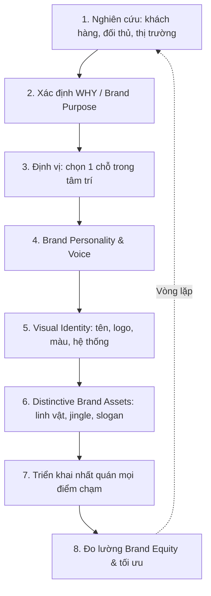

# Tập 3 · Chương 1 — Xây dựng Thương hiệu

> Đối tượng: Founder, CMO, Brand Manager, Marketer mới vào nghề · Thời lượng đọc: ~35–45 phút · Phiên bản: v1.0 (2026)

---

## 1. Giới thiệu

Một sản phẩm có thể bị sao chép trong 3 tháng. Một chiến dịch quảng cáo hay có thể bị bắt chước trong 3 tuần. Nhưng một thương hiệu mạnh — thứ tồn tại trong tâm trí khách hàng — thì gần như không thể sao chép. Đó là lý do các CEO giỏi nhất coi thương hiệu là **tài sản chiến lược dài hạn**, không phải là "logo và slogan".

Chương này là nền móng của Tập 3. Chúng ta sẽ đi từ khái niệm cơ bản (thương hiệu là gì, khác gì sản phẩm) đến các mô hình học thuật kinh điển (Aaker, Keller, Neumeier, Sinek, Sharp), rồi xuống tới quy trình thực chiến: cách xây brand identity, đo lường brand equity, và định vị thương hiệu.

Điểm đặc biệt của chương: chúng ta sẽ **đối chiếu trực diện hai trường phái** đang tranh luận gay gắt trong giới marketing hiện đại — trường phái "Purpose & Differentiation" (Sinek, Aaker: thương hiệu phải khác biệt và có lý do tồn tại) với trường phái "Distinctiveness & Mental Availability" (Byron Sharp: thương hiệu phải dễ nhận ra và dễ mua). Hiểu được cả hai, bạn mới xây thương hiệu tỉnh táo thay vì chạy theo trend.

*Lưu ý đọc:* Phần **dữ kiện** (định nghĩa, mô hình có nguồn) được trình bày trung lập. Phần **phân tích** là suy luận logic từ dữ kiện. Phần **ý kiến** của Hội đồng biên soạn được đánh dấu rõ.

---

## 2. Khái niệm

**Định nghĩa cốt lõi (dữ kiện):**

- **Thương hiệu (Brand):** Không phải logo, không phải sản phẩm. Theo cách diễn đạt nổi tiếng của Marty Neumeier trong *The Brand Gap* (2003), thương hiệu là *"cảm nhận trực giác của một người về một sản phẩm, dịch vụ hoặc tổ chức"* — và vì nó nằm trong tâm trí từng người, nên thương hiệu **thuộc về khách hàng, không thuộc về công ty**. Công ty chỉ kiểm soát được tín hiệu gửi đi; ý nghĩa thì khách hàng tự xây.

Phân biệt các thuật ngữ hay bị nhầm:

| Thuật ngữ | Nghĩa | Ví dụ |
|---|---|---|
| **Product** (sản phẩm) | Thứ được sản xuất trong nhà máy | Nước ngọt có ga |
| **Brand** (thương hiệu) | Thứ khách hàng mua trong tâm trí | "Coca-Cola" — cảm giác sảng khoái, tuổi thơ |
| **Brand Identity** (nhận diện) | Bộ tín hiệu công ty chủ động tạo ra: tên, logo, màu, giọng nói | Màu đỏ, font Spencerian của Coca-Cola |
| **Brand Image** (hình ảnh) | Cách khách hàng thực sự cảm nhận (có thể lệch với identity) | "Coca-Cola = dịp lễ, chia sẻ" |
| **Brand Equity** (tài sản thương hiệu) | Giá trị cộng thêm mà thương hiệu tạo ra cho sản phẩm | Người ta trả nhiều hơn cho lon có chữ Coca-Cola |
| **Brand Positioning** (định vị) | Vị trí thương hiệu chiếm trong tâm trí so với đối thủ | Coca vs Pepsi: "cổ điển" vs "trẻ trung" |

*Ý kiến Hội đồng:* Sai lầm phổ biến nhất của người mới là đánh đồng "làm thương hiệu" với "thiết kế logo". Logo chỉ là phần nổi 5% của tảng băng.

---

## 3. Lịch sử hình thành

**Dòng thời gian (dữ kiện, có bối cảnh):**

- **Cổ đại — nghĩa gốc:** Từ "brand" bắt nguồn từ tiếng Bắc Âu cổ *brandr* nghĩa là "đốt/dấu sắt nung" — dấu chủ nhân đóng lên gia súc để phân biệt sở hữu. Bản chất nguyên thủy của thương hiệu là **phân biệt và xác nhận nguồn gốc**.
- **Cuối thế kỷ 19 — thương hiệu tiêu dùng:** Cách mạng công nghiệp tạo hàng loạt sản phẩm giống nhau. Các thương hiệu đóng gói đầu tiên (như Ivory Soap của P&G, 1879) ra đời để tạo lòng tin ở khoảng cách xa.
- **Thập ni 1950–1960 — kỷ nguyên USP & định vị:** Rosser Reeves đưa ra khái niệm *Unique Selling Proposition*. Sau đó Al Ries & Jack Trout xuất bản *Positioning: The Battle for Your Mind* (1981), đặt nền cho tư duy "chiếm một chỗ trong tâm trí".
- **Thập niên 1990 — kỷ nguyên Brand Equity:** David Aaker (*Managing Brand Equity*, 1991) và Kevin Lane Keller (*Customer-Based Brand Equity model*, 1993) hệ thống hóa việc coi thương hiệu là tài sản đo đếm được.
- **Thập niên 2000 — Brand Gap & Purpose:** Marty Neumeier (*The Brand Gap*, 2003; *Zag*, 2006) nhấn mạnh khác biệt hóa. Simon Sinek (*Start With Why*, 2009) phổ biến "Golden Circle".
- **Thập niên 2010 — phản biện dựa trên dữ liệu:** Byron Sharp (*How Brands Grow*, 2010, dựa trên nghiên cứu của Viện Ehrenberg-Bass) thách thức nhiều "niềm tin" marketing bằng dữ liệu thực nghiệm, đề cao *distinctiveness* và *availability* hơn *differentiation* và *loyalty*.

*Phân tích:* Lịch sử thương hiệu là hành trình từ "dấu sở hữu" → "cam kết chất lượng" → "tài sản tài chính" → "chiến trường dữ liệu". Marketer 2026 cần cả tư duy nghệ thuật (identity, purpose) lẫn tư duy khoa học (đo lường, hành vi mua thực tế).

---

## 4. Tại sao quan trọng

**Với khách hàng (dữ kiện + phân tích):**
- Giảm rủi ro cảm nhận: thương hiệu quen thuộc = an tâm hơn khi mua.
- Giảm chi phí tìm kiếm/ra quyết định: não bộ dùng thương hiệu như "phím tắt".
- Cung cấp ý nghĩa biểu tượng: thể hiện bản thân (một người đi Nike hay đội mũ Trung Nguyên gửi tín hiệu về họ).

**Với doanh nghiệp:**
- **Premium giá:** thương hiệu mạnh cho phép định giá cao hơn sản phẩm tương đương.
- **Phòng thủ cạnh tranh:** khó bị copy hơn tính năng.
- **Hiệu quả marketing:** chi phí thu hút khách hàng (CAC) giảm khi thương hiệu đã có nhận biết.
- **Đòn bẩy mở rộng:** ra sản phẩm mới dễ hơn (brand extension).
- **Tài sản trên bảng cân đối:** thương hiệu là tài sản vô hình, được định giá trong M&A.

*Phân tích:* Trong thị trường mỹ phẩm/GMP (bối cảnh của bộ giáo trình này), sản phẩm dễ bị "trắng nhãn" và sao chép công thức. Thương hiệu chính là hàng rào duy nhất chống lại cuộc đua giảm giá.

---

## 5. Nguyên lý hoạt động

Thương hiệu vận hành trong **tâm trí con người** theo cơ chế trí nhớ liên tưởng. Đây là điểm hội tụ giữa các trường phái.

**Nguyên lý 1 — Mạng lưới liên tưởng (associative network):** Trong trí nhớ, một thương hiệu là một "nút" (node) nối với nhiều nút khác: thuộc tính, cảm xúc, tình huống sử dụng, con người. Nghe "Milo" → nút "năng lượng", "thể thao", "trẻ em", "màu xanh lá". Marketing là hành động **bồi đắp và củng cố các liên kết này**.

**Nguyên lý 2 — Hai loại "khả dụng" (Byron Sharp, dữ kiện):**
- *Mental availability* (khả dụng trong tâm trí): xác suất thương hiệu bật ra trong đầu ở tình huống mua. Được xây bằng **distinctive brand assets** (tài sản nhận diện đặc trưng: màu, linh vật, jingle, slogan).
- *Physical availability* (khả dụng vật lý): thương hiệu dễ tìm, dễ mua ở mọi kênh.

**Nguyên lý 3 — Khác biệt vs Đặc trưng:**
- *Differentiation* (Aaker, Sinek): thương hiệu phải **khác** — lý do lý trí/cảm xúc để chọn.
- *Distinctiveness* (Sharp): thương hiệu chỉ cần **dễ nhận ra là chính nó** — không nhất thiết phải khác về chức năng.

```
        TÂM TRÍ KHÁCH HÀNG
   ┌───────────────────────────┐
   │   [Tình huống mua] ──────┐ │
   │        ▼                 │ │
   │   Thương hiệu nào bật ra?│ │  ← Mental availability
   │        ▼                 │ │
   │   Liên tưởng gì đi kèm?  │ │  ← Brand associations
   │        ▼                 │ │
   │   Có dễ mua không? ──────┘ │  ← Physical availability
   └───────────────────────────┘
```

*Ý kiến Hội đồng:* Đừng chọn phe. Sharp đúng về việc phải **dễ nhớ, dễ mua** (đặc biệt cho hàng tiêu dùng phổ thông). Sinek/Aaker đúng về việc **purpose và khác biệt** tạo sức mạnh cảm xúc và premium (đặc biệt cho hàng cao cấp, ngành cạnh tranh về ý nghĩa). Xây thương hiệu tốt = *distinctive assets* + *một lý do khác biệt đáng nhớ*.

---

## 6. Mô hình

### 6.1. Kim tự tháp CBBE của Kevin Keller (dữ kiện)

Customer-Based Brand Equity — xây từ dưới lên qua 4 tầng, 6 khối:

```
                 ┌───────────────┐
    Tầng 4       │   RESONANCE   │   ← Lòng trung thành, gắn bó
   (Quan hệ)     └───────────────┘
              ┌────────┐   ┌──────────┐
    Tầng 3    │JUDGMENT│   │ FEELINGS │   ← Lý trí + Cảm xúc
   (Phản hồi) └────────┘   └──────────┘
           ┌────────────┐ ┌──────────┐
    Tầng 2 │PERFORMANCE │ │ IMAGERY  │   ← Chức năng + Hình ảnh
   (Ý nghĩa)└───────────┘ └──────────┘
                 ┌───────────────┐
    Tầng 1       │   SALIENCE    │   ← Nhận biết: "Bạn là ai?"
   (Nhận diện)   └───────────────┘
```

Câu hỏi tương ứng từng tầng: (1) Bạn là ai? (2) Bạn là gì? (3) Tôi nghĩ/cảm thấy gì về bạn? (4) Tôi và bạn thế nào? Đỉnh *Resonance* là mục tiêu — khi khách hàng chủ động gắn bó.

### 6.2. Brand Identity Prism của Kapferer (dữ kiện, tham chiếu)

6 mặt: Physique (đặc tính vật lý), Personality (tính cách), Culture (văn hóa/giá trị), Relationship (mối quan hệ), Reflection (hình ảnh khách hàng mong muốn phản chiếu), Self-image (khách tự thấy mình).

### 6.3. Bốn thành tố Brand Equity của Aaker (dữ kiện)

Aaker chia brand equity thành 4 (+1) trụ:
1. **Brand Awareness** (nhận biết)
2. **Brand Associations** (liên tưởng)
3. **Perceived Quality** (chất lượng cảm nhận)
4. **Brand Loyalty** (trung thành)
5. (+ tài sản độc quyền: bản quyền, kênh phân phối, bằng sáng chế)

---

## 7. Framework

### 7.1. Golden Circle — Simon Sinek (dữ kiện)

```
        ┌─────────────┐
        │    WHY      │  ← Niềm tin, lý do tồn tại (bắt đầu từ đây)
        │  ┌───────┐  │
        │  │  HOW  │  │  ← Cách làm khác biệt
        │  │ ┌───┐ │  │
        │  │ │WHAT│ │  │  ← Sản phẩm/dịch vụ
        │  │ └───┘ │  │
        │  └───────┘  │
        └─────────────┘
```
Luận điểm Sinek: *"People don't buy what you do, they buy why you do it."* Apple truyền thông từ WHY ("thách thức hiện trạng") ra ngoài WHAT (máy tính).

### 7.2. Kiến trúc thương hiệu — Branded House vs House of Brands (dữ kiện)

| Tiêu chí | Branded House | House of Brands |
|---|---|---|
| Cấu trúc | 1 thương hiệu mẹ bao trùm | Nhiều thương hiệu con độc lập |
| Ví dụ quốc tế | Google, Apple, FedEx | P&G, Unilever, Masan Consumer |
| Ví dụ Việt Nam | Vingroup → VinFast, Vinhomes, Vinschool | Masan → Chin-su, Nam Ngư, Omachi |
| Ưu điểm | Cộng hưởng, tiết kiệm marketing | Cô lập rủi ro, nhắm nhiều phân khúc |
| Nhược điểm | Rủi ro lan truyền khủng hoảng | Tốn ngân sách cho từng brand |

Giữa hai cực còn có *Endorsed Brands* (Courtyard by Marriott) và *Sub-brands* (VinFast VF8).

### 7.3. Onliness Statement — Marty Neumeier / Zag (framework khác biệt hóa)

Điền vào: *"[Thương hiệu] là [danh mục] duy nhất [làm điều gì khác biệt], cho [đối tượng], tại [khu vực], trong thời đại [xu hướng], và điều đó quan trọng vì [lý do]."*

---

## 8. Công thức

**Các công thức nền tảng (dữ kiện định nghĩa, không phải số liệu):**

**(1) Brand Equity theo Aaker (khái niệm):**
```
Brand Equity = Awareness + Associations + Perceived Quality + Loyalty (+ Proprietary Assets)
```

**(2) Giá trị cộng thêm nhờ thương hiệu (price premium):**
```
Brand Premium = Giá bán SP có thương hiệu − Giá bán SP tương đương không thương hiệu
```

**(3) Định vị thương hiệu (Positioning template — Geoffrey Moore):**
```
Cho [khách hàng mục tiêu]
Những người [nhu cầu/vấn đề]
[Tên thương hiệu] là [danh mục]
Mang lại [lợi ích khác biệt cốt lõi]
Khác với [đối thủ chính]
Bởi vì [lý do tin tưởng — reason to believe]
```

**(4) Chỉ số sức khỏe thương hiệu tổng hợp (gợi ý, tự định cấu trúc):**
```
Brand Health Score = w1·Awareness + w2·Consideration + w3·Preference + w4·NPS
(wi là trọng số do doanh nghiệp tự đặt, tổng = 1)
```

*Lưu ý:* Các công thức trên là **khung khái niệm**, không phải phương trình toán cho ra con số tuyệt đối. Trọng số và cách đo do từng tổ chức chuẩn hóa.

---

## 9. Quy trình

Quy trình 8 bước xây dựng thương hiệu (SOP rút gọn ở mục 16):



Mỗi bước có đầu ra cụ thể: (1) Insight report → (2) Purpose statement → (3) Positioning statement → (4) Brand voice guide → (5) Brand book/logo → (6) Asset library → (7) Brand guidelines → (8) Brand tracking dashboard.

---

## 10. Ví dụ đơn giản

**Quán cà phê nhỏ ở một con hẻm.** Có hai quán cạnh nhau, cà phê chất lượng như nhau, giá như nhau.

- Quán A: bảng hiệu chữ trắng nền đen chung chung, tên "Cà phê 24".
- Quán B: tên "Hẻm Nhỏ", màu vàng nghệ đặc trưng, mỗi ly có câu quote viết tay, chủ quán luôn hỏi tên khách.

Sau 6 tháng, khách nhớ "Hẻm Nhỏ" và rủ bạn tới. Đó là **distinctive assets** (màu vàng, quote) + **relationship** (nhớ tên) tạo ra brand equity — dù sản phẩm giống hệt. Bài học: thương hiệu được xây từ **những tín hiệu nhất quán, lặp lại** chứ không cần ngân sách lớn.

---

## 11. Ví dụ doanh nghiệp

**Apple (dữ kiện + phân tích):** Apple là ví dụ kinh điển của Golden Circle. Thông điệp truyền thông xoáy vào WHY ("Think Different" — thách thức hiện trạng, tôn vinh sự sáng tạo) thay vì liệt kê thông số kỹ thuật. Về kiến trúc, Apple theo **Branded House**: iPhone, iPad, Mac, Watch đều mang tên Apple và cùng một ngôn ngữ thiết kế tối giản. Về distinctive assets: logo quả táo cắn dở, font, phong cách chụp sản phẩm nền trắng — nhận ra ngay không cần đọc tên.

*Đối chiếu hai trường phái trên Apple:* Sinek nói Apple thắng nhờ WHY (differentiation cảm xúc). Sharp phản biện rằng Apple cũng thắng nhờ **mental + physical availability** khổng lồ (mặt tiền Apple Store, quảng cáo phủ rộng, phân phối toàn cầu). *Ý kiến Hội đồng:* Cả hai đúng — Apple mạnh vì làm tốt **đồng thời** cả purpose lẫn availability, điều rất hiếm.

---

## 12. Ví dụ Việt Nam

**Biti's Hunter (dữ kiện + phân tích):** Biti's là thương hiệu giày dép lâu đời với slogan quen thuộc "Nâng niu bàn chân Việt". Dòng **Biti's Hunter** ra mắt giữa thập niên 2010 nhắm giới trẻ. Cú hích truyền thông gắn với chiến dịch "Đi để trở về" và việc sản phẩm xuất hiện trong MV ca nhạc Việt được lan truyền rộng (2017) đã giúp thương hiệu trẻ hóa mạnh. Đây là ví dụ về **tái định vị (repositioning)** một thương hiệu di sản cho thế hệ mới, đồng thời tận dụng *cultural relevance* (gắn với cảm xúc "trở về ngày Tết").

**Vinamilk & Trung Nguyên (dữ kiện):**
- *Vinamilk* — thương hiệu sữa quốc dân, mạnh về **brand awareness** và **physical availability** (phủ khắp kênh phân phối), liên tục làm mới bộ nhận diện.
- *Trung Nguyên* — xây thương hiệu quanh **brand purpose** đậm chất triết lý ("cà phê năng lượng — cà phê đổi đời"), một cách tiếp cận thiên về differentiation/WHY.

**VinFast (dữ kiện):** Thuộc kiến trúc **Branded House** của Vingroup, VinFast định vị quanh câu chuyện "thương hiệu ô tô Việt vươn ra toàn cầu" — dùng brand purpose mang tính niềm tự hào dân tộc làm đòn bẩy.

**Cầu Đất Farm / cà phê Cầu Đất (dữ kiện định tính):** Ví dụ về xây thương hiệu vùng nguyên liệu (origin branding) — gắn giá trị với địa danh cao nguyên Cầu Đất (Đà Lạt) để tạo cảm nhận chất lượng và câu chuyện nguồn gốc.

*Lưu ý:* Các mốc chiến dịch nêu trên là dữ kiện truyền thông phổ biến; số liệu doanh thu cụ thể *cần kiểm chứng* từ báo cáo chính thức trước khi trích dẫn.

---

## 13. Ví dụ quốc tế

**Nike (dữ kiện + phân tích):** Purpose "tôn vinh mọi vận động viên" cô đọng trong slogan **"Just Do It"** — một *distinctive brand asset* bậc thầy đi cùng logo Swoosh. Nike là minh chứng cho việc **cảm xúc + distinctive assets** cùng vận hành: bạn nhận ra Nike qua dấu Swoosh (Sharp) và bạn *muốn* Nike vì câu chuyện vượt giới hạn bản thân (Sinek/Aaker).

**Coca-Cola (dữ kiện + phân tích):** Ví dụ tối thượng cho lý thuyết Byron Sharp. Coca-Cola đầu tư khổng lồ vào **distinctive assets** (màu đỏ, font chữ, dáng chai contour, ông già Noel, jingle) và **physical availability** ("in an arm's reach of desire" — luôn trong tầm với). Coca không cố "khác biệt chức năng" nhiều so với Pepsi; nó thắng bằng **dễ nhớ + dễ mua ở mọi nơi**.

*Đối chiếu:* So sánh Nike (thiên purpose) với Coca-Cola (thiên availability) cho thấy **không có công thức duy nhất**. Ngành, hành vi mua, và mức độ liên quan cảm xúc của sản phẩm quyết định nên nghiêng về đâu.

---

## 14. Sai lầm thường gặp

1. **Đánh đồng thương hiệu với logo.** Dồn hết ngân sách vào thiết kế, bỏ quên trải nghiệm và tính nhất quán.
2. **Đổi nhận diện xoành xoạch.** Phá vỡ distinctive assets vừa mới xây được — reset trí nhớ khách hàng về 0.
3. **Bắt chước đối thủ.** Dùng màu, giọng điệu giống người dẫn đầu → vô tình quảng cáo hộ họ (lỗi "distinctiveness ngược").
4. **Purpose sáo rỗng.** Gắn "sứ mệnh cao cả" không liên quan sản phẩm, không có hành động chứng minh → khách hàng cảm thấy giả tạo (purpose-washing).
5. **Chỉ chăm sóc khách trung thành, bỏ quên người mua mới.** Byron Sharp chỉ ra: tăng trưởng chủ yếu đến từ *penetration* (mở rộng tệp mua), không phải chỉ từ loyalty.
6. **Định vị tham lam.** Cố chiếm nhiều thuộc tính cùng lúc → không chiếm được gì trong tâm trí.
7. **Nhất quán hình thức nhưng không nhất quán trải nghiệm.** Quảng cáo sang trọng nhưng dịch vụ tệ → brand image sụp đổ.
8. **Không đo lường.** Xây thương hiệu theo cảm tính, không có brand tracking → không biết đang tiến hay lùi.

---

## 15. Checklist

Checklist thẩm định nền tảng thương hiệu (đánh dấu ✅ khi đạt):

- [ ] Đã có **Brand Purpose / WHY** viết thành 1 câu rõ ràng.
- [ ] Có **Positioning Statement** theo template (mục 8).
- [ ] Xác định rõ **đối thủ trong tâm trí** khách hàng (không phải chỉ đối thủ trên thị trường).
- [ ] Có **Brand Personality** (3–5 tính từ) và **Brand Voice guide**.
- [ ] Bộ **Visual Identity** hoàn chỉnh: logo, bảng màu, typography, hệ thống layout.
- [ ] Có ít nhất **2–3 Distinctive Brand Assets** rõ ràng (màu/linh vật/slogan/jingle/hình dáng).
- [ ] **Brand Guidelines** đã được viết và chia sẻ nội bộ.
- [ ] Xác định **kiến trúc thương hiệu** (branded house / house of brands / sub-brand).
- [ ] Có **hệ thống đo lường** brand equity (awareness, consideration, NPS...).
- [ ] Mọi **điểm chạm** (web, bao bì, fanpage, nhân viên, cửa hàng) đã audit tính nhất quán.

---

## 16. SOP

**SOP-BRAND-01: Quy trình xây dựng nền tảng thương hiệu**

| Bước | Hoạt động | Đầu vào | Đầu ra | Phụ trách |
|---|---|---|---|---|
| 1 | Nghiên cứu thị trường & insight | Khảo sát, phỏng vấn, social listening | Insight report | Research |
| 2 | Phân tích đối thủ & bản đồ định vị | Dữ liệu đối thủ | Perceptual map | Strategy |
| 3 | Xác lập Brand Purpose (WHY) | Workshop lãnh đạo | Purpose statement | Founder/CMO |
| 4 | Viết Positioning Statement | B1–B3 | Positioning statement duyệt | CMO |
| 5 | Xây Brand Personality & Voice | Positioning | Voice & tone guide | Brand + Content |
| 6 | Thiết kế Visual Identity | Brief sáng tạo | Brand book | Design agency |
| 7 | Chốt Distinctive Assets | Brand book | Asset library | Brand |
| 8 | Viết Brand Guidelines | Toàn bộ trên | Guidelines PDF | Brand |
| 9 | Triển khai điểm chạm | Guidelines | Website, bao bì, kênh | Marketing |
| 10 | Thiết lập Brand Tracking | KPI (mục 17) | Dashboard định kỳ | Analytics |

Chu kỳ rà soát: **hằng quý** cho tracking, **hằng năm** cho định vị, **3–5 năm** cho tái nhận diện lớn (nếu cần).

---

## 17. KPI

Bộ chỉ số đo sức khỏe thương hiệu (chia theo tầng CBBE):

| Nhóm | KPI | Cách đo (gợi ý) |
|---|---|---|
| Nhận biết (Salience) | **Brand Awareness** (aided/unaided) | Khảo sát: % nhớ có/không gợi ý |
| | **Top-of-mind** | % nêu tên đầu tiên trong danh mục |
| | **Share of Search** | Tỷ trọng lượt tìm kiếm brand vs đối thủ |
| Ý nghĩa/Phản hồi | **Consideration** | % sẵn sàng cân nhắc mua |
| | **Brand Preference** | % ưu tiên brand khi có lựa chọn |
| | **Perceived Quality** | Điểm đánh giá chất lượng cảm nhận |
| Quan hệ (Resonance) | **NPS** (Net Promoter Score) | % quảng bá − % gièm pha |
| | **Repeat Purchase Rate** | % khách mua lại |
| | **Penetration** | % người mua trong tổng thị trường (chỉ số Sharp) |
| Tài chính | **Brand Price Premium** | Chênh lệch giá bán (mục 8) |
| | **Brand Value** | Định giá qua Interbrand/Brand Finance (nếu đủ quy mô) |

*Ý kiến Hội đồng:* Với doanh nghiệp vừa và nhỏ, hãy bắt đầu với 3 chỉ số rẻ và khả thi: **Unaided Awareness, NPS, Share of Search**. Đừng chờ đủ ngân sách cho nghiên cứu lớn mới đo.

---

## 18. Biểu mẫu

**Biểu mẫu 1 — Brand Positioning Canvas**

```
┌──────────────────────────────────────────────┐
│ Tên thương hiệu:                              │
│ Danh mục (category):                          │
│ Khách hàng mục tiêu:                          │
│ Insight/vấn đề cốt lõi:                        │
│ Lợi ích khác biệt (1 điều):                    │
│ Reason to believe (bằng chứng):                │
│ Đối thủ trong tâm trí:                         │
│ Brand Personality (3-5 tính từ):               │
│ Brand Purpose (WHY, 1 câu):                    │
│ Onliness statement (Neumeier):                 │
└──────────────────────────────────────────────┘
```

**Biểu mẫu 2 — Distinctive Assets Audit**

| Asset | Loại | Mức độ nhận diện (1–5) | Độ nhất quán (1–5) | Hành động |
|---|---|---|---|---|
| Màu chủ đạo | Visual | | | |
| Logo/biểu tượng | Visual | | | |
| Slogan/tagline | Verbal | | | |
| Linh vật | Character | | | |
| Jingle/âm thanh | Audio | | | |
| Kiểu chụp/style ảnh | Visual | | | |

---

## 19. Prompt AI

Bộ prompt để tăng tốc công việc thương hiệu. Điều chỉnh phần [trong ngoặc].

**ChatGPT / Claude — Xây định vị:**
> "Bạn là chuyên gia thương hiệu. Với sản phẩm [mô tả], khách hàng mục tiêu [mô tả], và 3 đối thủ [tên], hãy: (1) đề xuất 3 hướng định vị khác nhau theo template của Geoffrey Moore; (2) với mỗi hướng nêu rõ reason-to-believe và rủi ro; (3) chấm điểm theo tiêu chí khác biệt + đáng tin + khả thi."

**Claude — Phản biện đa trường phái:**
> "Đánh giá bản định vị sau [dán vào] từ HAI góc nhìn: (a) trường phái differentiation/purpose của Aaker & Sinek; (b) trường phái distinctiveness/mental availability của Byron Sharp. Chỉ ra mâu thuẫn và đề xuất phương án dung hòa."

**Gemini — Brand voice & content:**
> "Dựa trên brand personality [5 tính từ] và purpose [câu WHY], viết bộ nguyên tắc brand voice: 3 điều nên, 3 điều tránh, kèm 3 ví dụ caption mạng xã hội thể hiện đúng giọng."

**Perplexity — Nghiên cứu thị trường có nguồn:**
> "Tổng hợp các báo cáo và bài viết uy tín về xu hướng thương hiệu ngành [ngành] tại Việt Nam giai đoạn 2024–2026. Trích dẫn nguồn kèm link cho mỗi luận điểm; phân biệt rõ dữ kiện và dự báo."

**NotebookLM — Trợ lý brand book:**
> Nạp các tài liệu: brand guidelines, khảo sát khách hàng, báo cáo đối thủ. Hỏi: "Có điểm nào brand image (khách cảm nhận) đang lệch với brand identity (ta muốn)? Trích dẫn nguồn trong tài liệu."

**AI Agent (tự động hóa):**
> "Thiết lập agent theo dõi Share of Search hằng tuần cho [brand] và 3 đối thủ, tổng hợp NPS từ khảo sát, và cảnh báo khi awareness giảm quá [X]%. Xuất báo cáo dashboard mỗi thứ Hai."

*Lưu ý:* Luôn kiểm chứng số liệu AI đưa ra — mô hình có thể bịa nguồn.

---

## 20. Bài tập

1. **Tách lớp thương hiệu:** Chọn 1 thương hiệu bạn yêu thích. Viết ra riêng biệt: product / brand identity / brand image / positioning. Chỗ nào identity và image bị lệch?
2. **Golden Circle:** Viết WHY–HOW–WHAT cho chính doanh nghiệp/dự án của bạn. WHY có thật sự truyền cảm hứng hay chỉ là mô tả sản phẩm?
3. **Perceptual map:** Vẽ bản đồ định vị 2 trục (ví dụ: giá × mức độ cao cấp) cho 5 thương hiệu trong ngành bạn. Có "khoảng trống" nào chưa ai chiếm?
4. **Distinctive Assets audit:** Dùng Biểu mẫu 2, chấm điểm tài sản nhận diện của thương hiệu bạn. Cái nào yếu cần đầu tư?
5. **Đối chiếu trường phái:** Với sản phẩm của bạn, lập luận nên nghiêng về "purpose/differentiation" hay "distinctiveness/availability"? Vì sao?

---

## 21. Câu hỏi ôn tập

1. Vì sao nói "thương hiệu thuộc về khách hàng, không thuộc về công ty"?
2. Phân biệt brand identity và brand image. Cho ví dụ khi hai thứ lệch nhau.
3. Liệt kê 4 thành tố brand equity của Aaker và giải thích ngắn.
4. Kim tự tháp CBBE của Keller gồm mấy tầng? Đỉnh là gì?
5. Golden Circle của Sinek gồm những vòng nào? Vì sao "bắt đầu từ WHY"?
6. So sánh branded house và house of brands, mỗi loại 1 ví dụ Việt Nam.
7. Phân biệt mental availability và physical availability (Byron Sharp).
8. "Differentiation" (Aaker/Sinek) khác "distinctiveness" (Sharp) ở điểm nào?
9. Nêu 3 KPI đo sức khỏe thương hiệu và cách đo.
10. Vì sao đổi nhận diện quá thường xuyên lại nguy hiểm?

---

## 22. Case Study

### 22.1. Thành công — Coca-Cola (dữ kiện + phân tích)

Coca-Cola duy trì vị thế dẫn đầu ngành nước giải khát hơn một thế kỷ. Chiến lược cốt lõi: **bảo vệ và khuếch đại distinctive assets** (màu đỏ, logo, dáng chai, jingle, biểu tượng lễ hội) và tối đa hóa **physical availability** trên toàn cầu. Ngay cả thất bại "New Coke" (1985) — khi đổi công thức và bị người tiêu dùng phản đối dữ dội — cũng cho thấy thương hiệu mạnh đến mức khách hàng cảm thấy *sở hữu* nó; công ty phải quay lại "Coca-Cola Classic". *Bài học:* nhất quán tài sản nhận diện + phủ rộng phân phối là nền tảng tăng trưởng bền vững; đừng phá vỡ thứ khách hàng đã yêu.

### 22.2. Thất bại — Gap logo redesign 2010 (dữ kiện + phân tích)

Năm 2010, hãng thời trang Gap bất ngờ thay logo biểu tượng (chữ Gap trong ô vuông xanh navy) bằng một logo mới font Helvetica đơn giản. Phản ứng dữ dội trên mạng xã hội khiến Gap **quay lại logo cũ chỉ sau khoảng một tuần**. *Phân tích:* Đây là bài học kinh điển về **distinctive brand assets** — công ty đã tự nguyện vứt bỏ một tài sản nhận diện có giá trị tích lũy hàng chục năm mà không có lý do chiến lược rõ ràng, cũng không tham vấn khách hàng. *Bài học:* Thay đổi nhận diện phải dựa trên nghiên cứu và có lộ trình; tài sản nhận diện tích lũy là vốn quý, không được phá bỏ tùy hứng.

*Đối chiếu hai case:* Coca-Cola thắng nhờ **bảo vệ** distinctive assets; Gap thua vì **phá bỏ** chúng. Cùng một nguyên lý, hai kết cục.

---

## 23. Tổng kết

Những điểm cần khắc cốt ghi tâm:

1. **Thương hiệu nằm trong tâm trí khách hàng** — công ty gửi tín hiệu, khách hàng xây ý nghĩa.
2. **Brand equity** gồm 4 trụ (Aaker): awareness, associations, perceived quality, loyalty; xây từ dưới lên theo kim tự tháp CBBE (Keller).
3. **Định vị** là chọn chiếm *một* chỗ trong tâm trí — tham lam là tự sát.
4. **Kiến trúc thương hiệu** (branded house vs house of brands) là quyết định chiến lược ảnh hưởng cả danh mục.
5. **Hai trường phái không loại trừ nhau:** cần *distinctive assets* + *dễ mua* (Sharp) LẪN *purpose/khác biệt đáng nhớ* (Sinek/Aaker). Tỷ trọng tùy ngành và hành vi mua.
6. **Nhất quán là siêu năng lực:** distinctive assets chỉ mạnh khi được lặp lại kiên trì — đừng phá bỏ tùy hứng (bài học Gap).
7. **Không đo thì không quản:** thiết lập brand tracking sớm, dù đơn giản.

*Ý kiến Hội đồng:* Xây thương hiệu là môn chơi dài hạn — kỷ luật của người làm vườn, không phải sự bốc đồng của người đốt pháo hoa.

---

## 24. Nguồn tham khảo

*Sách và tài liệu gốc (có thật):*

1. Aaker, David A. — *Managing Brand Equity* (Free Press, 1991).
2. Aaker, David A. — *Building Strong Brands* (Free Press, 1996) — nguồn của "Brand Identity" và mô hình 4 thành tố.
3. Keller, Kevin Lane — *Strategic Brand Management* (Prentice Hall) — mô hình CBBE Pyramid.
4. Neumeier, Marty — *The Brand Gap* (New Riders, 2003).
5. Neumeier, Marty — *Zag: The #1 Strategy of High-Performance Brands* (New Riders, 2006) — "Onliness statement".
6. Sinek, Simon — *Start With Why* (Portfolio, 2009) — "Golden Circle".
7. Sharp, Byron — *How Brands Grow: What Marketers Don't Know* (Oxford University Press, 2010) — mental & physical availability, distinctiveness.
8. Ries, Al & Trout, Jack — *Positioning: The Battle for Your Mind* (McGraw-Hill, 1981).
9. Kapferer, Jean-Noël — *The New Strategic Brand Management* — "Brand Identity Prism".
10. Moore, Geoffrey — *Crossing the Chasm* — positioning statement template.

*Nguồn định giá thương hiệu để tham khảo (kiểm chứng số liệu tại thời điểm dùng):* báo cáo thường niên của Interbrand ("Best Global Brands") và Brand Finance.

*Lưu ý trích dẫn:* Toàn bộ số liệu doanh thu, thị phần, giá trị thương hiệu của các ví dụ Việt Nam và quốc tế trong chương này ở dạng định tính; khi đưa vào tài liệu chính thức, **cần kiểm chứng** từ báo cáo tài chính, Interbrand/Brand Finance, hoặc nguồn sơ cấp có năm cụ thể.

---

## Cần cập nhật trong tương lai

- **Số liệu định giá thương hiệu:** bổ sung con số Brand Value mới nhất từ Interbrand/Brand Finance (kèm năm) cho các ví dụ.
- **AI & thương hiệu:** cập nhật vai trò của AI generative trong sản xuất nhận diện, cá nhân hóa trải nghiệm thương hiệu, và rủi ro "đồng phục hóa" (brand sameness) khi mọi người dùng chung công cụ.
- **Share of Search:** bổ sung phương pháp đo và dữ liệu chuẩn ngành khi công cụ trưởng thành.
- **Thương hiệu Việt vươn tầm quốc tế:** cập nhật diễn tiến VinFast, các case mỹ phẩm GMP Việt xuất khẩu (liên quan trực tiếp bối cảnh bộ giáo trình).
- **Tranh luận Sharp vs Aaker:** theo dõi các nghiên cứu thực nghiệm mới của Ehrenberg-Bass và phản biện để cập nhật phần đối chiếu.
- **Đo lường brand equity bằng dữ liệu hành vi:** cập nhật khi có phương pháp gắn brand tracking với dữ liệu first-party.
