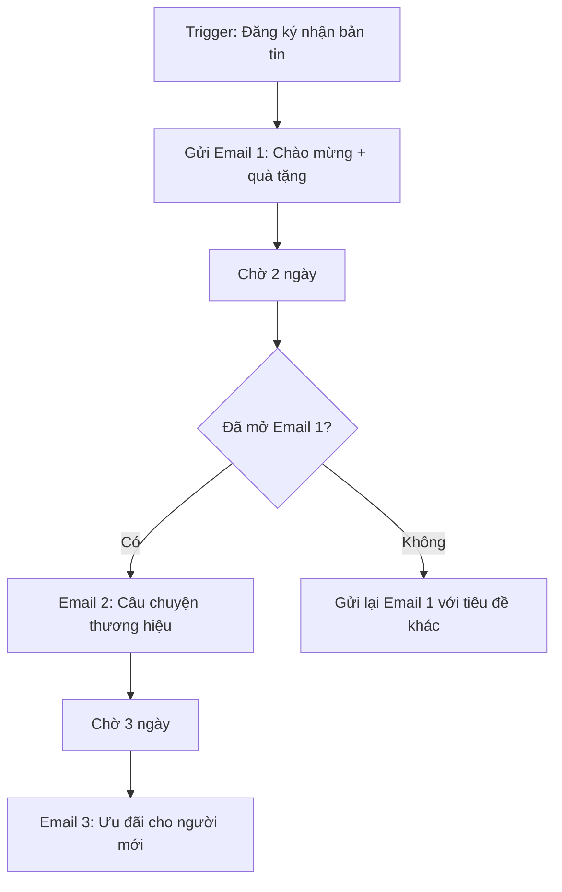

# Tập 6 · Chương 4 — Marketing Automation & Lead Nurturing

> **Metadata**
> - **Bộ giáo trình:** MARKETING THỰC CHIẾN 2026–2035
> - **Tập:** 6 — Funnel & CRM
> - **Chương:** 4 — Marketing Automation & Lead Nurturing
> - **Cấp độ:** Trung cấp → Nâng cao
> - **Thời lượng học gợi ý:** 6–8 giờ (lý thuyết + thực hành dựng luồng)
> - **Tiền đề:** Đã học Chương 1–3 Tập 6 (Sales Funnel, CRM cơ bản, Lead Management)
> - **Phiên bản:** 1.0 · Cập nhật 2026-07

**Tóm tắt một câu:** Chương này hướng dẫn cách thiết kế, vận hành và đo lường hệ thống marketing automation đa kênh để nuôi dưỡng (nurture) khách hàng tiềm năng từ lúc lạ đến lúc mua — dựa trên nguyên lý *trigger–condition–action*, lead scoring và cá nhân hóa bằng AI, đồng thời tránh bẫy spam/over-automation.

---

## 1. Giới thiệu

Hãy tưởng tượng một cửa hàng mỹ phẩm online có 5.000 khách để lại email và số điện thoại trong 3 tháng. Nếu chủ shop phải tự tay nhắn tin chăm sóc từng người — chào mừng, nhắc giỏ hàng bỏ quên, gợi ý mua lại sau 30 ngày — thì bất khả thi. Marketing automation ra đời để giải bài toán đó: **để phần mềm làm những việc lặp đi lặp lại, đúng người, đúng thời điểm, đúng thông điệp — ở quy mô lớn mà vẫn giữ cảm giác cá nhân.**

Nhưng automation không phải là "cỗ máy phun tin nhắn". Làm sai, nó trở thành cỗ máy spam khiến khách hàng chặn thương hiệu. Làm đúng, nó là nhân viên chăm sóc khách hàng làm việc 24/7, không nghỉ, không quên, và ngày càng thông minh nhờ AI.

Chương này đi từ khái niệm nền tảng đến quy trình dựng luồng thực chiến, kèm biểu mẫu, checklist, KPI và case study để bạn có thể bắt tay dựng luồng automation đầu tiên ngay sau khi đọc.

## 2. Khái niệm

**Marketing Automation** là việc sử dụng phần mềm để tự động hóa các tác vụ marketing lặp lại (gửi email, SMS, tin Zalo, chấm điểm lead, gắn thẻ, chuyển giao cho sales…) dựa trên hành vi và thuộc tính của khách hàng, nhằm nuôi dưỡng và chuyển đổi họ mà không cần thao tác thủ công cho từng người.

**Lead Nurturing** (nuôi dưỡng khách hàng tiềm năng) là quá trình xây dựng quan hệ với người chưa sẵn sàng mua, qua chuỗi nội dung có giá trị theo thời gian, cho đến khi họ đủ tin tưởng và đủ nhu cầu để mua.

Một vài thuật ngữ cốt lõi:

| Thuật ngữ | Định nghĩa ngắn |
|---|---|
| **Trigger (kích hoạt)** | Sự kiện khởi động một luồng: đăng ký form, bỏ giỏ hàng, click email… |
| **Condition (điều kiện)** | Điều kiện lọc/rẽ nhánh: "nếu đã mua thì…", "nếu điểm > 50 thì…" |
| **Action (hành động)** | Việc hệ thống thực hiện: gửi email, chờ 2 ngày, gắn thẻ, cộng điểm… |
| **Workflow/Flow (luồng)** | Chuỗi trigger–condition–action nối tiếp nhau |
| **Lead Scoring** | Chấm điểm lead theo mức độ sẵn sàng mua |
| **Segmentation** | Phân nhóm khách hàng theo đặc điểm/hành vi |
| **Lifecycle stage** | Giai đoạn vòng đời: Lạ → Lead → MQL → SQL → Khách hàng → Trung thành |

> **MQL** (Marketing Qualified Lead): lead đủ tiêu chuẩn marketing tiếp tục nuôi. **SQL** (Sales Qualified Lead): lead đủ nóng để sales gọi chốt.

## 3. Lịch sử hình thành

- **Thập niên 1990s:** Email marketing hàng loạt (batch-and-blast) ra đời — gửi cùng một email cho toàn bộ danh sách.
- **1999–2006:** Các nền tảng chuyên biệt xuất hiện; Eloqua (thành lập 1999) được xem là một trong những công ty tiên phong định hình khái niệm marketing automation cho B2B (cần kiểm chứng mốc chính xác).
- **2006:** HubSpot thành lập, phổ biến thuật ngữ "inbound marketing" và đưa automation đến doanh nghiệp vừa và nhỏ.
- **2010s:** Làn sóng sáp nhập lớn — Oracle mua Eloqua (2012), Salesforce mua ExactTarget/Pardot (2013), Adobe mua Marketo (2018). Automation trở thành một phần của CRM/CDP.
- **2015 trở đi:** Các công cụ no-code như Zapier, rồi Make (tiền thân Integromat), n8n cho phép người không lập trình tự nối các ứng dụng.
- **2022–2026:** AI tạo sinh (generative AI) tích hợp sâu — soạn nội dung, dự đoán điểm lead, quyết định thời điểm gửi, cá nhân hóa từng tin nhắn theo thời gian thực.

*(Các mốc năm là dữ kiện phổ biến ngành; người dạy nên kiểm chứng lại trước khi trích trong tài liệu chính thức.)*

## 4. Tại sao quan trọng

1. **Quy mô mà không mất tính cá nhân:** Một người không thể chăm 5.000 lead; automation làm được, và mỗi lead vẫn nhận đúng thông điệp phù hợp.
2. **Đúng thời điểm:** Khách bỏ giỏ hàng lúc 22h — automation nhắc lại sau 1 giờ, khi con người đã ngủ.
3. **Không bỏ sót lead:** Lead nào cũng được đưa vào luồng, không phụ thuộc trí nhớ nhân viên.
4. **Rút ngắn chu kỳ bán:** Nuôi dưỡng liên tục giúp lead "chín" nhanh hơn, giảm chi phí mỗi đơn.
5. **Tăng giá trị vòng đời (CLV):** Luồng chăm sóc sau mua, upsell, re-engagement khai thác khách cũ — vốn rẻ hơn nhiều so với tìm khách mới.
6. **Dữ liệu để ra quyết định:** Mỗi hành vi (mở, click, mua) trở thành tín hiệu để tối ưu.

> Ngành thường trích các con số kiểu "nuôi dưỡng lead tốt tạo nhiều đơn hơn với chi phí thấp hơn" (ví dụ các báo cáo của Forrester, Annuitas được nhiều nguồn dẫn lại). **Không nên trích số cụ thể nếu chưa truy được báo cáo gốc và năm.** (cần kiểm chứng)

## 5. Nguyên lý hoạt động

Trái tim của mọi automation là mô hình **Trigger → Condition → Action**:

```
[ TRIGGER ]  ──►  [ CONDITION ]  ──►  [ ACTION ]
 Sự kiện xảy ra    Kiểm tra/rẽ nhánh   Hệ thống làm gì đó
```

- **Trigger** trả lời: *Khi nào luồng bắt đầu?* (đăng ký form, thêm thẻ, đạt điểm, ngày cụ thể, bỏ giỏ hàng…)
- **Condition** trả lời: *Người này có đủ điều kiện / thuộc nhánh nào?* (đã mua chưa, ở tỉnh nào, điểm bao nhiêu…)
- **Action** trả lời: *Làm gì?* (gửi email/SMS/Zalo, chờ X ngày, cộng/trừ điểm, gắn thẻ, thông báo sales, cập nhật CRM…)

Nối nhiều khối này lại theo thời gian và điều kiện, ta có một **luồng nuôi dưỡng**. Automation vận hành theo cơ chế **event-driven** (dựa trên sự kiện) chứ không phải lịch cố định — điều này giúp thông điệp bám sát hành vi thật của khách.

**Khi nào NÊN dùng automation:** khi tác vụ lặp lại, có thể mô tả bằng quy tắc rõ ràng, có đủ lượng lead để việc thủ công không kham nổi, và có dữ liệu hành vi để kích hoạt.

**Khi nào KHÔNG nên:** khi quan hệ cần chạm cá nhân sâu (bán hàng giá trị lớn B2B giai đoạn chốt), khi dữ liệu bẩn/thiếu, hoặc khi bạn chưa có nội dung đủ tốt — automation chỉ khuếch đại thứ bạn đã có, kể cả cái dở.

## 6. Mô hình

**Mô hình phễu vòng đời + automation tương ứng:**

```
        NHẬN THỨC        │  Ad, SEO, content → Lead magnet
     ─────────────────── │
        QUAN TÂM (Lead)  │  ► Luồng WELCOME
     ─────────────────── │
        CÂN NHẮC (MQL)   │  ► Luồng NURTURE theo hành vi + Lead scoring
     ─────────────────── │
        Ý ĐỊNH (SQL)     │  ► Cảnh báo sales + Luồng ưu đãi
     ─────────────────── │
        MUA (Customer)   │  ► Luồng ONBOARDING + Abandoned cart trước đó
     ─────────────────── │
        TRUNG THÀNH      │  ► Upsell / Cross-sell / Re-engagement / Referral
```

Mô hình này cho thấy automation không phải một luồng duy nhất, mà là **một hệ luồng** đặt ở từng giai đoạn vòng đời, được nối bởi lead scoring và segmentation.

## 7. Framework

**Framework "5T" để thiết kế một luồng automation** (khung sư phạm của giáo trình này):

| Bước | Tên | Câu hỏi cần trả lời |
|---|---|---|
| **T1** | **Target** | Luồng này phục vụ nhóm nào, ở giai đoạn nào? |
| **T2** | **Trigger** | Sự kiện gì kích hoạt? Vào/ra luồng bằng điều kiện gì? |
| **T3** | **Track (nội dung)** | Chuỗi thông điệp gồm mấy chạm, kênh nào, cách nhau bao lâu? |
| **T4** | **Test** | Rẽ nhánh theo hành vi ra sao (mở/không mở, mua/chưa mua)? A/B test cái gì? |
| **T5** | **Track (đo lường)** | KPI nào chứng minh luồng hiệu quả? Ngưỡng dừng/thoát? |

Áp 5T cho từng luồng trước khi bấm nút "kích hoạt" giúp bạn không dựng luồng theo cảm tính.

## 8. Công thức

**Công thức 1 — Lead Scoring cơ bản (cộng điểm):**

```
Điểm Lead = Σ (điểm thuộc tính) + Σ (điểm hành vi) − Σ (điểm trừ)
```

Ví dụ bảng chấm điểm minh họa *(số minh họa — mỗi doanh nghiệp tự hiệu chỉnh)*:

| Tín hiệu | Điểm |
|---|---|
| Mở email | +2 |
| Click link trong email | +5 |
| Xem trang bảng giá | +15 |
| Tải lead magnet | +10 |
| Đúng chân dung mục tiêu (đúng ngành/khu vực) | +20 |
| Email không tồn tại / bounce | −20 |
| Không tương tác 30 ngày | −10 |
| Hủy đăng ký | −999 (loại) |

Ngưỡng ví dụ: ≥ 50 điểm → chuyển thành SQL, bắn cảnh báo cho sales *(số minh họa)*.

**Công thức 2 — Tỷ lệ chuyển đổi của một luồng:**

```
Tỷ lệ chuyển đổi luồng (%) = (Số người đạt mục tiêu luồng ÷ Số người vào luồng) × 100
```

Ví dụ *(số minh họa)*: luồng abandoned cart có 1.000 người vào, 130 người quay lại hoàn tất mua → tỷ lệ chuyển đổi = 130 ÷ 1.000 × 100 = **13%**.

**Công thức 3 — Doanh thu quy cho một luồng:**

```
Doanh thu luồng = Số chuyển đổi × Giá trị đơn trung bình (AOV)
```

## 9. Quy trình

Quy trình triển khai một hệ thống automation từ đầu, gồm 8 bước:

1. **Xác định mục tiêu kinh doanh:** tăng chuyển đổi giỏ hàng? giảm churn? tăng upsell?
2. **Vẽ bản đồ hành trình khách hàng (customer journey):** liệt kê các điểm chạm và "khoảnh khắc quyết định".
3. **Chuẩn hóa dữ liệu & cài công cụ:** kết nối form, website, CRM, kênh gửi (email/SMS/Zalo).
4. **Thiết kế segmentation & lead scoring:** ai vào nhóm nào, chấm điểm ra sao.
5. **Dựng nội dung cho từng chạm:** email, tin Zalo, SMS, kịch bản chatbot.
6. **Dựng luồng (áp 5T):** cấu hình trigger–condition–action trên công cụ.
7. **Kiểm thử (test):** chạy thử với tài khoản nội bộ, kiểm tra rẽ nhánh, thời gian chờ, link.
8. **Kích hoạt, đo lường, tối ưu:** theo dõi KPI, A/B test, cắt bớt chạm gây hủy đăng ký.

## 10. Ví dụ đơn giản

**Luồng Welcome cho một blog/cửa hàng nhỏ:**



Đây là luồng nhỏ nhất mà bất kỳ ai cũng dựng được: một trigger, một điều kiện rẽ nhánh, ba email.

## 11. Ví dụ doanh nghiệp

**Luồng Abandoned Cart cho một doanh nghiệp thương mại điện tử mỹ phẩm:**

```
Trigger: Thêm sản phẩm vào giỏ, 1 giờ sau chưa thanh toán
  ├─ Action: Gửi Email #1 "Bạn để quên gì đó" (chờ 1 giờ)
  ├─ Condition: Chưa mua sau 24h?
  │     └─ Action: Gửi SMS/Zalo nhắc nhẹ (chờ 24h)
  ├─ Condition: Chưa mua sau 48h?
  │     └─ Action: Email #2 kèm mã giảm 10% + review sản phẩm
  └─ Condition: Đã mua bất kỳ lúc nào?
        └─ Action: Thoát luồng ngay, chuyển sang luồng Onboarding
```

Điểm quan trọng ở cấp doanh nghiệp: luồng phải **đa kênh** (email + Zalo/SMS), phải có **điều kiện thoát** (đã mua thì dừng ngay để không gửi mã giảm giá cho người vừa trả tiền đủ), và phải **chuyển giao** sang luồng tiếp theo.

## 12. Ví dụ Việt Nam

Bối cảnh Việt Nam có đặc thù: **Zalo là kênh chủ lực** bên cạnh email, và người dùng nhạy cảm với spam tin nhắn.

- **The Coffee House / các chuỗi F&B** dùng app + CRM để gửi ưu đãi cá nhân hóa theo lịch sử mua và gom điểm thành viên (cần kiểm chứng chi tiết triển khai kỹ thuật).
- **Các shop trên nền tảng Haravan, Sapo, KiotViet** thường bật sẵn kịch bản Zalo OA + email: nhắc giỏ hàng, cảm ơn sau mua, nhắc mua lại theo chu kỳ sản phẩm (ví dụ mỹ phẩm hết sau ~45 ngày → nhắc mua lại ngày thứ 40).
- **Ngân hàng số & ví điện tử (Momo, ZaloPay…)** dùng push notification theo hành vi (số minh họa cho mô hình, không phải số liệu nội bộ).

**Kịch bản Việt Nam điển hình — chăm sóc theo chu kỳ tiêu dùng cho shop mỹ phẩm:**

```
Trigger: Khách mua serum (chu kỳ dùng ~45 ngày)
  → Ngày 40: Zalo "Serum sắp hết? Đặt lại nhận ưu đãi khách thân"
  → Ngày 45 (nếu chưa mua lại): Email hướng dẫn dùng + gợi ý combo
  → Ngày 60 (nếu vẫn im lặng): chuyển sang luồng Re-engagement
```

> Lưu ý pháp lý & văn hóa VN: tuân thủ quy định về tin nhắn quảng cáo, luôn có tùy chọn từ chối, và ưu tiên gửi tin trong khung giờ hợp lý để tránh phản cảm.

## 13. Ví dụ quốc tế

- **Amazon:** hệ thống gợi ý và email "sản phẩm bạn có thể thích", nhắc mua lại hàng tiêu hao, review sau mua — được xem là chuẩn mực của behavior-based automation (cần kiểm chứng chi tiết cơ chế).
- **Netflix:** email/push cá nhân hóa theo hành vi xem, re-engagement khi người dùng lâu không mở app.
- **Duolingo:** chuỗi nhắc học theo streak, re-engagement bằng thông báo push — một trong những ví dụ về lifecycle messaging được ngành hay dẫn.
- **Spotify Wrapped:** không phải luồng nurture kinh điển, nhưng minh họa sức mạnh cá nhân hóa dữ liệu ở quy mô lớn.

Điểm chung: các thương hiệu này dùng **hành vi thật** làm trigger, cá nhân hóa nội dung, và đo lường liên tục.

## 14. Sai lầm thường gặp

1. **Over-automation (tự động hóa quá đà):** gửi quá nhiều, quá dày → khách hủy đăng ký, chặn.
2. **Không có điều kiện thoát:** gửi mã giảm giá cho người vừa mua, nhắc giỏ hàng cho người đã thanh toán.
3. **Batch-and-blast trá hình:** gọi là automation nhưng thực chất gửi một nội dung cho tất cả, không cá nhân hóa.
4. **Dữ liệu bẩn:** email sai, trùng lặp, thiếu thông tin để phân nhóm → luồng chạy sai người.
5. **Bỏ quên nội dung:** đầu tư công cụ nhưng nội dung nhạt → automation chỉ khuếch đại cái dở.
6. **Không kiểm thử:** kích hoạt luồng chưa test → link hỏng, thời gian chờ sai, gửi nhầm.
7. **Chấm điểm lead một lần rồi quên:** không hiệu chỉnh bảng điểm theo dữ liệu thực tế.
8. **Đo lường sai chỉ số:** nhìn "tỷ lệ mở" mà quên "doanh thu quy cho luồng".
9. **Spam đa kênh:** cùng lúc email + SMS + Zalo cùng một thông điệp → phiền và tốn chi phí.
10. **Không tuân thủ quyền riêng tư/consent:** rủi ro pháp lý và mất niềm tin.

## 15. Checklist

**Trước khi kích hoạt một luồng:**

- [ ] Mục tiêu luồng rõ ràng (1 mục tiêu chính).
- [ ] Trigger vào luồng đúng và duy nhất, không gây trùng.
- [ ] Có điều kiện **thoát** luồng (đã mua, hủy đăng ký, đạt mục tiêu).
- [ ] Mỗi tin nhắn có 1 CTA rõ ràng.
- [ ] Kiểm tra tất cả link, hình, mã giảm giá.
- [ ] Thời gian chờ giữa các chạm hợp lý (không dồn dập).
- [ ] Giới hạn tần suất (frequency cap) toàn hệ thống để tránh trùng luồng.
- [ ] Có tùy chọn từ chối/hủy nhận rõ ràng ở mọi kênh.
- [ ] Đã test với tài khoản nội bộ, đi hết mọi nhánh.
- [ ] Đã gắn tracking để đo KPI.
- [ ] Tuân thủ quy định về consent và giờ gửi.

## 16. SOP

**SOP: Dựng và vận hành một luồng Lead Nurturing** (quy trình thao tác chuẩn cho nhân sự marketing)

1. **Nhận brief** từ trưởng nhóm: mục tiêu, nhóm mục tiêu, thời hạn.
2. **Điền biểu mẫu Bản đồ luồng** (mục 18) và trình duyệt.
3. **Chuẩn bị nội dung:** viết toàn bộ email/Zalo/SMS, đưa vào review.
4. **Cấu hình trên công cụ:** dựng trigger–condition–action theo bản đồ đã duyệt.
5. **Gắn tracking:** UTM, sự kiện chuyển đổi, mục tiêu.
6. **Kiểm thử nội bộ:** chạy thử tối thiểu 2 kịch bản (người mở / không mở).
7. **Duyệt cuối (QA):** người thứ hai kiểm tra checklist mục 15.
8. **Kích hoạt & theo dõi 72 giờ đầu:** soi lỗi gửi, tỷ lệ bounce, khiếu nại spam.
9. **Báo cáo tuần:** cập nhật KPI vào dashboard.
10. **Tối ưu định kỳ (2–4 tuần/lần):** A/B test, cắt chạm kém, cập nhật bảng lead scoring.

## 17. KPI

| Nhóm | Chỉ số | Ý nghĩa |
|---|---|---|
| **Gửi & sức khỏe list** | Delivery rate, Bounce rate, Unsubscribe rate, Spam complaint rate | List có sạch, có bị coi là spam không |
| **Tương tác** | Open rate, Click-through rate (CTR), Reply rate | Nội dung có hấp dẫn không |
| **Chuyển đổi** | Conversion rate của luồng, Số MQL→SQL, Số đơn | Luồng có tạo kết quả kinh doanh không |
| **Doanh thu** | Doanh thu quy cho luồng, AOV, ROI automation | Giá trị tiền thật |
| **Lead scoring** | Tỷ lệ lead đạt ngưỡng SQL, thời gian trung bình để "chín" | Bảng điểm có chuẩn không |
| **Sức khỏe hệ thống** | Số người trùng luồng, tần suất trung bình/người/tuần | Có over-automation không |

> Nguyên tắc: đừng dừng ở "open rate". Chỉ số cuối cùng luôn là **doanh thu và ROI**, còn open/CTR chỉ là chỉ số dẫn (leading indicators).

## 18. Biểu mẫu

**BIỂU MẪU: Bản đồ luồng Automation (Automation Flow Map)**

| Trường | Nội dung điền |
|---|---|
| Tên luồng | |
| Mục tiêu chính (1 câu) | |
| Nhóm mục tiêu / Segment | |
| Giai đoạn vòng đời | Lead / MQL / SQL / Customer / Retention |
| **Trigger vào luồng** | |
| **Điều kiện thoát luồng** | (đã mua / hủy / đạt mục tiêu…) |
| Kênh sử dụng | Email ☐ SMS ☐ Zalo ☐ Push ☐ Chatbot ☐ |
| Số chạm (touchpoints) | |
| Frequency cap | (tối đa … tin/tuần) |
| KPI mục tiêu | |
| Người phụ trách | |
| Ngày kích hoạt / rà soát | |

**Bảng chi tiết từng chạm:**

| # | Chờ (delay) | Kênh | Nội dung/Chủ đề | CTA | Điều kiện rẽ nhánh |
|---|---|---|---|---|---|
| 1 | Ngay | Email | Chào mừng | Nhận quà | — |
| 2 | +2 ngày | Zalo | Câu chuyện thương hiệu | Xem thêm | Nếu chưa mở chạm 1 → gửi lại |
| 3 | +3 ngày | Email | Ưu đãi người mới | Mua ngay | Nếu đã mua → thoát |

## 19. Prompt AI (6 công cụ)

Dưới đây là 6 prompt mẫu, mỗi prompt gắn với một công cụ/loại công cụ thật. **Luôn kiểm tra lại đầu ra của AI trước khi dùng thật.**

1. **ChatGPT / Claude (soạn chuỗi nội dung):**
   > "Đóng vai chuyên gia email marketing ngành mỹ phẩm. Viết chuỗi 4 email Welcome bằng tiếng Việt cho khách vừa đăng ký nhận ưu đãi. Mỗi email: tiêu đề < 45 ký tự, giọng thân thiện, 1 CTA duy nhất. Trình bày dạng bảng: số email | ngày gửi | tiêu đề | nội dung | CTA."

2. **HubSpot (AI trong nền tảng — tối ưu & phân nhóm):**
   > "Dựa trên các thuộc tính contact hiện có (nguồn, trang đã xem, số lần mở email), đề xuất 3 phân khúc (segment) để nuôi dưỡng và tiêu chí lọc cho mỗi phân khúc. Giải thích logic chấm điểm lead phù hợp cho từng phân khúc."

3. **ActiveCampaign (thiết kế luồng & điều kiện):**
   > "Mô tả cấu trúc một automation abandoned cart gồm trigger, các điều kiện rẽ nhánh (đã mua/chưa mua, đã mở/chưa mở), thời gian chờ và 3 chạm đa kênh (email + SMS). Xuất ra dạng danh sách bước trigger–condition–action."

4. **n8n (nối hệ thống no-code/self-hosted):**
   > "Phác thảo workflow n8n: khi có lead mới từ webhook form → kiểm tra trùng trong Google Sheets → nếu mới thì thêm dòng, chấm điểm cơ bản, và gửi 1 tin Zalo qua HTTP Request. Liệt kê các node cần dùng theo thứ tự."

5. **Make (kịch bản tự động hóa trực quan):**
   > "Thiết kế một scenario Make: theo dõi email mới trong Gmail có nhãn 'Lead', trích tên + email bằng module text parser, thêm vào CRM và gắn thẻ 'inbound'. Nêu các module và bộ lọc cần thiết."

6. **Zapier (kết nối nhanh giữa app):**
   > "Tạo một Zap: Trigger = form mới trên Typeform; Action = tạo/ cập nhật contact trong CRM, sau đó thêm vào chuỗi nurture email. Nêu trigger, các action, và trường dữ liệu cần map."

## 20. Bài tập

1. **Vẽ Trigger–Condition–Action:** Chọn một sản phẩm bạn biết, viết ra 1 trigger, 2 condition và 3 action cho luồng Welcome.
2. **Điền biểu mẫu Bản đồ luồng** (mục 18) cho luồng abandoned cart của một shop online.
3. **Thiết kế bảng lead scoring** riêng cho ngành của bạn: liệt kê 6 tín hiệu cộng điểm và 3 tín hiệu trừ điểm, đặt ngưỡng SQL.
4. **Tính toán:** Một luồng re-engagement có 800 người vào, 96 người quay lại mua. Tính tỷ lệ chuyển đổi. Nếu AOV = 350.000đ, doanh thu luồng là bao nhiêu?
5. **Phân tích rủi ro:** Liệt kê 3 điểm trong luồng của bạn có nguy cơ gây spam và cách khắc phục.

## 21. Câu hỏi ôn tập

1. Phân biệt Marketing Automation và Lead Nurturing.
2. Mô tả mô hình Trigger–Condition–Action bằng một ví dụ của riêng bạn.
3. Vì sao "điều kiện thoát luồng" lại quan trọng? Cho một tình huống cụ thể.
4. Lead scoring là gì và nó phục vụ mục đích gì trong việc chuyển giao lead cho sales?
5. Kể tên tối thiểu 4 luồng automation phổ biến và mục đích của mỗi luồng.
6. Nêu 3 chỉ số KPI dẫn (leading) và 2 chỉ số kết quả (lagging) của automation.
7. AI đóng những vai trò nào trong automation & personalization?
8. Vì sao "open rate cao" chưa chắc là luồng thành công?
9. Trong bối cảnh Việt Nam, vì sao Zalo là kênh cần cân nhắc đặc biệt?
10. Over-automation là gì và ba cách phòng tránh?

## 22. Case Study

**Case thành công (mô hình hóa) — Shop mỹ phẩm "GlowLab" (tên minh họa, số minh họa):**
GlowLab có tỷ lệ mua lại thấp. Họ dựng 3 luồng: (1) Onboarding sau mua hướng dẫn dùng đúng, (2) Nhắc mua lại theo chu kỳ 45 ngày qua Zalo + email, (3) Re-engagement cho khách im lặng 60 ngày. Sau 3 tháng, tỷ lệ mua lại tăng và doanh thu quy cho automation chiếm một phần đáng kể tổng doanh thu *(số minh họa — dùng để dạy cấu trúc, không phải số liệu thực)*. **Bài học:** thành công đến từ (a) nội dung hữu ích trước khi bán, (b) điều kiện thoát chặt chẽ, (c) đo bằng doanh thu chứ không chỉ open rate.

**Case thất bại (mô hình hóa) — Sàn khóa học online "EduFast" (tên minh họa):**
EduFast mua công cụ automation đắt tiền, nhập toàn bộ 20.000 email cũ (nhiều email chết), rồi bật cùng lúc 5 luồng gửi email + SMS mỗi ngày mà không có frequency cap và không kiểm thử. Kết quả: bounce rate cao khiến domain bị đánh dấu spam, tỷ lệ hủy đăng ký tăng vọt, một số tin bị nhà mạng chặn. **Bài học:** (a) không làm sạch dữ liệu, (b) over-automation không giới hạn tần suất, (c) không kiểm thử — ba lỗi kinh điển đã học ở mục 14. Công cụ mạnh không cứu được quy trình sai.

> Cả hai case được **mô hình hóa cho mục đích giảng dạy**; con số và tên là minh họa, không trích từ doanh nghiệp có thật.

## 23. Tổng kết

- Marketing automation = để phần mềm làm việc lặp lại, đúng người – đúng lúc – đúng thông điệp, ở quy mô lớn.
- Lõi kỹ thuật là **Trigger → Condition → Action**; lõi chiến lược là **nuôi dưỡng bằng nội dung giá trị theo hành vi**.
- **Lead scoring** giúp phân biệt lead nóng/lạnh và chuyển giao đúng lúc cho sales.
- Các luồng phổ biến: Welcome, Onboarding, Abandoned cart, Re-engagement, chăm sóc theo hành vi/chu kỳ.
- Đa kênh (email, SMS, Zalo, push, chatbot) nhưng phải có **frequency cap** để tránh spam.
- **AI** nâng cấp automation: soạn nội dung, chấm điểm dự đoán, chọn thời điểm, cá nhân hóa thời gian thực — nhưng cần con người kiểm duyệt.
- Đo lường phải chạm tới **doanh thu và ROI**, không dừng ở open rate.
- Kẻ thù lớn nhất là **over-automation** và **dữ liệu bẩn**. Áp framework 5T, checklist và SOP để tránh.

Bắt đầu nhỏ: dựng một luồng Welcome, đo, tối ưu, rồi mới mở rộng.

## 24. Nguồn tham khảo

> Ghi chú: Các nguồn dưới đây là tài liệu ngành phổ biến, người học nên truy cập bản gốc để kiểm chứng số liệu và năm. Không trích số cụ thể nếu chưa xác minh.

- HubSpot Academy — Email Marketing & Marketing Automation (tài liệu học trực tuyến), HubSpot. (cần kiểm chứng phiên bản/năm)
- ActiveCampaign — Automation Recipes & Guides (tài liệu sản phẩm), ActiveCampaign. (cần kiểm chứng)
- n8n — Documentation & Workflow Templates, n8n.io. (cần kiểm chứng)
- Make — Help Center & Scenario Guides, make.com. (cần kiểm chứng)
- Zapier — Learn/Guides, zapier.com. (cần kiểm chứng)
- Forrester, Annuitas — các báo cáo thường được ngành dẫn về hiệu quả lead nurturing (cần truy nguồn gốc + năm trước khi trích số).
- Kotler, P. & Keller, K. L. — *Marketing Management* (làm nền lý thuyết vòng đời khách hàng, CLV). (cần kiểm chứng ấn bản)
- Tài liệu nội bộ giáo trình MARKETING THỰC CHIẾN 2026–2035, Tập 6 — Chương 1–3 (Sales Funnel, CRM, Lead Management).

---

## Cần cập nhật trong tương lai

- **Số liệu benchmark ngành:** bổ sung số liệu open rate/CTR/conversion theo ngành tại Việt Nam khi có báo cáo đáng tin cậy (kèm nguồn + năm).
- **AI agent trong automation:** cập nhật khi các nền tảng ra mắt "AI agent" tự thiết kế và tối ưu luồng end-to-end (2026–2027).
- **Quy định pháp lý VN:** cập nhật quy định mới nhất về tin nhắn quảng cáo, bảo vệ dữ liệu cá nhân (Nghị định/Luật liên quan) khi có thay đổi.
- **Kênh mới:** theo dõi sự trỗi dậy của các kênh nhắn tin/RCS, WhatsApp Business tại VN, và tích hợp chatbot AI hội thoại.
- **Case study thật:** thay các case mô hình hóa bằng case doanh nghiệp Việt Nam thật khi thu thập được số liệu được phép công bố.
- **Cập nhật công cụ:** rà soát tính năng và bảng giá HubSpot, ActiveCampaign, n8n, Make, Zapier theo từng năm.
