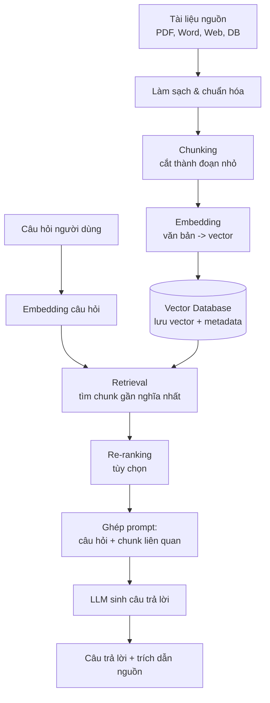

# Tập 8 · Chương 5 — Xây dựng Knowledge Base & RAG cho doanh nghiệp

> **Bộ giáo trình:** MARKETING THỰC CHIẾN 2026–2035
> **Tập 8:** AI Marketing
> **Chương 5:** Xây dựng Knowledge Base & RAG cho doanh nghiệp
> **Cấp độ:** Trung cấp → Nâng cao
> **Đối tượng:** Marketer, chủ doanh nghiệp SME, trưởng nhóm chăm sóc khách hàng, người vận hành AI nội bộ
> **Thời lượng học đề xuất:** 3–4 buổi (lý thuyết + thực hành)
> **Phiên bản:** 1.0 — cập nhật 2026

**Tóm tắt một câu:** Chương này hướng dẫn doanh nghiệp cách biến khối kiến thức rời rạc của mình thành một Knowledge Base có tổ chức, rồi dùng kiến trúc RAG (Retrieval-Augmented Generation) để AI trả lời chính xác trên chính dữ liệu riêng — giảm bịa đặt (hallucination) và luôn cập nhật.

---

## 1. Giới thiệu

Mỗi doanh nghiệp đều là một "kho tri thức sống": chính sách bảo hành, bảng giá, kịch bản tư vấn, hồ sơ sản phẩm, quy trình vận hành (SOP), lịch sử khiếu nại, thư viện nội dung marketing, các câu hỏi thường gặp (FAQ)… Vấn đề là phần lớn kho tri thức đó nằm rải rác: trong file Word trên máy nhân viên, trong nhóm chat, trong đầu của "người biết việc" — người mà khi nghỉ phép thì cả đội đứng hình.

Trong giai đoạn 2023–2025, các mô hình ngôn ngữ lớn (LLM) như dòng GPT, Claude, Gemini bùng nổ. Nhưng doanh nghiệp nhanh chóng gặp một bức tường: LLM "biết mọi thứ trên Internet" nhưng **không biết gì về doanh nghiệp bạn**. Hỏi chatbot "Chính sách đổi trả của công ty mình thế nào?" thì nó hoặc trả lời chung chung, hoặc tệ hơn — **bịa ra một chính sách nghe rất thuyết phục nhưng hoàn toàn sai**.

RAG ra đời để giải quyết đúng bài toán đó: cho phép LLM **truy xuất tài liệu thật của bạn trước khi trả lời**. Đây là công nghệ nền tảng đằng sau hầu hết chatbot doanh nghiệp, trợ lý nội bộ và công cụ tra cứu tài liệu thông minh hiện nay.

Một liên hệ thú vị: **chính bộ sách "Marketing Thực Chiến 2026–2035" mà bạn đang đọc là một Knowledge Base**. Nếu nạp toàn bộ các tập vào một hệ RAG, bạn có thể hỏi "Chương nào nói về money model?" và nhận câu trả lời trích dẫn đúng tập, đúng chương. Đó chính là điều chương này dạy bạn tự làm cho doanh nghiệp mình.

## 2. Khái niệm

**Knowledge Base (KB) — Cơ sở tri thức:** một tập hợp tài liệu, dữ liệu, thông tin của tổ chức được **thu thập, làm sạch, cấu trúc và lưu trữ có hệ thống** để con người hoặc máy có thể tra cứu. KB không phải là "một đống file trong Google Drive"; nó là dữ liệu đã được tổ chức để dùng được.

**RAG (Retrieval-Augmented Generation) — Sinh văn bản có tăng cường truy xuất:** một kiến trúc kết hợp hai bước:
- **Retrieval (truy xuất):** khi có câu hỏi, hệ thống tìm trong Knowledge Base những đoạn tài liệu liên quan nhất.
- **Generation (sinh):** đưa những đoạn tài liệu đó vào LLM cùng câu hỏi, để LLM soạn câu trả lời **dựa trên tài liệu thật**.

Nói ngắn gọn: **RAG = "tìm tài liệu liên quan → đưa cho AI đọc → AI trả lời dựa trên đó"**, thay vì để AI trả lời bằng trí nhớ mơ hồ.

Một vài thuật ngữ cốt lõi cần nắm:

| Thuật ngữ | Nghĩa dễ hiểu |
|---|---|
| **Chunking** | Cắt tài liệu dài thành các đoạn nhỏ (chunk) vừa đủ để xử lý |
| **Embedding** | Biến một đoạn văn bản thành một dãy số (vector) biểu diễn "ý nghĩa" |
| **Vector Database** | Kho lưu các vector, cho phép tìm đoạn "gần nghĩa" nhất với câu hỏi |
| **Retrieval** | Bước tìm và lấy về các đoạn liên quan |
| **Context window** | Lượng văn bản tối đa LLM đọc được trong một lần |
| **Hallucination** | Hiện tượng AI bịa thông tin sai một cách tự tin |

## 3. Lịch sử hình thành

Diễn tiến của ý tưởng RAG (mốc thời gian mang tính khái quát, **một số chi tiết cần kiểm chứng** theo tài liệu học thuật gốc):

- **Trước 2020 — Tìm kiếm truyền thống:** doanh nghiệp dùng tìm kiếm theo từ khóa (keyword search), như Elasticsearch. Nhược điểm: gõ sai từ hoặc dùng từ đồng nghĩa là không ra kết quả.
- **2020 — Bài báo "Retrieval-Augmented Generation":** thuật ngữ RAG được giới thiệu trong một công trình nghiên cứu của nhóm tác giả tại Facebook AI (nay là Meta AI), đề xuất kết hợp mô-đun truy xuất với mô hình sinh (*cần kiểm chứng tên tác giả và năm chính xác*).
- **2022–2023 — Bùng nổ LLM:** ChatGPT ra mắt cuối 2022 khiến nhu cầu "cho AI đọc tài liệu riêng" tăng vọt. Các thư viện như LangChain, LlamaIndex xuất hiện để ghép nối LLM với dữ liệu.
- **2023–2024 — Vector database phổ biến:** Pinecone, Weaviate, Chroma, FAISS, pgvector… trở thành hạ tầng quen thuộc. Embedding chất lượng cao dễ tiếp cận hơn.
- **2024–2025 — RAG trở thành "mặc định":** hầu hết chatbot doanh nghiệp, công cụ hỏi-đáp tài liệu đều dùng RAG. Xuất hiện các biến thể: hybrid search, re-ranking, GraphRAG, agentic RAG.
- **2025 trở đi:** cửa sổ ngữ cảnh của LLM ngày càng lớn, làm dấy lên tranh luận "context dài có thay thế RAG không?" — thực tế hai hướng bổ trợ nhau nhiều hơn là thay thế (*xu hướng đang biến động, cần theo dõi*).

## 4. Tại sao quan trọng

RAG và Knowledge Base quan trọng với doanh nghiệp vì **bảy** lý do thực chiến:

1. **Giảm hallucination:** AI trả lời dựa trên tài liệu thật, không bịa. Đây là yếu tố sống còn khi tư vấn về giá, chính sách, y tế, pháp lý.
2. **Cập nhật kiến thức riêng:** LLM gốc có "hạn kiến thức" (knowledge cutoff) và không biết dữ liệu nội bộ của bạn. RAG bơm dữ liệu mới vào lúc trả lời mà **không cần huấn luyện lại mô hình**.
3. **Rẻ và nhanh hơn fine-tuning:** cập nhật KB chỉ là thêm/sửa tài liệu, không tốn chi phí và thời gian huấn luyện lại mô hình.
4. **Truy vết nguồn (traceability):** RAG tốt sẽ trích dẫn "câu trả lời này lấy từ tài liệu nào" — giúp kiểm chứng và tạo niềm tin.
5. **Bảo toàn tri thức tổ chức:** khi nhân sự giỏi nghỉ việc, tri thức của họ đã nằm trong KB.
6. **Đồng nhất câu trả lời:** mọi kênh (chatbot, tổng đài, nhân viên mới) đều tra cùng một nguồn, tránh "mỗi người nói một kiểu".
7. **Tự động hóa chăm sóc khách hàng & nội bộ:** giảm tải cho đội CSKH và marketing với câu hỏi lặp lại.

Nếu Tập 8 dạy bạn *dùng* AI, thì chương này dạy bạn *dạy AI về chính doanh nghiệp mình* — bước biến AI từ "trợ lý chung chung" thành "nhân viên hiểu việc".

## 5. Nguyên lý hoạt động

RAG vận hành qua hai giai đoạn: **giai đoạn nạp dữ liệu (indexing/ingestion)** làm trước, và **giai đoạn truy vấn (query)** làm mỗi khi có câu hỏi.

**Giai đoạn 1 — Nạp dữ liệu (làm một lần, cập nhật định kỳ):**
1. Thu thập tài liệu (PDF, Word, trang web, bảng tính, cơ sở dữ liệu…).
2. Làm sạch: bỏ định dạng thừa, gộp/tách hợp lý.
3. **Chunking:** cắt thành các đoạn nhỏ (ví dụ vài trăm token mỗi đoạn), thường có phần chồng lấn (overlap) để không mất ngữ cảnh ở ranh giới.
4. **Embedding:** mỗi chunk được một mô hình embedding biến thành một vector số.
5. Lưu vector cùng nội dung gốc và metadata (nguồn, ngày, danh mục) vào **vector database**.

**Giai đoạn 2 — Truy vấn (mỗi lần người dùng hỏi):**
1. Câu hỏi của người dùng cũng được embedding thành vector.
2. Hệ thống tìm trong vector DB những chunk có vector **gần nhất** về ý nghĩa (semantic search) — thường dùng độ đo như cosine similarity.
3. (Tùy chọn) **Re-ranking:** sắp xếp lại các chunk theo mức liên quan thật sự.
4. Ghép các chunk liên quan + câu hỏi thành một **prompt** đưa cho LLM.
5. LLM đọc ngữ cảnh và **soạn câu trả lời dựa trên tài liệu được cung cấp**, kèm trích dẫn nguồn nếu được cấu hình.

Điểm mấu chốt: LLM không "nhớ" toàn bộ KB. Nó chỉ đọc vài đoạn liên quan được đưa vào ngay lúc trả lời. Chất lượng câu trả lời phụ thuộc rất lớn vào **chất lượng bước truy xuất** — "rác vào, rác ra".

## 6. Mô hình

**Sơ đồ pipeline RAG (mermaid):**



**Sơ đồ dạng ASCII (khi không render được mermaid):**

```
[ NẠP DỮ LIỆU - làm một lần ]
Tài liệu → Làm sạch → Chunking → Embedding → [Vector DB]

[ TRUY VẤN - mỗi câu hỏi ]
Câu hỏi → Embedding → Retrieval ──┐
                                  ↓  (lấy từ Vector DB)
                          Chunk liên quan
                                  ↓
                     Ghép prompt (hỏi + chunk)
                                  ↓
                             LLM sinh
                                  ↓
                  Câu trả lời + trích dẫn nguồn
```

**Ba tầng của một hệ RAG doanh nghiệp:**

| Tầng | Vai trò | Ví dụ thành phần |
|---|---|---|
| Dữ liệu | Nguồn tri thức | Tài liệu, FAQ, SOP, CRM |
| Truy xuất | Tìm đúng đoạn liên quan | Embedding + Vector DB + Re-ranker |
| Sinh & Giao diện | Trả lời & tương tác | LLM + Chatbot / trợ lý nội bộ |

## 7. Framework

Khung **"5C"** để xây dựng và vận hành một hệ Knowledge Base + RAG (khung do nhóm biên soạn hệ thống hóa cho mục đích giảng dạy):

- **C1 — Collect (Thu thập):** gom toàn bộ nguồn tri thức, lập danh mục "cái gì, ở đâu, ai giữ".
- **C2 — Clean (Làm sạch):** loại bỏ tài liệu lỗi thời, mâu thuẫn, trùng lặp; chuẩn hóa định dạng và thuật ngữ.
- **C3 — Chunk & Convert (Cắt & Chuyển đổi):** cắt thành đoạn hợp lý, embedding, nạp vào vector DB kèm metadata.
- **C4 — Connect (Kết nối):** ghép vector DB với LLM và giao diện (chatbot web, Zalo, trợ lý nội bộ).
- **C5 — Control (Kiểm soát):** đo lường chất lượng câu trả lời, phân quyền, bảo mật, cập nhật định kỳ.

Khung này chạy theo vòng lặp: sau C5 quay lại C1 để bổ sung tri thức mới → hệ RAG là một hệ **sống**, không phải dự án làm một lần.

## 8. Công thức

RAG không có "công thức toán duy nhất", nhưng có vài quan hệ định lượng đáng nhớ để ra quyết định thiết kế:

**(1) Số chunk từ một tài liệu:**
```
Số chunk ≈ (Tổng số token của tài liệu) / (Kích thước chunk − Độ chồng lấn)
```
Ví dụ tài liệu 10.000 token, chunk 500 token, overlap 50 token → ≈ 10.000 / 450 ≈ 23 chunk.

**(2) Độ tương đồng ngữ nghĩa (cosine similarity):**
```
similarity(A, B) = (A · B) / (|A| × |B|)
```
Giá trị gần 1 nghĩa là hai đoạn "gần nghĩa"; gần 0 là không liên quan. Đây là cách hệ thống chọn chunk để đưa cho LLM.

**(3) Ngân sách ngữ cảnh (context budget):**
```
Số chunk đưa vào LLM ≤ (Context window − Token prompt hệ thống − Token câu hỏi − Token dành cho câu trả lời) / (Token trung bình mỗi chunk)
```
Quan hệ này nhắc bạn: không thể nhồi vô hạn chunk vào LLM. Phải chọn lọc — đây là lý do re-ranking quan trọng.

**Lưu ý:** các con số cụ thể (kích thước chunk tối ưu, số chunk nên lấy — thường gọi là *top-k*) **phụ thuộc mô hình, ngôn ngữ và loại tài liệu, cần kiểm chứng và thử nghiệm** trên chính dữ liệu của bạn, không có giá trị "chuẩn vàng" cố định.

## 9. Quy trình

Quy trình 9 bước triển khai RAG cho một doanh nghiệp SME:

1. **Xác định mục tiêu & phạm vi:** chatbot CSKH? trợ lý marketing nội bộ? tra cứu SOP? Chọn 1 bài toán rõ ràng để bắt đầu.
2. **Kiểm kê nguồn tri thức:** liệt kê tài liệu, xác định "nguồn chân lý" (source of truth) cho từng chủ đề.
3. **Làm sạch & phân loại:** loại bỏ bản lỗi thời, gắn nhãn danh mục, thống nhất thuật ngữ.
4. **Chọn công cụ:** nền tảng no-code (dễ) hay tự dựng bằng thư viện (linh hoạt). Chọn mô hình embedding và vector DB.
5. **Chunking & embedding:** cắt đoạn, sinh vector, nạp vào vector DB kèm metadata.
6. **Kết nối LLM & thiết kế prompt hệ thống:** ràng buộc "chỉ trả lời dựa trên tài liệu, không biết thì nói không biết".
7. **Kiểm thử với bộ câu hỏi thật:** dựng "bộ đề" 30–100 câu hỏi thực tế, chấm điểm câu trả lời.
8. **Triển khai & tích hợp kênh:** gắn vào website, Zalo OA, tổng đài, hoặc công cụ nội bộ.
9. **Giám sát & cập nhật:** theo dõi câu hỏi không trả lời được, bổ sung KB, đo KPI, định kỳ làm mới dữ liệu.

## 10. Ví dụ đơn giản

**Tình huống:** một quán cà phê nhỏ có 1 trang FAQ (giờ mở cửa, wifi, chỗ đậu xe, có nhận đặt tiệc không).

- Chủ quán dán FAQ vào một công cụ hỏi-đáp tài liệu (ví dụ dạng NotebookLM — *mô tả khái niệm, chi tiết tính năng cần kiểm chứng*).
- Khách hỏi: *"Tối thứ Bảy mình đưa 15 người tới được không?"*
- Hệ thống truy xuất đoạn FAQ về "đặt tiệc/nhóm đông" → LLM trả lời: *"Quán nhận nhóm trên 10 người nếu đặt trước 1 ngày, bạn nhắn số điện thoại 09xx để giữ chỗ."*

Điểm học: dù khách **không dùng đúng từ "đặt tiệc"**, semantic search vẫn tìm đúng đoạn nhờ hiểu ý nghĩa. Đây là khác biệt lớn so với tìm theo từ khóa.

## 11. Ví dụ doanh nghiệp

**Tình huống:** một công ty mỹ phẩm GMP (liên hệ chính bối cảnh của kho dữ liệu này) có: hồ sơ 40 sản phẩm, chứng nhận công bố, chính sách đại lý, kịch bản tư vấn da, và quy trình xử lý khiếu nại.

Họ xây một hệ RAG nội bộ phục vụ 2 nhóm:

- **Đội CSKH & bán hàng:** hỏi *"Sản phẩm serum B5 có dùng cho da đang bị mụn viêm không?"* → hệ thống truy xuất hồ sơ sản phẩm + hướng dẫn sử dụng → trả lời kèm trích dẫn "theo Hồ sơ sản phẩm serum B5, mục Chống chỉ định".
- **Đội marketing:** hỏi *"Có claim nào về sản phẩm mà mình KHÔNG được nói theo quy định công bố không?"* → truy xuất tài liệu pháp lý/công bố → trả lời để tránh vi phạm quảng cáo.

Kết quả kỳ vọng: nhân viên mới lên việc nhanh hơn, câu trả lời cho khách đồng nhất, và giảm rủi ro quảng cáo sai công dụng — đặc biệt quan trọng trong ngành mỹ phẩm chịu quản lý chặt.

## 12. Ví dụ Việt Nam

**Bối cảnh nội địa hóa** (ví dụ minh họa mô hình triển khai, số liệu cụ thể chỉ mang tính giả định để giảng dạy):

- **Ngân hàng / Fintech:** nhiều ngân hàng Việt triển khai chatbot trên app và website để trả lời về sản phẩm thẻ, lãi suất, biểu phí. RAG giúp chatbot tra đúng biểu phí hiện hành thay vì trả lời chung.
- **Thương mại điện tử & bán lẻ:** shop trên Shopee/Zalo OA dùng chatbot RAG nạp bảng size, chính sách đổi trả, tình trạng đơn để giảm tin nhắn lặp cho nhân viên.
- **Giáo dục:** trung tâm tiếng Anh, trường học nạp thông tin khóa học, học phí, lịch khai giảng vào trợ lý tư vấn tuyển sinh.

**Đặc thù tiếng Việt cần lưu ý:**
- Chọn mô hình embedding **hỗ trợ tốt tiếng Việt** (có dấu, từ ghép) — không phải mô hình nào cũng làm tốt (*cần kiểm chứng bằng thử nghiệm thực tế*).
- Xử lý văn bản có dấu và không dấu; khách Việt hay gõ không dấu, viết tắt, sai chính tả.
- Ưu tiên tích hợp **Zalo OA** vì đây là kênh nhắn tin phổ biến nhất tại Việt Nam.

## 13. Ví dụ quốc tế

- **Chăm sóc khách hàng quy mô lớn:** nhiều nền tảng CSKH quốc tế (ví dụ hướng tiếp cận của Intercom, Zendesk với tính năng trợ lý AI) dùng RAG để trả lời dựa trên trung tâm trợ giúp (help center) của từng khách hàng doanh nghiệp — *chi tiết tính năng thay đổi theo thời gian, cần kiểm chứng*.
- **Tra cứu tài liệu kỹ thuật:** các công ty phần mềm dựng "hỏi đáp trên tài liệu (docs)" để lập trình viên hỏi thẳng thay vì đọc thủ công.
- **Trợ lý nghiên cứu cá nhân:** công cụ như **NotebookLM** của Google cho phép người dùng nạp tài liệu của riêng mình rồi hỏi-đáp, tóm tắt, tạo dàn ý — về bản chất là một ứng dụng RAG thân thiện với người không chuyên (*tính năng cụ thể cần kiểm chứng theo phiên bản*).
- **Nội bộ doanh nghiệp lớn:** nhiều tập đoàn dựng "trợ lý nhân sự" trả lời về chính sách phúc lợi, ngày phép, quy trình — giảm tải cho phòng HR.

Bài học chung: mô hình giống nhau (KB + RAG), chỉ khác **loại tài liệu và kênh triển khai**.

## 14. Sai lầm thường gặp

| # | Sai lầm | Hậu quả | Cách tránh |
|---|---|---|---|
| 1 | Nạp dữ liệu bẩn, lỗi thời, mâu thuẫn | AI trả lời sai một cách tự tin | Làm sạch (C2) trước khi nạp; có "nguồn chân lý" |
| 2 | Chunk quá to hoặc quá nhỏ | To: loãng, lẫn nhiễu; Nhỏ: mất ngữ cảnh | Thử nghiệm nhiều kích thước; dùng overlap |
| 3 | Không ràng buộc "không biết thì nói không biết" | AI bịa khi không tìm thấy | Prompt hệ thống chặt; yêu cầu trích dẫn nguồn |
| 4 | Không có trích dẫn nguồn | Không kiểm chứng được, mất niềm tin | Bật hiển thị nguồn cho mỗi câu trả lời |
| 5 | Embedding không hợp tiếng Việt | Truy xuất sai, bỏ sót | Chọn mô hình hỗ trợ tiếng Việt, kiểm thử |
| 6 | "Làm một lần rồi bỏ" | KB lỗi thời sau vài tháng | Lập lịch cập nhật định kỳ (C5) |
| 7 | Bỏ qua bảo mật & phân quyền | Rò rỉ dữ liệu nhạy cảm | Phân quyền theo vai trò; ẩn dữ liệu mật |
| 8 | Không có bộ câu hỏi kiểm thử | Không biết hệ tốt hay tệ | Xây "bộ đề" đánh giá, chấm điểm định kỳ |
| 9 | Kỳ vọng RAG thay thế hoàn toàn con người | Xử lý sai ca phức tạp | Thiết kế đường chuyển tiếp sang người thật |

## 15. Checklist

**Trước khi xây (chuẩn bị):**
- [ ] Đã chọn 1 bài toán cụ thể để bắt đầu (không ôm đồm)
- [ ] Đã kiểm kê toàn bộ nguồn tri thức và xác định "nguồn chân lý"
- [ ] Đã loại bỏ tài liệu lỗi thời, mâu thuẫn, trùng lặp
- [ ] Đã thống nhất thuật ngữ và định dạng

**Khi xây (kỹ thuật):**
- [ ] Đã chọn mô hình embedding phù hợp (kiểm thử tiếng Việt nếu cần)
- [ ] Đã quyết định chiến lược chunking và overlap
- [ ] Đã gắn metadata (nguồn, ngày, danh mục) cho mỗi chunk
- [ ] Đã viết prompt hệ thống ràng buộc "chỉ dựa trên tài liệu"
- [ ] Đã bật trích dẫn nguồn

**Trước khi lên thật (kiểm thử & vận hành):**
- [ ] Đã kiểm thử với bộ 30–100 câu hỏi thực tế
- [ ] Đã thiết lập phân quyền và bảo mật dữ liệu nhạy cảm
- [ ] Đã có đường chuyển tiếp sang nhân viên khi AI không chắc
- [ ] Đã thiết lập theo dõi câu hỏi thất bại và lịch cập nhật KB

## 16. SOP

**SOP: Quy trình chuẩn cập nhật Knowledge Base hàng tháng**

- **Mục đích:** giữ KB luôn chính xác, không lỗi thời.
- **Tần suất:** định kỳ hàng tháng + cập nhật đột xuất khi có thay đổi chính sách/giá.
- **Người phụ trách:** "Chủ sở hữu tri thức" (Knowledge Owner) từng lĩnh vực.

| Bước | Việc làm | Người | Đầu ra |
|---|---|---|---|
| 1 | Rà soát danh sách câu hỏi AI trả lời "không biết" hoặc bị đánh giá sai trong tháng | Vận hành AI | Danh sách lỗ hổng tri thức |
| 2 | Kiểm tra tài liệu nào đã thay đổi (giá, chính sách, sản phẩm) | Các phòng ban | Danh sách tài liệu cần cập nhật |
| 3 | Cập nhật/bổ sung tài liệu vào nguồn chân lý | Knowledge Owner | Tài liệu mới |
| 4 | Làm sạch, chunk lại, nạp vào vector DB | Vận hành AI | KB đã cập nhật |
| 5 | Chạy lại bộ câu hỏi kiểm thử, so sánh điểm | Vận hành AI | Báo cáo chất lượng |
| 6 | Ghi log phiên bản KB & ngày cập nhật | Vận hành AI | Nhật ký phiên bản |

## 17. KPI

| KPI | Định nghĩa | Ý nghĩa |
|---|---|---|
| **Tỷ lệ trả lời được (Answer/Coverage rate)** | % câu hỏi hệ thống trả lời (không "không biết") | Đo độ phủ của KB |
| **Độ chính xác (Accuracy)** | % câu trả lời đúng khi con người chấm | Chất lượng cốt lõi |
| **Tỷ lệ có trích dẫn đúng** | % câu trả lời dẫn đúng nguồn | Đo mức chống bịa đặt |
| **Tỷ lệ tự giải quyết (Deflection/Self-serve rate)** | % hội thoại không cần chuyển người thật | Giá trị tiết kiệm nhân lực |
| **Thời gian phản hồi trung bình** | Độ trễ từ câu hỏi đến trả lời | Trải nghiệm người dùng |
| **Điểm hài lòng (CSAT)** | Đánh giá của người dùng sau hội thoại | Cảm nhận thực tế |
| **Tỷ lệ câu hỏi thất bại lặp lại** | % câu hỏi vẫn thất bại sau khi đã cập nhật KB | Đo hiệu quả vòng cải tiến |

**Lưu ý:** không tồn tại "mức chuẩn ngành" cố định cho các KPI này; hãy đặt mốc theo baseline của chính bạn và cải thiện dần (*mọi con số benchmark bên ngoài cần kiểm chứng nguồn*).

## 18. Biểu mẫu

**Biểu mẫu 1 — Phiếu kiểm kê nguồn tri thức**

| Mã | Tên tài liệu | Chủ đề | Định dạng | Người sở hữu | Cập nhật lần cuối | Là nguồn chân lý? |
|---|---|---|---|---|---|---|
| KB-001 | Chính sách đổi trả | CSKH | PDF | Trưởng CSKH | 2026-06 | Có |
| KB-002 | Bảng giá sản phẩm | Bán hàng | Excel | Sales Admin | 2026-07 | Có |
| ... | ... | ... | ... | ... | ... | ... |

**Biểu mẫu 2 — Phiếu chấm câu hỏi kiểm thử (test set)**

| # | Câu hỏi | Câu trả lời đúng kỳ vọng | Câu AI trả lời | Đúng/Sai | Có trích dẫn? | Ghi chú |
|---|---|---|---|---|---|---|
| 1 | ... | ... | ... | | | |
| 2 | ... | ... | ... | | | |

**Biểu mẫu 3 — Nhật ký phiên bản KB**

| Phiên bản | Ngày | Thay đổi chính | Người thực hiện | Điểm test set |
|---|---|---|---|---|
| v1.0 | 2026-06-01 | Khởi tạo | | 72% |
| v1.1 | 2026-07-01 | Thêm 12 FAQ mới | | 81% |

## 19. Prompt AI (6 công cụ)

Dưới đây là 6 prompt dùng với 6 loại công cụ AI khác nhau để hỗ trợ xây dựng KB & RAG. (Tên công cụ nêu là có thật; **cách vận hành chi tiết thay đổi theo thời gian, cần kiểm chứng**.)

**1) ChatGPT (OpenAI) — Sinh bộ câu hỏi kiểm thử:**
```
Bạn là chuyên gia QA cho chatbot doanh nghiệp. Dựa trên mô tả sản phẩm/dịch vụ
sau: [dán mô tả]. Hãy tạo 40 câu hỏi mà khách hàng thật có thể hỏi, gồm cả câu
hỏi khó, câu mơ hồ, câu dùng từ đồng nghĩa và câu ngoài phạm vi. Với mỗi câu,
ghi rõ: (a) câu trả lời đúng kỳ vọng, (b) tài liệu nguồn nên dùng.
```

**2) Claude (Anthropic) — Viết prompt hệ thống chống hallucination:**
```
Hãy viết một "system prompt" tiếng Việt cho chatbot RAG của công ty [tên].
Yêu cầu: chỉ trả lời dựa trên đoạn tài liệu được cung cấp; nếu không tìm thấy
thông tin thì nói rõ "Tôi chưa có thông tin này, bạn vui lòng liên hệ [kênh]";
luôn trích dẫn tên tài liệu nguồn; giọng thân thiện, ngắn gọn; không suy đoán
về giá và chính sách.
```

**3) Gemini / NotebookLM (Google) — Tổ chức & tóm tắt tài liệu:**
```
Tôi vừa nạp các tài liệu nội bộ về [chủ đề]. Hãy: (1) tóm tắt các chủ đề chính,
(2) chỉ ra chỗ nào các tài liệu mâu thuẫn nhau, (3) liệt kê thông tin còn thiếu
mà một khách hàng có thể hỏi nhưng tài liệu chưa trả lời được.
```

**4) Perplexity — Nghiên cứu công cụ & thực hành tốt (có nguồn):**
```
So sánh các vector database phổ biến cho doanh nghiệp nhỏ (ví dụ pgvector,
Chroma, Weaviate, Pinecone) về: chi phí, độ khó triển khai, hỗ trợ tiếng Việt.
Trích dẫn nguồn cho từng nhận định và ghi rõ thông tin cập nhật đến thời điểm nào.
```

**5) Microsoft Copilot — Chuẩn hóa tài liệu nguồn:**
```
Giúp tôi biến tài liệu Word lộn xộn này thành cấu trúc chuẩn để nạp vào knowledge
base: tách thành các mục có tiêu đề rõ ràng, mỗi mục trả lời một câu hỏi, viết
lại cho nhất quán thuật ngữ. Giữ nguyên mọi con số và chính sách.
```

**6) Grok (xAI) — Kiểm tra góc nhìn phản biện:**
```
Đóng vai một khách hàng khó tính và một đối thủ cạnh tranh. Với knowledge base
mô tả dưới đây, hãy chỉ ra 10 câu hỏi "gài" có thể khiến chatbot trả lời sai,
lộ thông tin nhạy cảm, hoặc đưa ra cam kết quá đà về mặt pháp lý.
```

## 20. Bài tập

1. **Kiểm kê:** liệt kê 10 nguồn tri thức của doanh nghiệp bạn (hoặc một doanh nghiệp giả định) và đánh dấu đâu là "nguồn chân lý".
2. **Chunking tay:** lấy một tài liệu 2 trang, tự cắt thành các chunk hợp lý, giải thích vì sao cắt ở đó.
3. **Bộ đề:** viết 20 câu hỏi thật khách hàng có thể hỏi, kèm câu trả lời đúng kỳ vọng và tài liệu nguồn.
4. **Prompt hệ thống:** soạn một system prompt chống hallucination cho bài toán của bạn (dùng gợi ý ở mục 19).
5. **Thực hành công cụ no-code:** nạp 3–5 tài liệu vào một công cụ hỏi-đáp tài liệu (ví dụ NotebookLM), hỏi 10 câu và ghi lại: câu nào đúng, câu nào bịa, câu nào "không biết".
6. **Phân tích thất bại:** với các câu sai ở bài 5, chẩn đoán nguyên nhân theo bảng "Sai lầm thường gặp" (mục 14).

## 21. Câu hỏi ôn tập

1. RAG là viết tắt của gì và giải quyết vấn đề cốt lõi nào của LLM?
2. Nêu 5 bước của giai đoạn nạp dữ liệu (indexing).
3. Vì sao chunking có overlap lại quan trọng?
4. Embedding là gì? Vector database dùng để làm gì?
5. Semantic search khác gì tìm kiếm theo từ khóa?
6. Vì sao RAG rẻ hơn và linh hoạt hơn fine-tuning khi cập nhật kiến thức riêng?
7. Trích dẫn nguồn giúp ích gì trong việc chống hallucination?
8. Kể 4 sai lầm thường gặp khi triển khai RAG và cách phòng tránh.
9. Nêu 4 KPI quan trọng để đánh giá một hệ RAG.
10. Vì sao KB phải được cập nhật định kỳ thay vì "làm một lần"?

## 22. Case Study

**Case thành công (mô hình minh họa, chi tiết doanh nghiệp ẩn danh — *số liệu mang tính giả định để giảng dạy, cần kiểm chứng nếu trích dẫn*):**

Một chuỗi bán lẻ mỹ phẩm quy mô vừa tại Việt Nam bị quá tải tin nhắn tư vấn trên Zalo OA và Fanpage — phần lớn là câu hỏi lặp lại: giá, thành phần, hợp loại da nào, chính sách đổi trả. Họ triển khai RAG theo khung 5C: kiểm kê và làm sạch hồ sơ 40+ sản phẩm, chuẩn hóa thuật ngữ, nạp vào vector DB, ràng buộc prompt "chỉ dựa trên hồ sơ sản phẩm, không tư vấn y tế, không chắc thì chuyển nhân viên". Kết quả định tính: phần lớn câu hỏi cơ bản được chatbot xử lý ngay, nhân viên tập trung vào ca tư vấn phức tạp và chốt đơn; câu trả lời về công dụng nhất quán và bám sát hồ sơ công bố, giảm rủi ro quảng cáo sai. **Yếu tố thành công:** dữ liệu sạch, prompt kỷ luật, có trích dẫn nguồn, và đường chuyển tiếp sang người thật.

**Case thất bại (bài học cảnh báo):**

Một công ty dịch vụ dựng chatbot RAG nhanh bằng cách "đổ toàn bộ Google Drive vào" — gồm cả bản nháp cũ, bảng giá năm ngoái và tài liệu nội bộ nhạy cảm. Họ bỏ qua bước làm sạch (C2) và phân quyền (C5). Hậu quả: chatbot **báo giá cũ đã hết hiệu lực** cho khách, tạo tranh cãi hợp đồng; đồng thời khi bị hỏi khéo, nó **trích dẫn cả thông tin nội bộ không nên lộ**. Do không có bộ câu hỏi kiểm thử, đội ngũ chỉ phát hiện lỗi khi khách phàn nàn. **Bài học:** "rác vào, rác ra"; RAG khuếch đại cả điểm mạnh lẫn điểm yếu của dữ liệu nguồn. Bảo mật, làm sạch và kiểm thử không phải bước tùy chọn.

## 23. Tổng kết

- **Knowledge Base** là kho tri thức có tổ chức của doanh nghiệp; **RAG** là kỹ thuật cho AI truy xuất kho đó trước khi trả lời.
- Pipeline RAG: **tài liệu → làm sạch → chunking → embedding → vector database → retrieval → LLM → câu trả lời + trích dẫn**.
- RAG **giảm hallucination** và **cập nhật kiến thức riêng** mà không cần huấn luyện lại mô hình — rẻ, nhanh, truy vết được.
- Chất lượng phụ thuộc trước hết vào **chất lượng dữ liệu** và **bước truy xuất**: rác vào, rác ra.
- Áp dụng khung **5C** (Collect, Clean, Chunk & Convert, Connect, Control) và vận hành như một hệ **sống**, cập nhật định kỳ.
- Ứng dụng thực chiến: **chatbot CSKH** và **trợ lý marketing nội bộ** — cả hai đều dựa trên cùng một KB.
- Quản trị **chất lượng dữ liệu và bảo mật** là điều kiện sống còn, không phải bước phụ.
- Chính bộ sách này là một ví dụ về Knowledge Base: có tổ chức, có chương mục, sẵn sàng cho một hệ RAG tra cứu.

## 24. Nguồn tham khảo

> **Lưu ý biên soạn:** để tránh dẫn sai, phần này liệt kê **loại nguồn nên tra cứu** thay vì bịa đường link cụ thể. Người học nên tự tìm bản gốc và **kiểm chứng năm, tác giả, phiên bản**.

- Công trình học thuật gốc giới thiệu thuật ngữ "Retrieval-Augmented Generation" (nhóm tác giả tại Facebook/Meta AI, khoảng 2020 — *cần kiểm chứng chi tiết*).
- Tài liệu chính thức của các thư viện điều phối RAG: **LangChain**, **LlamaIndex**.
- Tài liệu của các vector database: **Pinecone**, **Weaviate**, **Chroma**, **FAISS (Meta)**, **pgvector**.
- Tài liệu và blog kỹ thuật của các nhà cung cấp LLM: **OpenAI**, **Anthropic**, **Google (Gemini, NotebookLM)** — phần hướng dẫn về embedding, ngữ cảnh và grounding.
- Tài liệu về trợ lý AI trong nền tảng CSKH: **Zendesk**, **Intercom** (*tính năng thay đổi theo thời gian*).
- Các báo cáo ngành về AI doanh nghiệp và chatbot (nên ưu tiên bản có ghi rõ phương pháp và năm khảo sát).
- Các tập khác trong bộ **"Marketing Thực Chiến 2026–2035"**, đặc biệt các chương khác của Tập 8 về AI Marketing.

---

## Cần cập nhật trong tương lai

Lĩnh vực RAG biến động rất nhanh; các mục sau cần được rà soát và cập nhật định kỳ (ít nhất mỗi 6–12 tháng):

- **Cửa sổ ngữ cảnh (context window) ngày càng lớn:** khi LLM đọc được hàng triệu token, cần đánh giá lại ranh giới giữa "RAG" và "nhồi toàn bộ tài liệu vào context". Nhiều khả năng hai hướng bổ trợ nhau, nhưng cán cân có thể đổi — **cần theo dõi**.
- **Biến thể RAG mới:** GraphRAG, Agentic RAG, hybrid search, re-ranking thế hệ mới, RAG đa phương thức (multimodal: đọc cả ảnh, bảng, biểu đồ) — cập nhật khi có bằng chứng hiệu quả thực tế.
- **Mô hình embedding cho tiếng Việt:** chất lượng embedding tiếng Việt đang cải thiện; cần cập nhật khuyến nghị mô hình theo kết quả benchmark mới nhất (*mọi khuyến nghị hiện tại đều cần kiểm chứng lại*).
- **Chi phí và công cụ:** giá embedding, giá gọi LLM, và bảng so sánh vector database thay đổi liên tục — **không dùng lại con số cũ**.
- **Quy định pháp lý về dữ liệu:** luật bảo vệ dữ liệu cá nhân tại Việt Nam và quốc tế đang siết chặt; cập nhật phần bảo mật, phân quyền, và lưu trú dữ liệu (data residency) theo quy định hiện hành.
- **Tên và tính năng công cụ:** NotebookLM, các nền tảng vector/RAG, trợ lý CSKH — tên gọi, tính năng và mô hình định giá có thể thay đổi hoặc ngừng cung cấp; **kiểm chứng trước khi giảng dạy**.
- **Chuẩn đo lường (evaluation):** các framework đánh giá chất lượng RAG (đo độ trung thực, độ liên quan) đang hình thành; bổ sung khi có chuẩn được cộng đồng chấp nhận rộng rãi.
- **Số liệu benchmark & case study có thật:** thay các ví dụ giả định trong chương bằng số liệu thực đã được kiểm chứng khi thu thập được, kèm nguồn rõ ràng.
